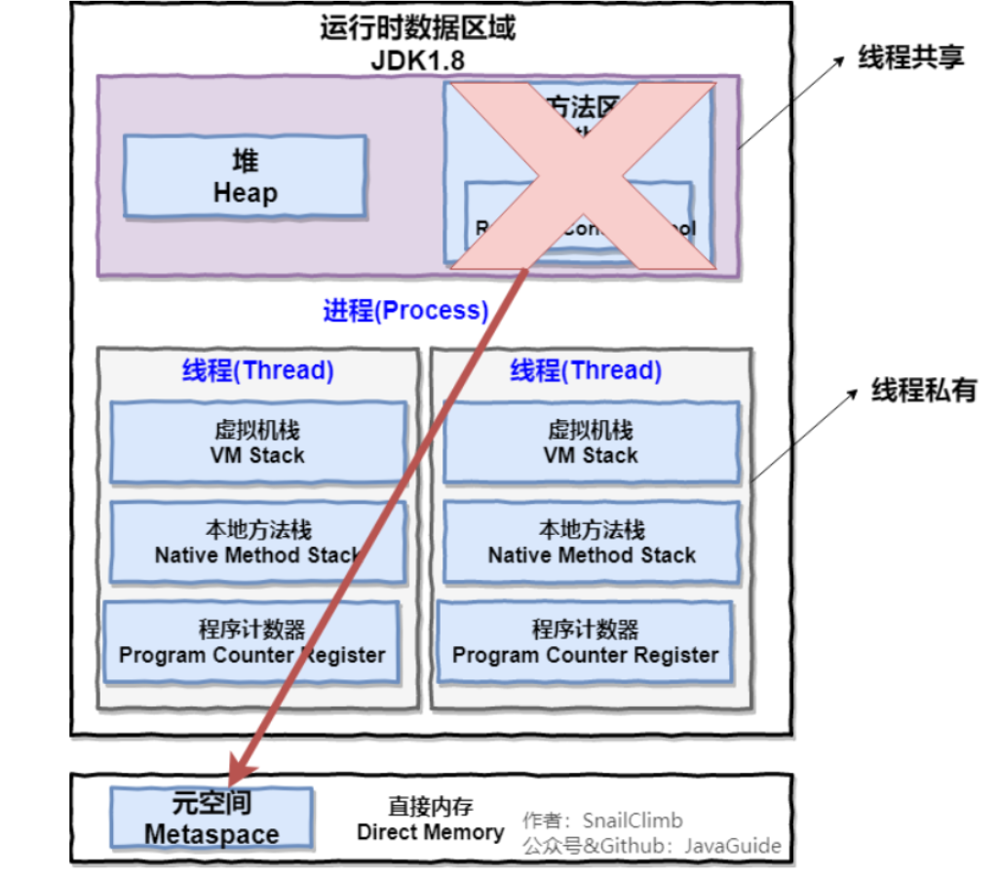

# JVM知识点

## 1.JVM概述（Java Virtual Machine）

是用来运行Java字节码的虚拟机，包括**字节码指令集、程序寄存器、栈、堆、方法区和垃圾回收器**。

JVM运行在操作系统之上，不与硬件设备直接交互。

Java源文件在通过编译器之后被编译成相应的．Class文件（字节码文件），.Class文件又被JVM中的解释器编译成机器码在不同的操作系统（Windows、Linux、Mac）上运行。

每种操作系统的解释器都是不同的，但基于解释器实现的虚拟机是相同的，这也是Java能够跨平台的原因。

在一个Java进程开始运行后，虚拟机就开始实例化了，有多个进程启动就会实例化多个虚拟机实例。进程退出或者关闭，则虚拟机实例消亡，在多个虚拟机实例之间不能共享数据。

Java程序的具体运行过程如下：

（1）Java源文件被编译器编译成字节码文件。

（2）JVM将字节码文件编译成相应操作系统的机器码。

（3）机器码调用相应操作系统的本地方法库执行相应的方法。

Java虚拟机包括一个类加载器子系统（Class Loader SubSystem）、运行时数据区（Runtime Data Area）、执行引擎和本地接口库（Native InterfaceLibrary）。

本地接口库通过调用本地方法库（Native Method Library）与操作系统交互。

类加载器子系统用于将编译好的．Class文件加载到JVM中；

◎ 运行时数据区用于存储在JVM运行过程中产生的数据，包括程序计数器、方法区、本地方法区、虚拟机栈和虚拟机堆；

◎ 执行引擎包括即时编译器和垃圾回收器，即时编译器用于将Java字节码编译成具体的机器码，垃圾回收器用于回收在运行过程中不再使用的对象；

◎ 本地接口库用于调用操作系统的本地方法库完成具体的指令操作。


java jdk1.8之后 方法区 移动到直接内存中作为==元空间==存在。

## 2.JVM的内存区域



**线程私有的：**

- 程序计数器
- 虚拟机栈
- 本地方法栈

**线程共享的：**

- 堆
- 方法区
- 直接内存 (非运行时数据区的一部分)

### 2.1 程序计数器

程序计数器是一块较小的内存空间，可以看作是当前线程所执行的字节码的行号指示器。**字节码解释器工作时通过改变这个计数器的值来选取下一条需要执行的字节码指令，分支、循环、跳转、异常处理、线程恢复等功能都需要依赖这个计数器来完成。**

另外，**为了线程切换后能恢复到正确的执行位置，每条线程都需要有一个独立的程序计数器，各线程之间计数器互不影响，独立存储，我们称这类内存区域为“线程私有”的内存。**

**从上面的介绍中我们知道程序计数器主要有两个作用：**

1. 字节码解释器通过改变程序计数器来依次读取指令，从而实现代码的流程控制，如：顺序执行、选择、循环、异常处理。
2. 在多线程的情况下，程序计数器用于记录当前线程执行的位置，从而当线程被切换回来的时候能够知道该线程上次运行到哪儿了。

**注意：程序计数器是唯一一个不会出现 `OutOfMemoryError` 的内存区域，它的生命周期随着线程的创建而创建，随着线程的结束而死亡。**

### 2.2 Java 虚拟机栈

**与程序计数器一样，Java 虚拟机栈也是线程私有的，它的生命周期和线程相同，描述的是 Java 方法执行的内存模型，每次方法调用的数据都是通过栈传递的。**

**Java 内存可以粗糙的区分为堆内存（Heap）和栈内存 (Stack),其中栈就是现在说的虚拟机栈，或者说是虚拟机栈中局部变量表部分。** （实际上，Java 虚拟机栈是由一个个栈帧组成，而每个栈帧中都拥有：局部变量表、操作数栈、动态链接、方法出口信息。）

**局部变量表主要存放了编译期可知的各种数据类型**（boolean、byte、char、short、int、float、long、double）、**对象引用**（reference 类型，它不同于对象本身，可能是一个指向对象起始地址的引用指针，也可能是指向一个代表对象的句柄或其他与此对象相关的位置）。

**Java 虚拟机栈会出现两种错误：`StackOverFlowError` 和 `OutOfMemoryError`。**

- **`StackOverFlowError`：** 若 Java 虚拟机栈的内存大小不允许动态扩展，那么当线程请求栈的深度超过当前 Java 虚拟机栈的最大深度的时候，就抛出 StackOverFlowError 错误。
- **`OutOfMemoryError`：** 若 Java 虚拟机堆中没有空闲内存，并且垃圾回收器也无法提供更多内存的话。就会抛出 OutOfMemoryError 错误。

Java 虚拟机栈也是线程私有的，每个线程都有各自的 Java 虚拟机栈，而且随着线程的创建而创建，随着线程的死亡而死亡。

**扩展：那么方法/函数如何调用？**

Java 栈可用类比数据结构中栈，Java 栈中保存的主要内容是栈帧，每一次函数调用都会有一个对应的栈帧被压入 Java 栈，每一个函数调用结束后，都会有一个栈帧被弹出。

Java 方法有两种返回方式：

1. return 语句。
2. 抛出异常。

不管哪种返回方式都会导致栈帧被弹出。

### 2.3 本地方法栈

和虚拟机栈所发挥的作用非常相似，区别是： **虚拟机栈为虚拟机执行 Java 方法 （也就是字节码）服务，而本地方法栈则为虚拟机使用到的 Native 方法服务。** 在 HotSpot 虚拟机中和 Java 虚拟机栈合二为一。

本地方法被执行的时候，在本地方法栈也会创建一个栈帧，用于存放该本地方法的局部变量表、操作数栈、动态链接、出口信息。

方法执行完毕后相应的栈帧也会出栈并释放内存空间，也会出现 StackOverFlowError 和 OutOfMemoryError 两种错误。

### 2.4 堆

Java 虚拟机所管理的内存中最大的一块，Java 堆是所有线程共享的一块内存区域，在虚拟机启动时创建。**此内存区域的唯一目的就是存放对象实例，几乎所有的对象实例以及数组都在这里分配内存。**

**Java世界中“几乎”所有的对象都在堆中分配，但是，随着JIT编译期的发展与逃逸分析技术逐渐成熟，栈上分配、标量替换优化技术将会导致一些微妙的变化，所有的对象都分配到堆上也渐渐变得不那么“绝对”了。从jdk 1.7开始已经默认开启逃逸分析，如果某些方法中的对象引用没有被返回或者未被外面使用（也就是未逃逸出去），那么对象可以直接在栈上分配内存。**

Java 堆是垃圾收集器管理的主要区域，因此也被称作**GC 堆（Garbage Collected Heap）**.从垃圾回收的角度，由于现在收集器基本都采用分代垃圾收集算法，所以 Java 堆还可以细分为：新生代和老年代：再细致一点有：Eden 空间、From Survivor、To Survivor 空间等。**进一步划分的目的是更好地回收内存，或者更快地分配内存。**

JDK 8 版本之后方法区（HotSpot 的永久代）被彻底移除了（JDK1.7 就已经开始了），取而代之是**元空间**，元空间使用的是直接内存。

[](https://github.com/SuperTchain/JavaGuide/blob/master/docs/java/jvm/pictures/java内存区域/JVM堆内存结构-jdk8.png)

**上图所示的 Eden 区、两个 Survivor 区都属于新生代（为了区分，这两个 Survivor 区域按照顺序被命名为 from 和 to），中间一层属于老年代。一般为8:1:1***

大部分情况，对象都会首先在 Eden 区域分配，在一次新生代垃圾回收后，如果对象还存活，则会进入 s0 或者 s1，并且对象的年龄还会加 1(Eden 区->Survivor 区后对象的初始年龄变为 1)，当它的年龄增加到一定程度（默认为 15 岁），就会被晋升到老年代中。对象晋升到老年代的年龄阈值，可以通过参数 `-XX:MaxTenuringThreshold` 来设置。

堆这里最容易出现的就是 OutOfMemoryError 错误，并且出现这种错误之后的表现形式还会有几种，比如：

1. **`OutOfMemoryError: GC Overhead Limit Exceeded`** ： 当JVM花太多时间执行垃圾回收并且只能回收很少的堆空间时，就会发生此错误。
2. **`java.lang.OutOfMemoryError: Java heap space`** :假如在创建新的对象时, 堆内存中的空间不足以存放新创建的对象, 就会引发`java.lang.OutOfMemoryError: Java heap space` 错误。(和本机物理内存无关，和你配置的内存大小有关！)
3. ......

### 2.5 方法区

方法区与 Java 堆一样，是各个线程共享的内存区域，它用于存储已被虚拟机加载的类信息、常量、静态变量、即时编译器编译后的代码等数据。虽然 **Java 虚拟机规范把方法区描述为堆的一个逻辑部分**，但是它却有一个别名叫做 **Non-Heap（非堆）**，目的应该是与 Java 堆区分开来。

方法区也被称为永久代。很多人都会分不清方法区和永久代的关系，为此我也查阅了文献。

#### 2.5.1 方法区和永久代的关系

> 《Java 虚拟机规范》只是规定了有方法区这么个概念和它的作用，并没有规定如何去实现它。那么，在不同的 JVM 上方法区的实现肯定是不同的了。 **方法区和永久代的关系很像 Java 中接口和类的关系，类实现了接口，而永久代就是 HotSpot 虚拟机对虚拟机规范中方法区的一种实现方式。** 也就是说，永久代是 HotSpot 的概念，==方法区是 Java 虚拟机规范中的定义，是一种规范，而永久代是一种实现，一个是标准一个是实现==，其他的虚拟机实现并没有永久代这一说法。

#### 2.5.2 常用参数

JDK 1.8 之前永久代还没被彻底移除的时候通常通过下面这些参数来调节方法区大小

```
-XX:PermSize=N //方法区 (永久代) 初始大小
-XX:MaxPermSize=N //方法区 (永久代) 最大大小,超过这个值将会抛出 OutOfMemoryError 异常:java.lang.OutOfMemoryError: PermGen
```

相对而言，垃圾收集行为在这个区域是比较少出现的，但并非数据进入方法区后就“永久存在”了。

JDK 1.8 的时候，方法区（HotSpot 的永久代）被彻底移除了（JDK1.7 就已经开始了），取而代之是元空间，元空间使用的是直接内存。

下面是一些常用参数：

```
-XX:MetaspaceSize=N //设置 Metaspace 的初始（和最小大小）
-XX:MaxMetaspaceSize=N //设置 Metaspace 的最大大小
```

与永久代很大的不同就是，如果不指定大小的话，随着更多类的创建，虚拟机会耗尽所有可用的系统内存。

#### 2.5.3 为什么要将永久代 (PermGen) 替换为元空间 (MetaSpace) 呢?

1. 整个永久代有一个 JVM 本身设置固定大小上限，无法进行调整，而元空间使用的是直接内存，受本机可用内存的限制，虽然元空间仍旧可能溢出，但是比原来出现的几率会更小。

> 当你元空间溢出时会得到如下错误： `java.lang.OutOfMemoryError: MetaSpace`

你可以使用 `-XX：MaxMetaspaceSize` 标志设置最大元空间大小，默认值为 unlimited，这意味着它只受系统内存的限制。`-XX：MetaspaceSize` 调整标志定义元空间的初始大小如果未指定此标志，则 Metaspace 将根据运行时的应用程序需求动态地重新调整大小。

1. 元空间里面存放的是类的元数据，这样加载多少类的元数据就不由 `MaxPermSize` 控制了, 而由系统的实际可用空间来控制，这样能加载的类就更多了。
2. 在 JDK8，合并 HotSpot 和 JRockit 的代码时, JRockit 从来没有一个叫永久代的东西, 合并之后就没有必要额外的设置这么一个永久代的地方了。

### 2.6直接内存

**直接内存并不是虚拟机运行时数据区的一部分，也不是虚拟机规范中定义的内存区域，但是这部分内存也被频繁地使用。而且也可能导致 OutOfMemoryError 错误出现。**

JDK1.4 中新加入的 **NIO(New Input/Output) 类**，引入了一种基于**通道（Channel）** 与**缓存区（Buffer）** 的 I/O 方式，它可以直接使用 Native 函数库直接分配堆外内存，然后通过一个存储在 Java 堆中的 DirectByteBuffer 对象作为这块内存的引用进行操作。这样就能在一些场景中显著提高性能，因为**避免了在 Java 堆和 Native 堆之间来回复制数据**。

本机直接内存的分配不会受到 Java 堆的限制，但是，既然是内存就会受到本机总内存大小以及处理器寻址空间的限制。

## 3.JVM类加载器

### 3.1类加载过程

类加载过程：**加载->连接->初始化**。连接过程又可分为三步:**验证->准备->解析**。

	

一个非数组类的加载阶段（加载阶段获取类的二进制字节流的动作）是可控性最强的阶段，这一步我们可以去完成还可以自定义类加载器去控制字节流的获取方式（重写一个类加载器的 `loadClass()` 方法）。数组类型不通过类加载器创建，它由 Java 虚拟机直接创建。

所有的类都由类加载器加载，加载的作用就是将 .class文件加载到内存。

### 3.2类加载器总结

JVM 中内置了三个重要的 ClassLoader，除了 BootstrapClassLoader 其他类加载器均由 Java 实现且全部继承自`java.lang.ClassLoader`：

1. **BootstrapClassLoader(启动类加载器)** ：最顶层的加载类，由C++实现，负责加载 `%JAVA_HOME%/lib`目录下的jar包和类或者或被 `-Xbootclasspath`参数指定的路径中的所有类。
2. **ExtensionClassLoader(扩展类加载器)** ：主要负责加载目录 `%JRE_HOME%/lib/ext` 目录下的jar包和类，或被 `java.ext.dirs` 系统变量所指定的路径下的jar包。
3. **AppClassLoader(应用程序类加载器)** :面向我们用户的加载器，负责加载当前应用classpath下的所有jar包和类。


### 3.3双亲委派模型

每一个类都有一个对应它的类加载器。系统中的 ClassLoder 在协同工作的时候会默认使用 **双亲委派模型** 。即在类加载的时候，系统会首先判断当前类是否被加载过。已经被加载的类会直接返回，否则才会尝试加载。加载的时候，首先会把该请求委派该父类加载器的 `loadClass()` 处理，因此所有的请求最终都应该传送到顶层的启动类加载器 `BootstrapClassLoader` 中。当父类加载器无法处理时，向下传递才由自己来处理。当父类加载器为null时，会使用启动类加载器 `BootstrapClassLoader` 作为父类加载器。

	

 `AppClassLoader`的父类加载器为`ExtClassLoader` `ExtClassLoader`的父类加载器为null，**null并不代表`ExtClassLoader`没有父类加载器，而是 `BootstrapClassLoader`** 。 

### 3.4双亲委派模型的好处

双亲委派模型保证了Java程序的稳定运行，比较安全，可以避免类的重复加载（JVM 区分不同类的方式不仅仅根据类名，相同的类文件被不同的类加载器加载产生的是两个不同的类），也保证了 Java 的核心 API 不被篡改。如果没有使用双亲委派模型，而是每个类加载器加载自己的话就会出现一些问题，比如我们编写一个称为 `java.lang.Object` 类的话，那么程序运行的时候，系统就会出现多个不同的 `Object` 类。

### 3.5自定义类加载器

 **自定义加载器的话，需要继承 `ClassLoader` 。如果我们不想打破双亲委派模型，就重写 `ClassLoader` 类中的 `findClass()` 方法即可，无法被父类加载器加载的类最终会通过这个方法被加载。但是，如果想打破双亲委派模型则需要重写 `loadClass()` 方法** 