##         		Java基础

### 1.重载

方法名称一样参数不同

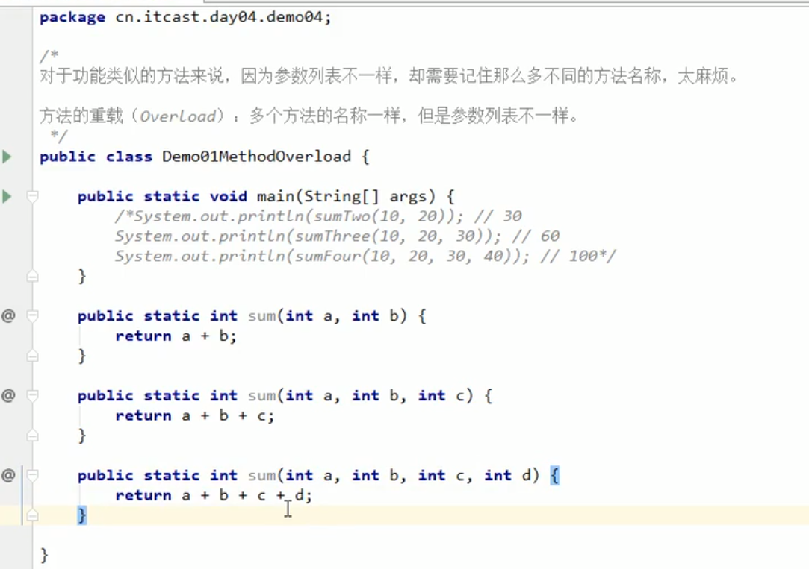

重写

	

**细说一下重写和重载：**

**这两个都是多态的一种表现形式。**

**重载：**

  **1、 重载是在编译器通过方法中形参的静态类型确定调用方法版本的过程。**

  **2、 重载是多态在编译期的表现形式**

  **3、 重载的判定只有两个条件（其他的条件都不能作为判定）：**

​      **1、 方法名一致**

​      **2、形参列表不同**

**重写：**

  **1、重写在方法运行时，通过调用者的实际类型来确定调用的方法版本。（具体细说，就是子父类中的重写方法在对应的class文件常量池的位置相同，一旦子类没有重写，那么子类的实例就会沿着这个位置往上找，直到找到父类的同名方法****）**

  **2、重写只发生在可见的实例方法中：**

​      **1、静态方法不存在重写，形式上的重写只能说是隐藏。**

​      **2、私有方法也不存在重写，父类中private的方法，子类中就算定义了，就是相当于一个新的方法。**

​      **3、静态方法和实例方法不存在相互重写。**

  **3、重写满足一个规则：两同两小一大**

​      **1、两同：方法名和形参列表一致**

​      **2、两小：重写方法的返回值（引用类型）和抛出异常，要和被重写方法的返回值（引用类型）和抛出异常****相同或者是其子类。注意，一旦返回值是基本数据类型，那么重写方法和被重写方法必须相同，且不存在自动拆装箱的问题。**

​      **3、一大：重写方法的访问修饰符大于等于被重写方法的访问修饰符。**

### 2.数组， 二维数组定义，一维长度必须定义，二维可以后续定义

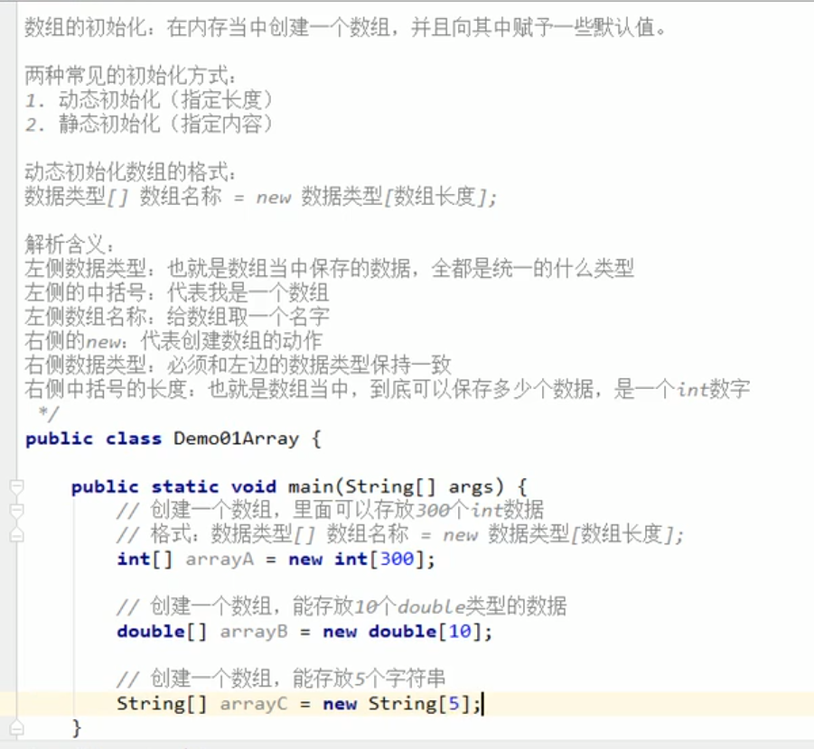

	

### 3.三元运算符，位运算符

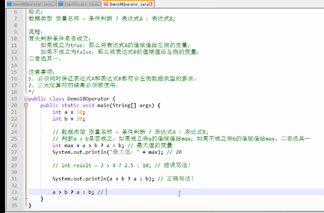	

三元操作符如果遇到可以转换为数字的类型，会做自动类型提升。

```java
`Object o1 = (``false``) ? ``new` `Double(``1.0``) : ``new` `Integer(``2``);``System.out.println(o1);`
```

会打印2.0

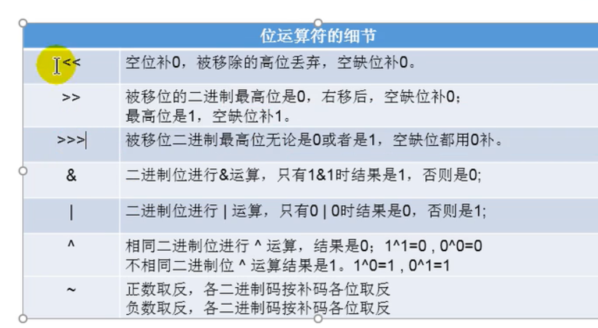

### 4.API

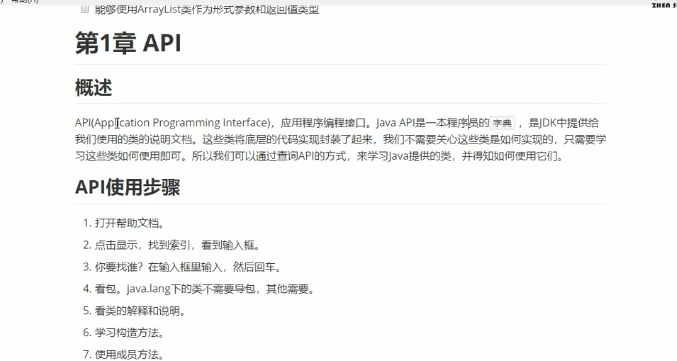	

### 5.多态

- 多态，简而言之就是==同一个行为具有多个不同表现形式或形态的能力==。
- 多态的分类：运行时多态( 重写式多态 )和编译时多态( 重载式多态 )。
- 运行时多态的前提：继承（实现），重写，向上转型
- 向上转型与向下转型。
- 继承链中对象方法的调用的优先级：this.show(O)、super.show(O)、this.show((super)O)、super.show((super)O)。

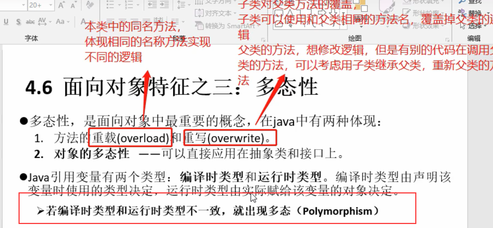

重载式多态，也叫编译时多态。也就是说这种多态再编译时已经确定好了。重载大家都知道，方法名相同而参数列表不同的一组方法就是重载。在调用这种重载的方法时，通过传入不同的参数最后得到不同的结果。

同一个行为具有多个不同表现形式或形态的能力就是多态，所以我认为重载也是一种多态

重写式多态，也叫运行时多态。这种多态通过动态绑定（dynamic binding）技术来实现，是指在执行期间判断所引用对象的实际类型，根据其实际的类型调用其相应的方法。也就是说，只有程序运行起来，你才知道调用的是哪个子类的方法。
这种多态通过函数的重写以及向上转型来实现，我们上面代码中的例子就是一个完整的重写式多态。我们接下来讲的所有多态都是重写式多态，因为它才是面向对象编程中真正的多态。

#### 5.1向上转型(把子类对象给父类引用)

- 减少重复代码，使代码变得简洁。
- 提高系统扩展性

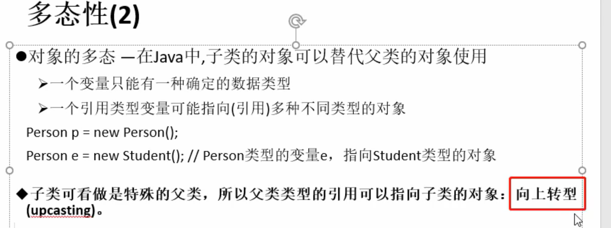

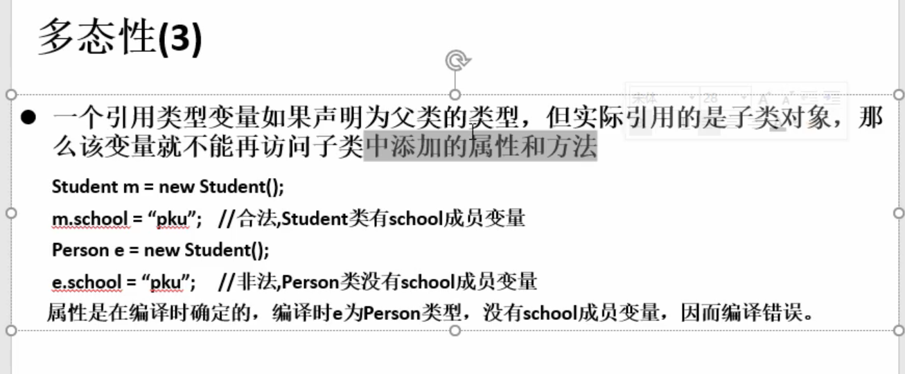

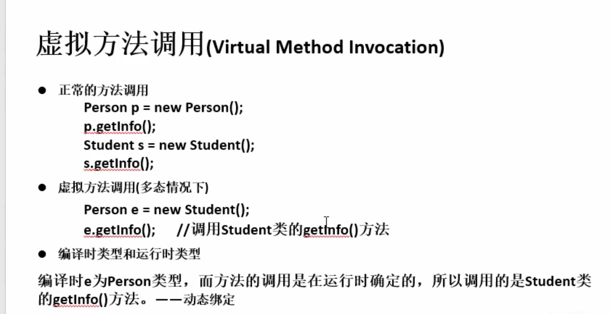

#### 5.2向下转型(把父类对象转为子类对象)

```java
//还是上面的animal和cat dog
Animal a = new Cat();
Cat c = ((Cat) a);
c.eat();
//输出  我吃鱼
Dog d = ((Dog) a);
d.eat();
// 报错 ： java.lang.ClassCastException：com.chengfan.animal.Cat cannot be cast to com.chengfan.animal.Dog
Animal a1 = new Animal();
Cat c1 = ((Cat) a1);
c1.eat();
// 报错 ： java.lang.ClassCastException：com.chengfan.animal.Animal cannot be cast to com.chengfan.animal.Cat
```

为什么第一段代码不报错呢？相比你也知道了，因为a本身就是Cat对象，所以它理所当然的可以向下转型为Cat，也理所当然的不能转为Dog，你见过一条狗突然就变成一只猫这种操蛋现象？

而a1为Animal对象，它也不能被向下转型为任何子类对象。比如你去考古，发现了一个新生物，知道它是一种动物，但是你不能直接说，啊，它是猫，或者说它是狗。

- 向下转型的前提是父类对象指向的是子类对象（也就是说，在向下转型之前，它得先向上转型）
- 向下转型只能转型为本类对象（猫是不能变成狗的）。

#### 5.3经典案例分析

[多态案例分析]()

注意： 当父类对象引用变量引用子类对象时，被引用对象的类型决定了调用谁的成员方法，引用变量类型决定可调用的方法。如果子类中没有覆盖该方法，那么会去父类中寻找。 (即父类确定引用范围，子类确定引用类型)

```java
class A {
    public String show(D obj) {
        return ("A and D");
    }

    public String show(A obj) {
        return ("A and A");
    }

}

class B extends A{
    public String show(B obj){
        return ("B and B");
    }

    public String show(A obj){
        return ("B and A");
    }
}

class C extends B{

}

class D extends B{

}

public class Demo {
    public static void main(String[] args) {
        A a1 = new A();
        A a2 = new B();
        B b = new B();
        C c = new C();
        D d = new D();

        System.out.println("1--" + a1.show(b));
        System.out.println("2--" + a1.show(c));
        System.out.println("3--" + a1.show(d));
        System.out.println("4--" + a2.show(b));
        System.out.println("5--" + a2.show(c));
        System.out.println("6--" + a2.show(d));
        System.out.println("7--" + b.show(b));
        System.out.println("8--" + b.show(c));
        System.out.println("9--" + b.show(d));
    }
}
//结果：
//1--A and A
//2--A and A
//3--A and D
//4--B and A
//5--B and A
//6--A and D
//7--B and B
//8--B and B
//9--A and D

```

```java
a2.show()分析:
首先，a2是类型为A的引用类型，它指向类型为B的对象。A确定可调用的方法：show(D obj)和show(A obj)。
a2.show(b) ==> this.show(b)，这里this指的是B。
然后.在B类中找show（B obj），找到了，可惜没用，因为show（B obj）方法不在可调用范围内，this.show(O)失败，进入下一级别：super.show(O)，super指的是A。
在A 中寻找show（B obj)，失败，因为没用定义这个方法。进入第三级别：this.show((super)O)，this指的是B。
在B中找show（（A）O）,找到了：show(A obj)，选择调用该方法。
输出：B and A
```

- 先方法，后对象
- this.show(O)、super.show(O)、this.show((super)O)、super.show((super)O)

### 6.集合

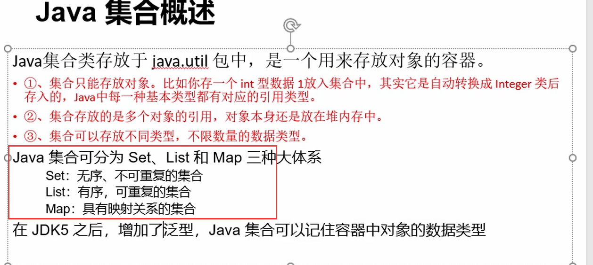

#### 6.1HashSet

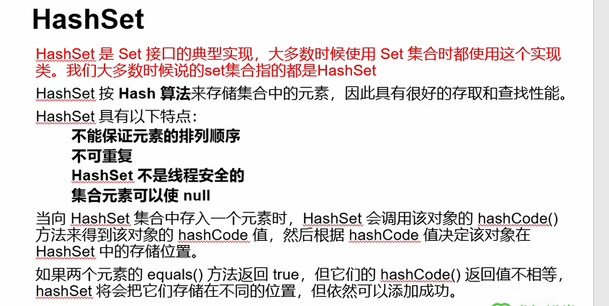

#### 6.2TreeSet

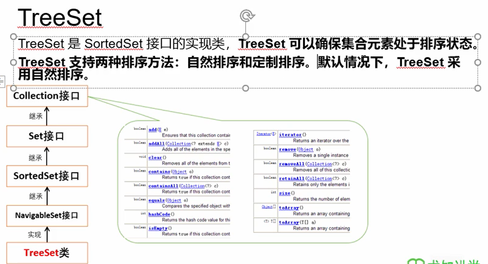

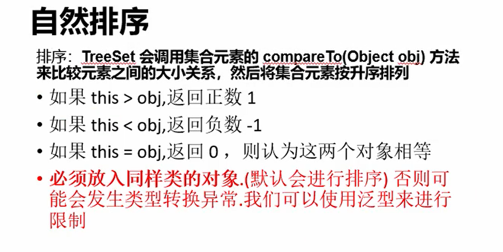

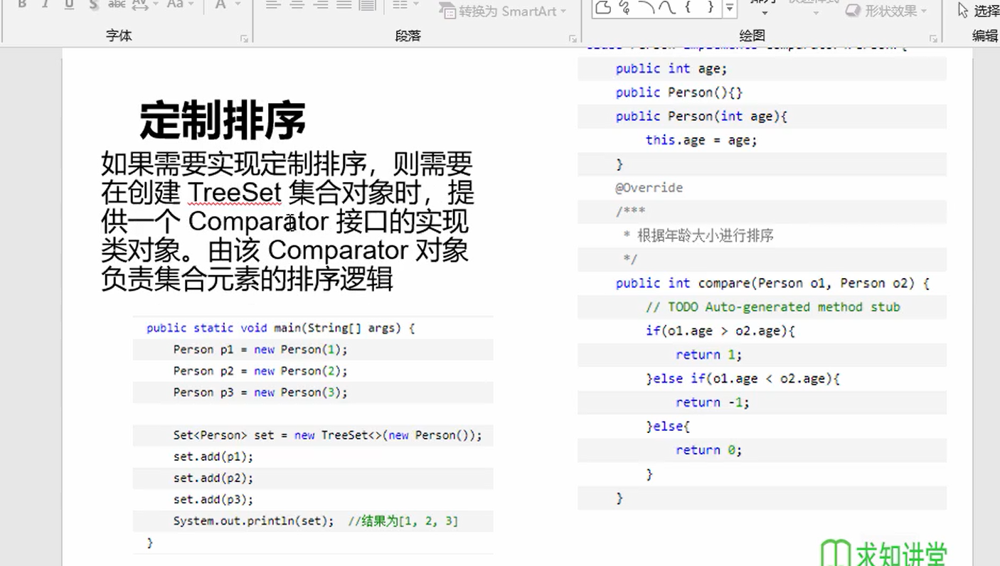

#### 6.3List

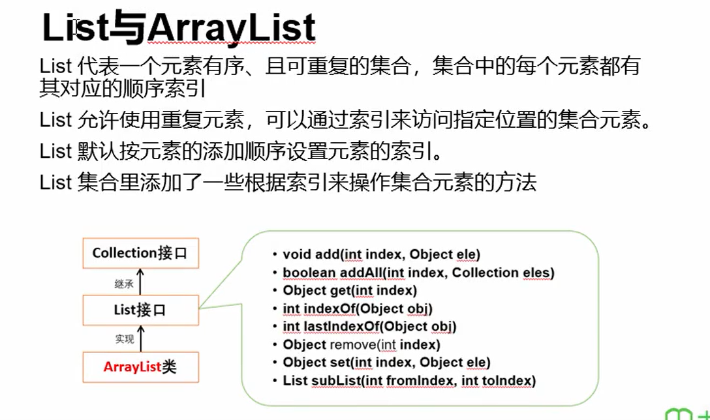

ArrayList线程不安全。

#### 6.4HashMap

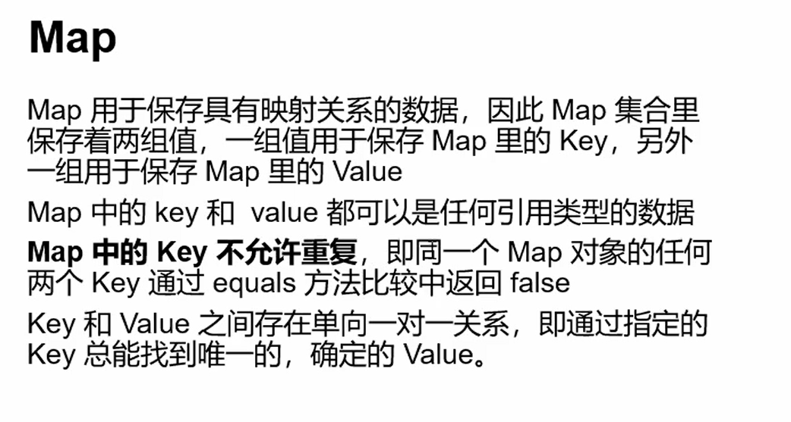

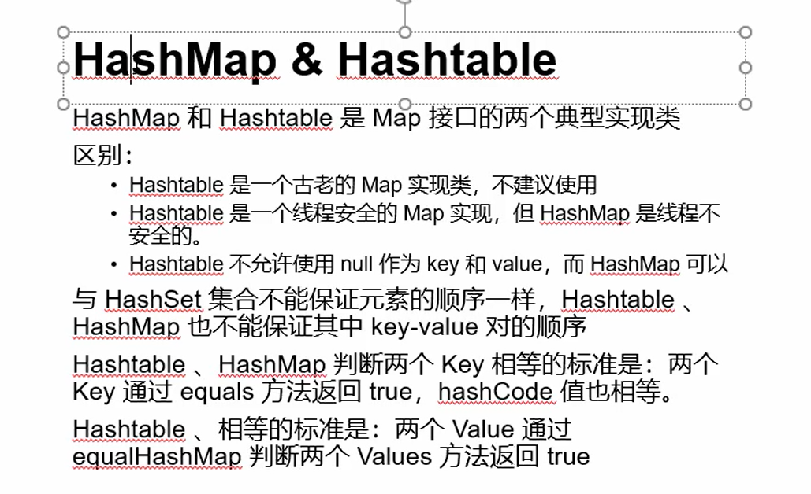

Map集合的遍历

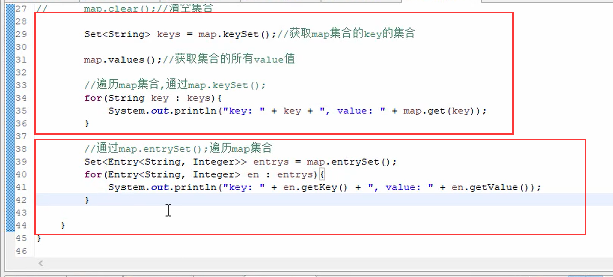

第一种遍历效率较低

### ==注意==：==equals hascode区别==

```java
1、“==”
“==”运算符用来比较两个变量的值是否相等。具体情况如下：
（1）如果两个变量是基本数据类型，可以直接使用“==”运算符来比较其对应的值是否相等。
（2）如果一个变量指向的数据是对象（引用类型），此时就会涉及到两块内存，对象本身占用一块内存（堆内存），变量也占用一块内存，变量所对应内存存储的数值就是对象占用的那块内存的首地址。如果要比较两个变量是否指向同一个对象，就可以用“==”来判断。但是如果要比较两个变量所指向对象的内容是否相等，“==”就无能为力了。

2、equals()
equals()是Object类提供的方法之一。每一个Java类都继承Object类，所以每个对象都具有equals()方法。Object类中定义的equals(Object)方法是直接使用“==”运算符比较两个对象，所以在没有覆盖equals(Object)方法的情况下，equals(Object)与“==”运算符一样，比较的是引用。
相比“==”，equals(Object)方法的特殊之处就在于它可以被覆盖，所以可以通过覆盖的方法让它比较数据内容而不是比较引用。

3、hashCode()
hashCode()方法是从Object类中继承过来的，它也用来鉴定两个对象是否相等。Object类中的hashCode()方法返回对象在内存中地址转换成的一个int值，所以如果没有重写hashCode()方法，任何对象的hashCode()方法返回值都是不相等的。
一般在覆盖equals()方法的同时也要覆盖hashCode()方法，否则，就会违反Object.hashCode的通用约定，从而导致该类无法与所有基于散列值（hash）的集合类（HashMap、HashSet和Hashtable）结合在一起正常运行。
hashCode()方法返回值和equals()方法的关系如下：
（1）如果x.equals(y)返回true，即两个对象根据euqals()方法比较是相等的，那么x和y两个对象的hashCode()返回值也是相等的。
（2）x.equals(y)返回false，那么x和y两个对象的hashCode()返回值可能是相等的，也可能不相等。
（3）如果x和y两个对象的hashCode()返回值不相等，一定能推出x.equals(y)返回false。
（4）如果x和y两个对象的hashCode()返回值相等，x.equals(y)可能返回false，也可能返回true。

```


#### 6.5TreeMap

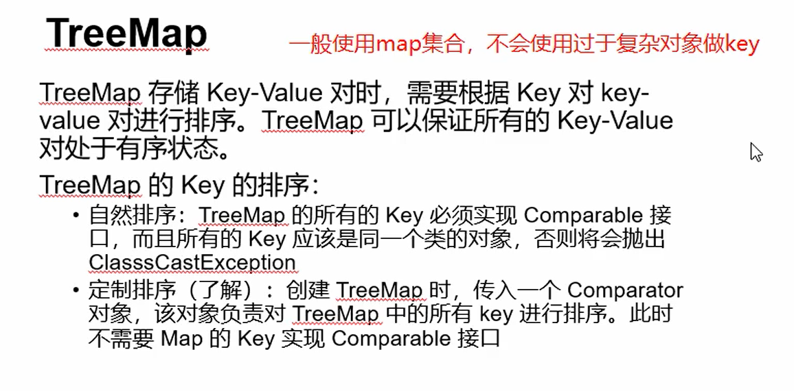

### 7.泛型

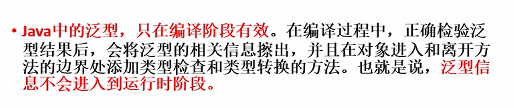

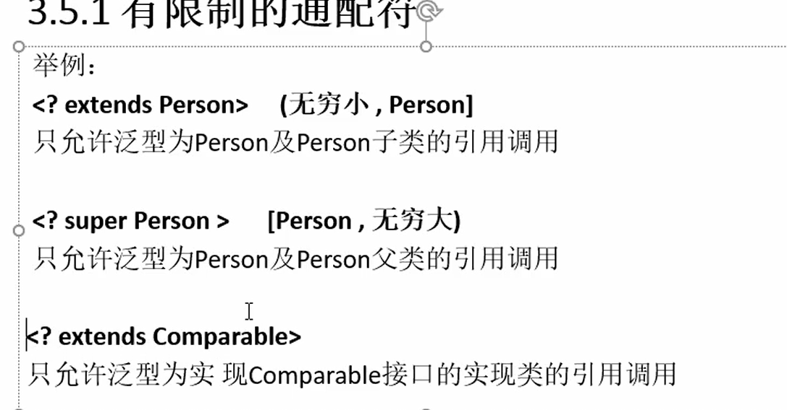

### 8.Anntation注解

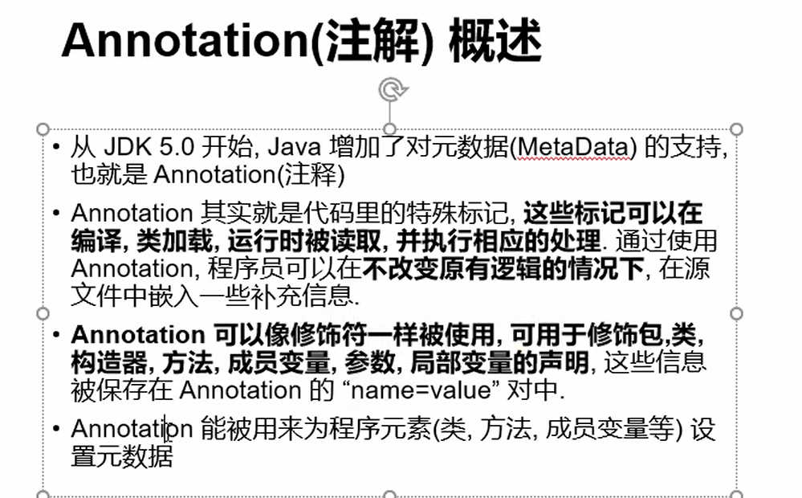

### 8.文件io操作

流的分类

外部输入，内部输出

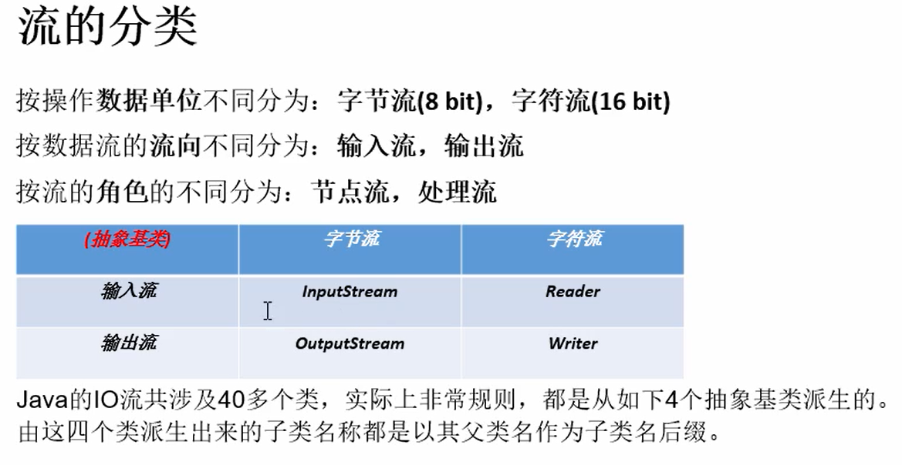

#### 8.1==字节流==

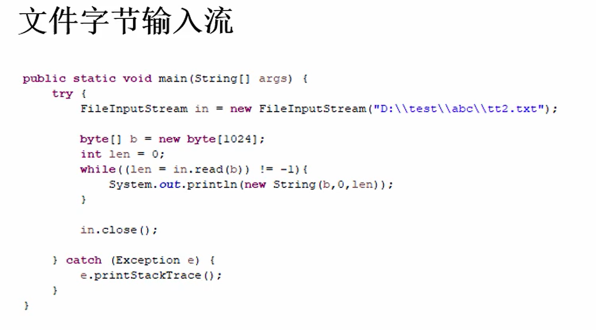

```java
	//字节流输入
			// 创建文件
		File f = new File("E:/TEST/io.txt");
		if (!f.exists()) {// 当文件不存在的时候进入创建
			// 创建文件
			try {
				f.createNewFile();
				System.out.println("文件创建成功");
			} catch (IOException e) {
				// TODO Auto-generated catch block
				e.printStackTrace();
			}
		} else {
			System.out.println("文件已存在");
		}

		// 通过FileInputstream来进行读字节流，读到内存中（磁盘到内存）
		FileInputStream fis = null;
		try {
			fis = new FileInputStream(f);
			int n = 0;// 实际读取到的字节数
			// 定义一个byte数组当做缓冲区
			byte[] bytes = new byte[1024];
			//循环读取
			while ((n = fis.read(bytes)) != -1) {// 没读完
				// 将其转化成字符串
				String s = new String(bytes, 0, n);
				System.out.println(s);
			}

		} catch (FileNotFoundException e) {
			// TODO Auto-generated catch block
			e.printStackTrace();
		} finally {
			try {
				fis.close();
			} catch (Exception e) {
				// TODO Auto-generated catch block
				e.printStackTrace();
			}
		}

	}
```


```java
//字节流输出
public static void main(String[] args) throws IOException {
		// TODO Auto-generated method stub
		File f = new File("E:/TEST/io.txt");
		if (!f.exists()) {
			try {
				f.createNewFile();
			} catch (IOException e) {
				// TODO Auto-generated catch block
				e.printStackTrace();
			}
		} else {
			System.out.println("文件已存在,写入的内容将覆盖原内容");
		}

		// 通过FileOutputStream输出内容
		FileOutputStream fos = null;
		try {
			fos = new FileOutputStream(f);

			String s1 = "这是iodemo2的输出文件\r\n";// \r\n换行符
			String s2 = "测试换行的文字123qw!";
			// 把String->byte数组
			fos.write(s1.getBytes());
			fos.write(s2.getBytes());
			System.out.println("写入成功");
		} catch (FileNotFoundException e) {
			// TODO Auto-generated catch block
			e.printStackTrace();
		} finally {
			try {
				fos.close();
			} catch (IOException e) {
				// TODO Auto-generated catch block
				e.printStackTrace();
			}
		}
	}
```


#### 8.2==字符流==

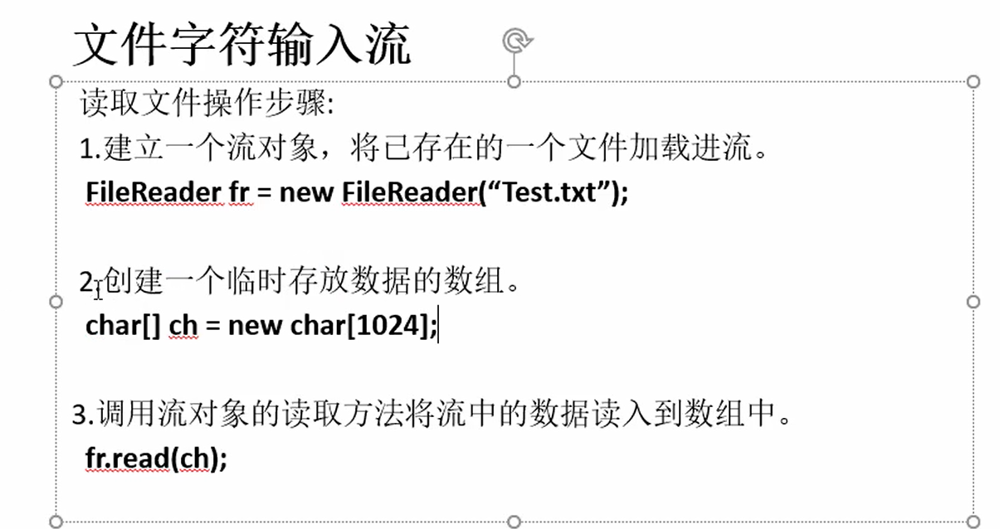

#### 8.3==缓冲流==

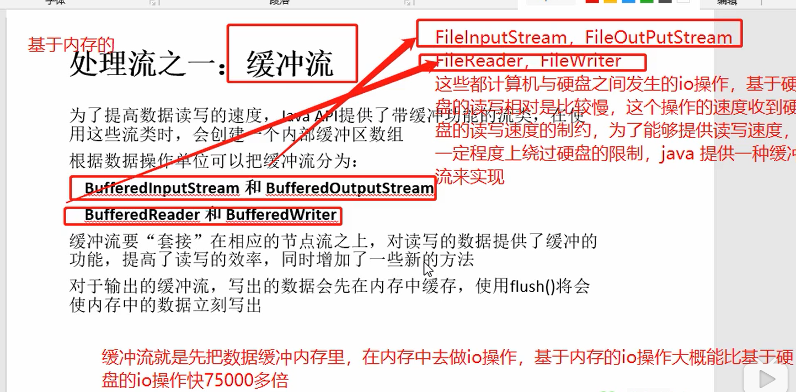

```java
//字符流缓冲
public static void main(String[] args) {
		// TODO Auto-generated method stub
		// 先定义一个BufferedReader
		BufferedReader br = null;
		// 定义一个BufferedWriter
		BufferedWriter bw = null;
		// 先写入内存，再从内存中输出
		try {
			// 因为BufferedWriter,Reader比FileWriter,Reader高级所以先创建低级对象，再用高级调用
			FileReader fr = new FileReader("E:/TEST/字符流.txt");// 创建输入流文件
			br = new BufferedReader(fr);
			FileWriter fw = new FileWriter("E:/TEST2/输出2.txt");// 创建输出流文件
			bw = new BufferedWriter(fw);
			String s = "";
          // 循环读入
			while ((s = br.readLine()) != null) {
          // 输出内容
				bw.write(s + "\r\n");// 让输出的每一行换行
			}
		} catch (Exception e) {
			// TODO: handle exception
		} finally {
			try {
				br.close();
				bw.close();
			} catch (IOException e) {
				// TODO Auto-generated catch block
				e.printStackTrace();
			}
		}
	}
```

#### 8.4转换流

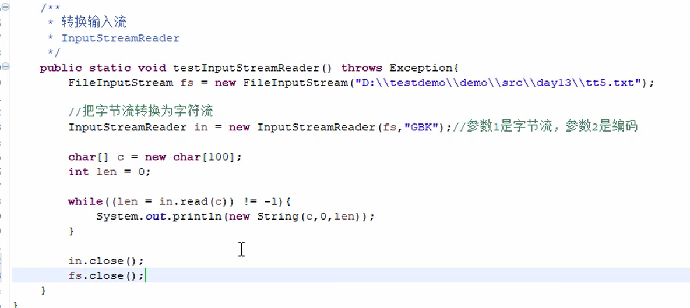

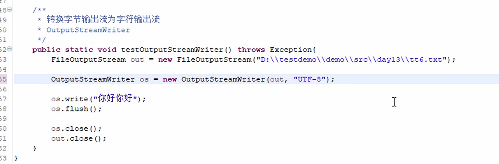

#### 8.5记事本

```java
public class notepad extends JFrame implements ActionListener {
	// 创建文本域
	JTextArea jta = null;
	// 创建菜单条
	JMenuBar jmb = null;
	// 创建菜单
	JMenu jm = null;
	// 创建Item(子菜单)
	JMenuItem jmi1 = null;
	JMenuItem jmi2 = null;

	public static void main(String[] args) {
		notepad nd = new notepad();
	}

	// 初始化
	public notepad() {
		// 设置文本域
		jta = new JTextArea();
		// 创建菜单条,菜单,子菜单
		jmb = new JMenuBar();
		jm = new JMenu("文件");
		jmi1 = new JMenuItem("打开");
		// 注册监听
		jmi1.addActionListener(this);
		jmi1.setActionCommand("open");
		// 设置助记符
		jmi1.setMnemonic('F');// 按alt+f自动展开
		jmi2 = new JMenuItem("保存");
		// 注册监听
		jmi2.addActionListener(this);
		jmi2.setActionCommand("save");

		// 将菜单条加入文本域
		this.setJMenuBar(jmb);
		// 将菜单加入菜单条
		jmb.add(jm);
		// 将子菜单加入菜单
		jm.add(jmi1);
		jm.add(jmi2);

		// 将jta加入JFrame
		this.add(jta);
		// 设置大小
		this.setSize(400, 300);
		this.setTitle("我的记事本");
		this.setVisible(true);
		this.setDefaultCloseOperation(JFrame.EXIT_ON_CLOSE);
	}

	@Override
	public void actionPerformed(ActionEvent e) {
		// TODO Auto-generated method stub
		// 检测按下按钮是否是open
		if (e.getActionCommand().equals("open")) {

			// JFileChooser文件选择组件
			// 创建组件
			JFileChooser jfs = new JFileChooser();
			// 设置组件名字
			jfs.setDialogTitle("保存为:");
			// 设置默认方式打开
			jfs.showOpenDialog(null);
			// 设置组件可见
			jfs.setVisible(true);
			// 得到用户选择的文件的绝对路径
			String Filename = jfs.getSelectedFile().getAbsolutePath();

			// 读取文件
			FileReader fr = null;
			BufferedReader br = null;
			try {
				fr = new FileReader(Filename);
				br = new BufferedReader(fr);
				// 循环读入
				String s = "";
				String lastCont = "";
				while ((s = br.readLine()) != null) {
					// 换行符
					lastCont += s + "\r\n";
				}
				// 将内容输入到文本域
				jta.setText(lastCont);
			} catch (Exception e2) {
				// TODO: handle exception
				e2.printStackTrace();
			} finally {// 关闭流
				try {
					fr.close();
					br.close();
				} catch (IOException e1) {
					// TODO Auto-generated catch block
					e1.printStackTrace();
				}
			}
		}

		// 检测按下按钮是否是save
		else if (e.getActionCommand().equals("save")) {
			// 创建文件选择组件
			JFileChooser jfs = new JFileChooser();
			// 创建文件名字
			jfs.setDialogTitle("保存在");
			// 设置默认打开
			jfs.showSaveDialog(null);
			// 设置可见
			jfs.setVisible(true);

			// 设置用户选择保存文件的绝对路径
			String file = jfs.getSelectedFile().getAbsolutePath();

			// 输出到指定文件
			FileWriter fw = null;
			BufferedWriter bw = null;
			try {
				fw = new FileWriter(file);
				bw = new BufferedWriter(fw);

				bw.write(this.jta.getText());
			} catch (Exception e2) {
				// TODO: handle exception
				e2.printStackTrace();
			} finally {
				try {// 关闭流
					bw.close();
					fw.close();
				} catch (Exception e3) {
					// TODO: handle exception
					e3.printStackTrace();
				}
			}

		}
	}
}
```

#### 8.6序列化与反序列化

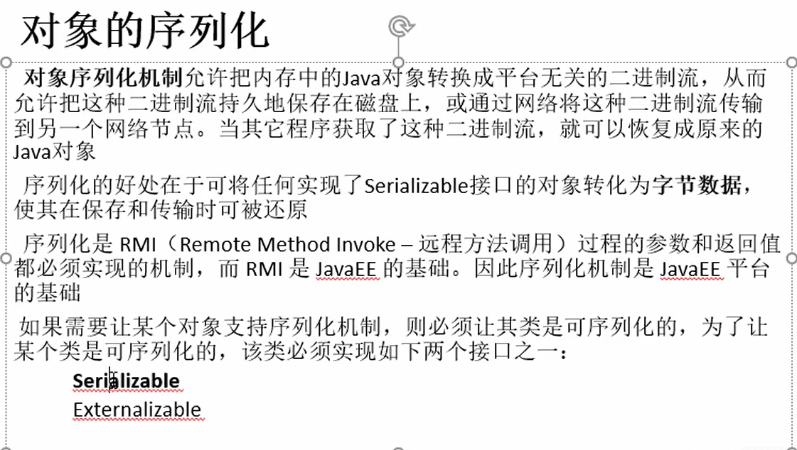

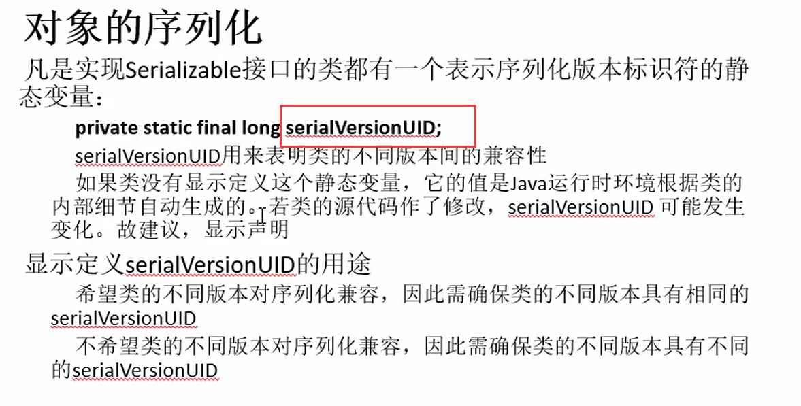

### 9.反射

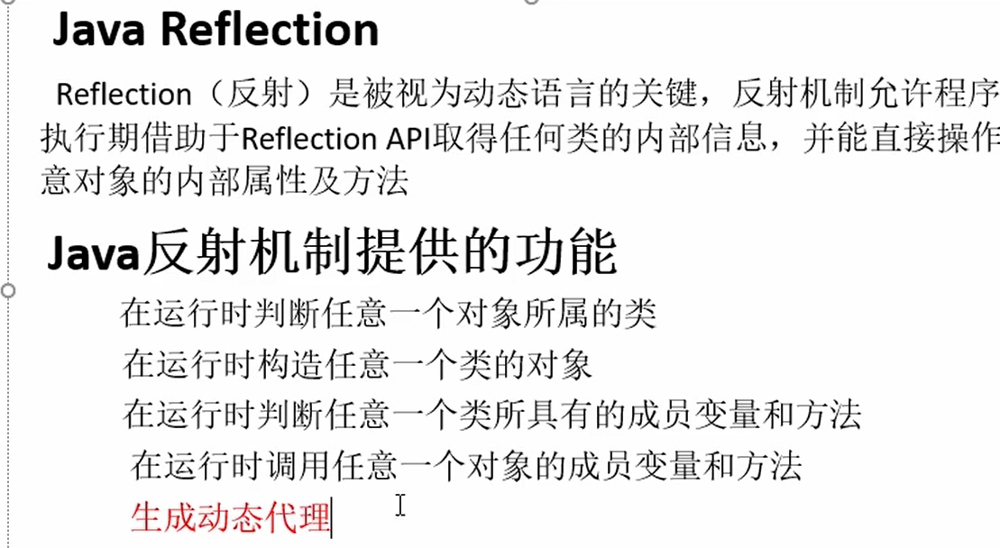


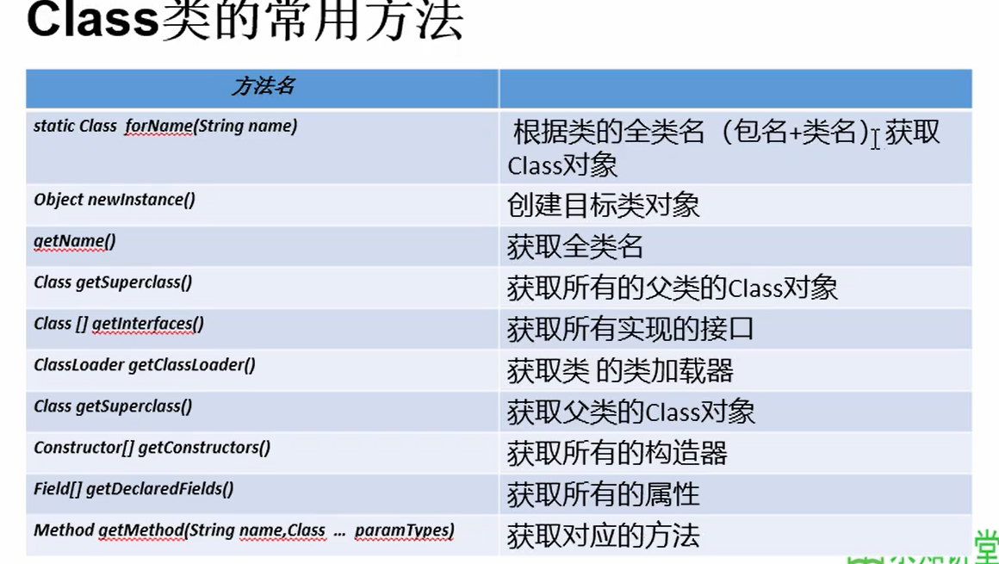

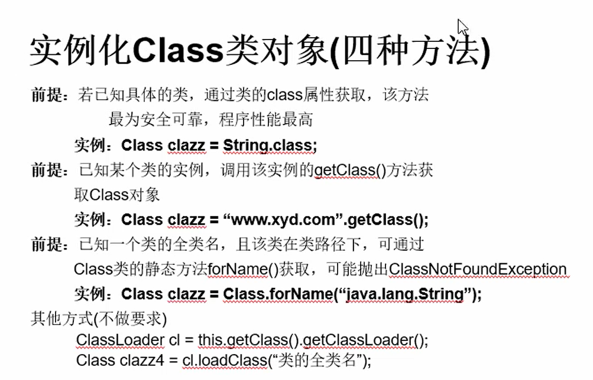

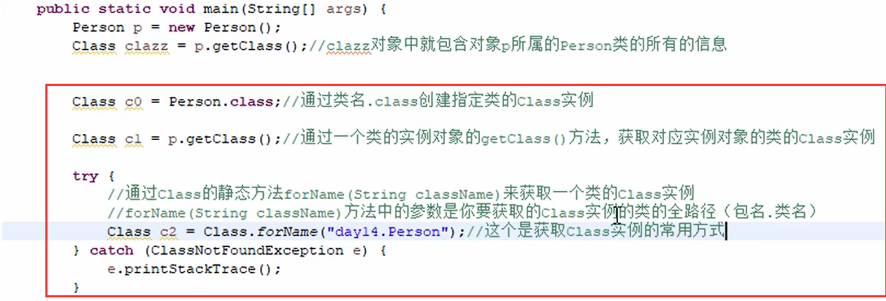

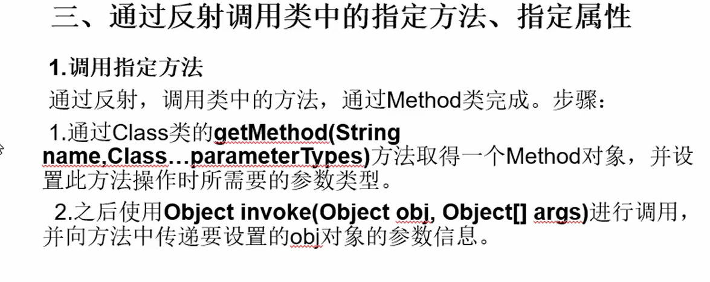

```java
super.getClass().getName()
返回：包名+类名
getClass（）方法是继承自Object类而且没有重写，要返回Date类的名字需要写super.getClass().getSuperclass()
```

### 10.动态代理

动态代理类实现InvocationHandler


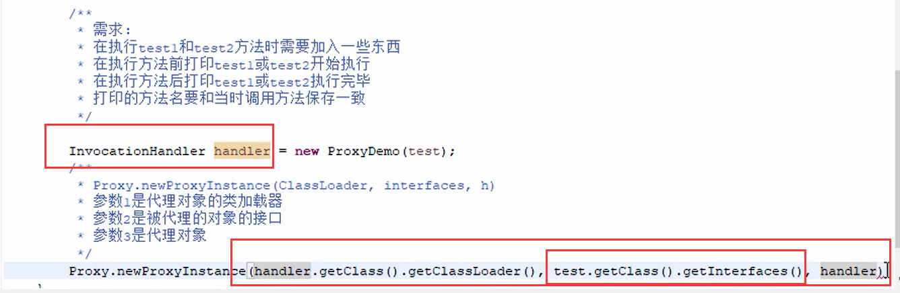

### 11.线程

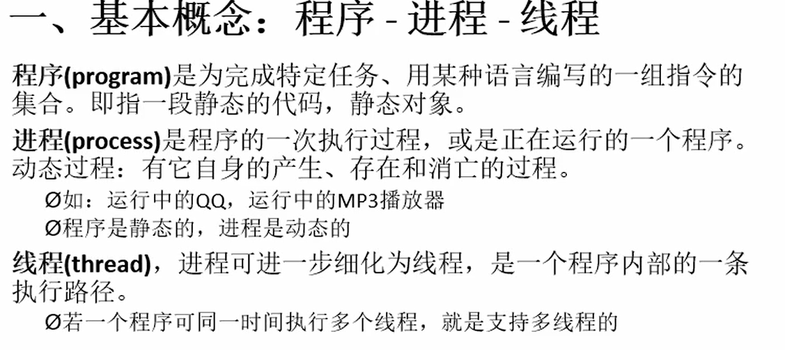

子进程得到的是除了代码段是与父进程共享以外，其他所有的都是得到父进程的一个副本，子进程的所有资源都继承父进程，得到父进程资源的副本，子进程可获得父进程的所有堆和栈的数据，但二者并不共享地址空间。两个是单独的进程，继承了以后二者就没有什么关联了，子进程单独运行；进程的线程之间共享由进程获得的资源，但线程拥有属于自己的一小部分资源，就是栈空间，保存其运行状态和局部自动变量的。

线程之间共享进程获得的数据资源，所以开销小，但不利于资源的管理和保护；而进程执行开销大，但是能够很好的进行资源管理和保护。

线程的通信速度更快，切换更快，因为他们共享同一进程的地址空间。

一个进程可以有多个线程，线程是进程的一个实体，是CPU调度的基本单位。

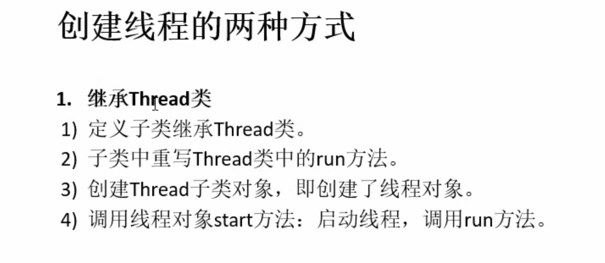

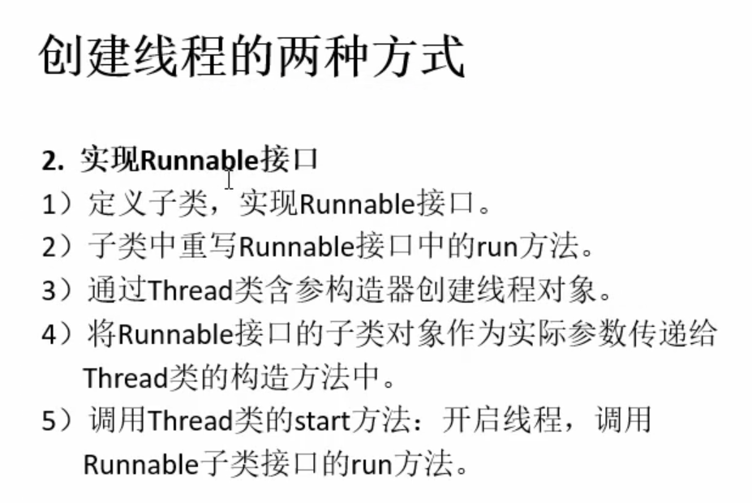

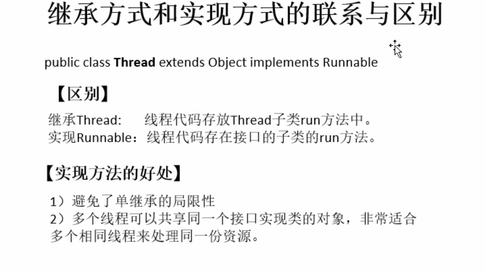

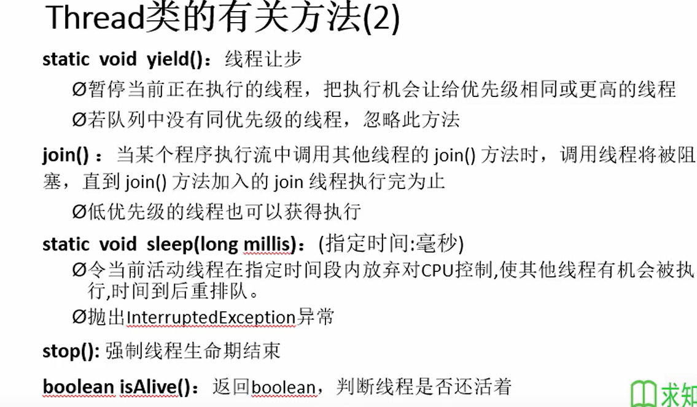

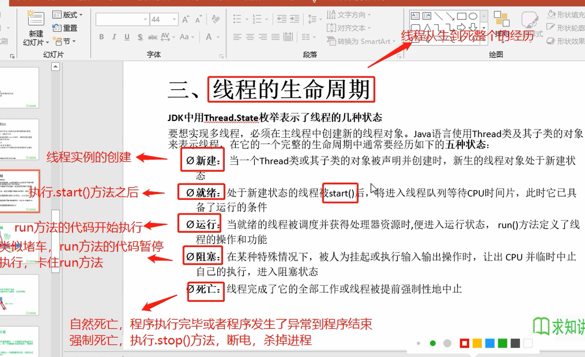

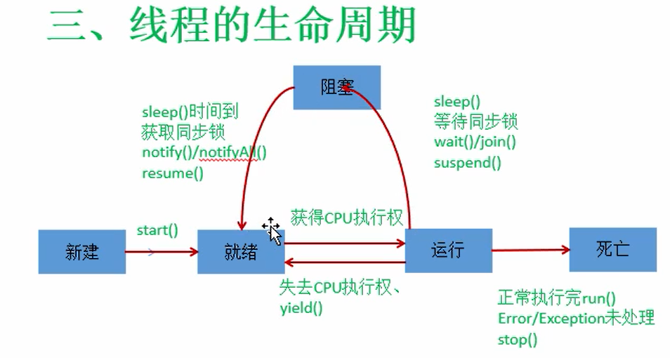

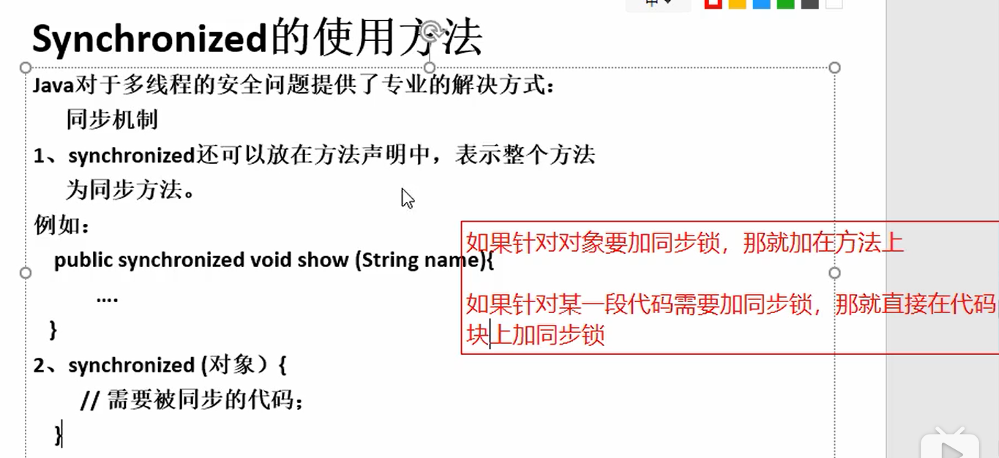

普通方法加同步锁，锁的是当前方法对应的对象，当前==对象==的所有加了同步锁的方法共用一个同步锁

静态方法加同步锁，所有对象共用一个同步锁

代码块加同步锁：当前对象的所有synchronized(this)同步的代码都使用同一个锁；synchronized(a)根据传入不同的对象使用不同的锁

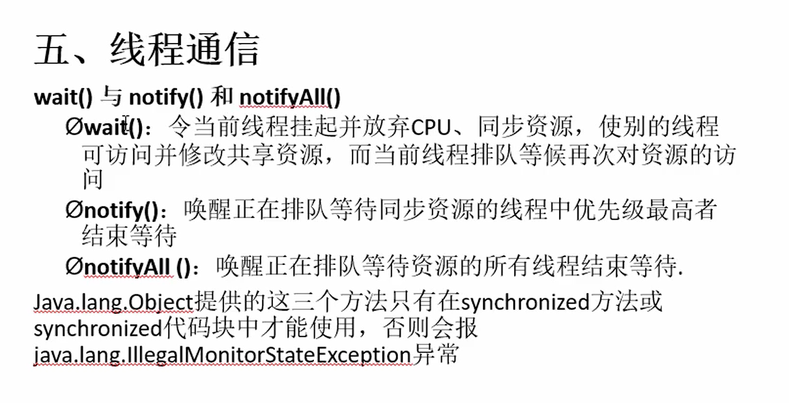

### 12.==GET请求和POST请求==

1.哪一些情况下，浏览器会发送get请求

- a. 直接在浏览器地址栏输入某个地址

- b. 点击链接

- c. 表单默认的提交方式

2.哪一些情况下，浏览器会发送post请求？

- a. 设置表单method = “post”

3.get请求的特点

- a. 请求参数会添加到请求资源路劲的后面，只能添加少量参数（因为请求行只有一行，大约只能存放2K左右的数据）

- b. 请求参数会显示在浏览器地址栏，路由器会记录请求地址

4.post请求的特点

- a. 请求参数添加到实体内容里面，可以添加大量的参数（也解释了为什么浏览器地址栏不能发送post请求，在地址栏里我们只能填写URL，并不能进入到Http包的实体当中）

- b. 相对安全，但是，post请求不会对请求参数进行加密处理（可以使用https协议来保证数据安全）

[更多详情在这里](https://www.zhihu.com/question/28586791)

### 13.上传下载

#### 1.文件上传

- 要有一个 form 标签，method=post 请求
- form 标签的 encType 属性值必须为==multipart/form-data==值
- 在 form 标签中使用 input type=file 添加上传的文件
- 编写服务器代码（Servlet 程序）接收，处理上传的数据。encType=multipart/form-data 表示提交的数据，以多段（每一个表单项一个数据段）的形式进行拼接，然后以二进制流的形式发送给服务器。

```jsp
<form action="http://192.168.31.74:8080/09_EL_JSTL/uploadServlet" method="post"
enctype="multipart/form-data">
用户名：<input type="text" name="username" /> <br>
头像：<input type="file" name="photo" > <br>
<input type="submit" value="上传">
</form>
```

1.1导入jar包

commons-fileupload-1.2.1.jar
commons-io-1.4.jar

1.2解析上传信息

```java
package com.atguigu.servlet;


import org.apache.commons.fileupload.FileItem;
import org.apache.commons.fileupload.FileItemFactory;
import org.apache.commons.fileupload.disk.DiskFileItemFactory;
import org.apache.commons.fileupload.servlet.ServletFileUpload;

import javax.servlet.ServletException;
import javax.servlet.http.HttpServlet;
import javax.servlet.http.HttpServletRequest;
import javax.servlet.http.HttpServletResponse;
import java.io.File;
import java.io.IOException;
import java.util.List;

public class UploadServlet extends HttpServlet {
    /**
     * 用来处理上传的数据
     * @param req
     * @param resp
     * @throws ServletException
     * @throws IOException
     */
    @Override
    protected void doPost(HttpServletRequest req, HttpServletResponse resp) throws ServletException, IOException {

        //1 先判断上传的数据是否多段数据（只有是多段的数据，才是文件上传的）
        if (ServletFileUpload.isMultipartContent(req)) {
//           创建FileItemFactory工厂实现类
            FileItemFactory fileItemFactory = new DiskFileItemFactory();
            // 创建用于解析上传数据的工具类ServletFileUpload类
            ServletFileUpload servletFileUpload = new ServletFileUpload(fileItemFactory);
            try {
                // 解析上传的数据，得到每一个表单项FileItem
                List<FileItem> list = servletFileUpload.parseRequest(req);
                // 循环判断，每一个表单项，是普通类型，还是上传的文件
                for (FileItem fileItem : list) {

                    if (fileItem.isFormField()) {
                        // 普通表单项

                        System.out.println("表单项的name属性值：" + fileItem.getFieldName());
                        // 参数UTF-8.解决乱码问题
                        System.out.println("表单项的value属性值：" + fileItem.getString("UTF-8"));

                    } else {
                        // 上传的文件
                        System.out.println("表单项的name属性值：" + fileItem.getFieldName());
                        System.out.println("上传的文件名：" + fileItem.getName());

                        fileItem.write(new File("e:\\" + fileItem.getName()));
                    }
                }
            } catch (Exception e) {
                e.printStackTrace();
            }
        }

    }

}

```

#### 2.文件下载

response.setHeader("Content-Disposition", "attachment; fileName=1.jpg");这个响应头告诉浏览器。这是需要下载的。而 attachment 表示附件，也就是下载的一个文件。fileName表示下载的文件名

```java
package com.atguigu.servlet;

import org.apache.commons.io.IOUtils;
import sun.misc.BASE64Encoder;

import javax.servlet.ServletContext;
import javax.servlet.ServletException;
import javax.servlet.http.HttpServlet;
import javax.servlet.http.HttpServletRequest;
import javax.servlet.http.HttpServletResponse;
import java.io.IOException;
import java.io.InputStream;
import java.io.OutputStream;
import java.net.URLEncoder;

public class Download extends HttpServlet {


    @Override
    protected void doGet(HttpServletRequest req, HttpServletResponse resp) throws ServletException, IOException {
//        1、获取要下载的文件名
        String downloadFileName = "2.jpg";
//        2、读取要下载的文件内容 (通过ServletContext对象可以读取)
        ServletContext servletContext = getServletContext();
        // 获取要下载的文件类型/file/文件所在路径
        String mimeType = servletContext.getMimeType("/file/" + downloadFileName);
        System.out.println("下载的文件类型：" + mimeType);
//        4、在回传前，通过响应头告诉客户端返回的数据类型
        resp.setContentType(mimeType);
//        5、还要告诉客户端收到的数据是用于下载使用（还是使用响应头）
        // Content-Disposition响应头，表示收到的数据怎么处理
        // attachment表示附件，表示下载使用
        // filename= 表示指定下载的文件名
        // url编码是把汉字转换成为%xx%xx的格式
        if (req.getHeader("User-Agent").contains("Firefox")) {
            // 如果是火狐浏览器使用Base64编码
            resp.setHeader("Content-Disposition", "attachment; filename==?UTF-8?B?" + new BASE64Encoder().encode("中国.jpg".getBytes("UTF-8")) + "?=");
        } else {
0            // 如果不是火狐，是IE或谷歌，使用URL编码操作
            resp.setHeader("Content-Disposition", "attachment; filename=" + URLEncoder.encode("中国.jpg", "UTF-8"));
        }
        /**
         * /斜杠被服务器解析表示地址为http://ip:prot/工程名/  映射 到代码的Web目录
         */
        InputStream resourceAsStream = servletContext.getResourceAsStream("/file/" + downloadFileName);
        // 获取响应的输出流
        OutputStream outputStream = resp.getOutputStream();
        //        3、把下载的文件内容回传给客户端
        // 读取输入流中全部的数据，复制给输出流，输出给客户端
        IOUtils.copy(resourceAsStream, outputStream);
    }
}

```


### 14.接口和抽象类

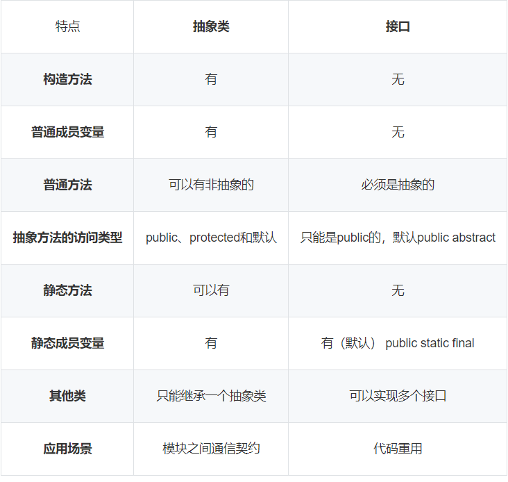	

 JDK 1.8时，抽象类的方法默认访问权限变为default 

 JDK 1.8时，接口中的方法可以是public的，也可以是default的 

### 15.静态内部类，成员内部类，局部 内部类，匿名内部类

类方法：static修饰的方法 


  

### 16.变量初始化赋值

类变量在不设置初始值时，会进行默认值赋值，而==局部方法中==声明的变量则必须进行初始化，他不会进行默认值赋值。

 被static修饰的变量称为静态变量，静态变量属于整个类，而局部变量属于方法，只在该方法内有效，所以static不能修饰局部变量  

### 17.访问修饰符大小

	

### 18.操作符


```java
//1、&   与运算  二进制中，只有同为1才是1		a &= b;		System.out.println("a: "+a);
```


```java
//2、|   非运算  二进制中只要一个为1就为1		a = 4;		b = 2;		a |= b;		System.out.println("a: "+a);
```


```java
//3、^   异或运算  二进制中只要是两者的值不一样那么就是1		a = 4;		b = 2;		a ^= b;		System.out.println("a: "+a);
```


```java
//4、<<  移位运算    左移运算符，num << 1,相当于num乘以2		a = 4;		b = 2;		a <<= b;		System.out.println("a: "+a);
```


```java
//5、>>   移位运算   右移运算符，num >> 1,相当于num除以2		a = 4;		b = 2;		a >>= b;		System.out.println("a: "+a);
```


```java
//6、~   非运算  二进制所有的位数取反;		 -n=~n+1可推出~n=-n-1，所以~10=-11再加5结果为-6 
```


```java
//7、>>>   移位运算  二进制统一向右移 b位，左边不管是什么都用0代替，这是与 >>的区别;		a = 4;		b = 2;		a >>>= b;		System.out.println("a: "+a+" b: "+b);		System.out.println(8>>>1);
```

### 19.Socket的交互

	

### 20.Java8接口修饰符

Java8的接口方法可以有如下定义

only ==public, abstract, default, static== and strictfp are permitted

### 21.Object中的方法

> Object 类中方法及说明如下：
>
> registerNatives()  //私有方法
>
> getClass()  //返回此 Object 的运行类。
> hashCode()  //用于获取对象的哈希值。
> equals(Object obj)   //用于确认两个对象是否“相同”。
> clone()  //创建并返回此对象的一个副本。
> toString()  //返回该对象的字符串表示。  
> notify()  //唤醒在此对象监视器上等待的单个线程。  
> notifyAll()   //唤醒在此对象监视器上等待的所有线程。  
> wait(long timeout)  //在其他线程调用此对象的 notify() 方法或 notifyAll() 方法，或    者超过指定的时间量前，导致当前线程等待。  
> wait(long timeout, int nanos)  //在其他线程调用此对象的 notify() 方法或 notifyAll() 方法，或者其他某个线程中断当前线程，或者已超过某个实际时间量前，导致当前线程等待。
> wait()  //用于让当前线程失去操作权限，当前线程进入等待序列
> finalize()  //当垃圾回收器确定不存在对该对象的更多引用时，由对象的垃圾回收器调用此方法。

### 22.集合结构

	

	

### 23.异常

 	

\1. 粉红色的是受检查的异常(checked exceptions),其必须被 try{}catch语句块所捕获,或者在方法签名里通过throws子句声明.受检查的异常必须在编译时被捕捉处理,命名为 Checked Exception 是因为Java编译器要进行检查,Java虚拟机也要进行检查,以确保这个规则得到遵守.

\2. 绿色的异常是运行时异常(runtime exceptions),需要程序员自己分析代码决定是否捕获和处理,比如 空指针,被0除...

\3. 而声明为Error的，则属于严重错误，如系统崩溃、虚拟机错误、动态链接失败等，这些错误无法恢复或者不可能捕捉，将导致应用程序中断，Error不需要捕捉。 

### 24.i=i++与i=++i的坑

> Java使用了中间缓存变量机制：
> i=i++;等同于：
> temp=i； (等号右边的i)
> i=i+1;    (等号右边的i)
> i=temp;  (等号左边的i)
> 而i=++i;则等同于：
> i=i+1;
> temp=i;
> i=temp; 

### 25.常用ASCII码

 常用ASCII码值：空格为32；数字0为48；“A”为65；“a”值为97。 

## 26.常用命令

查看被占用端口对应的 PID

```
netstat -aon|findstr "8081"
```

 查看指定 PID 的进程

```
tasklist|findstr "9088"
```

结束进程

```
taskkill /T /F /PID 9088 
```

查看当前线程情况查看堆栈信息

```
jconsole
```

top中最高占用CPU的PID

```
top -p 24212 -H
```

`chattr`目录不能保护`/`, `/dev`, `/tmp`, `/var`等目录，`lsattr`可以显示chattr目录设置的文件属性。

chattr命令的用法：

```javascript
chattr [ -RVf ] [ -v version ] [ mode ] files…
```

最关键的是在[mode]部分，[mode]部分是由+-=和[ASacDdIijsTtu]这些字符组合的，这部分是用来控制文件的属性。

```javascript
+ ：在原有参数设定基础上，追加参数。
- ：在原有参数设定基础上，移除参数。
= ：更新为指定参数设定。
A：文件或目录的 atime (access time)不可被修改(modified), 可以有效预防例如手提电脑磁盘I/O错误的发生。
S：硬盘I/O同步选项，功能类似sync。
a：即append，设定该参数后，只能向文件中添加数据，而不能删除，多用于服务器日志文件安全，只有root才能设定这个属性。
c：即compresse，设定文件是否经压缩后再存储。读取时需要经过自动解压操作。
d：即no dump，设定文件不能成为dump程序的备份目标。
i：设定文件不能被删除、改名、设定链接关系，同时不能写入或新增内容。i参数对于文件 系统的安全设置有很大帮助。
j：即journal，设定此参数使得当通过mount参数：data=ordered 或者 data=writeback 挂 载的文件系统，文件在写入时会先被记录(在journal中)。如果filesystem被设定参数为 data=journal，则该参数自动失效。
s：保密性地删除文件或目录，即硬盘空间被全部收回。
u：与s相反，当设定为u时，数据内容其实还存在磁盘中，可以用于undeletion。
各参数选项中常用到的是a和i。a选项强制只可添加不可删除，多用于日志系统的安全设定。而i是更为严格的安全设
```

