## Java基础

### 1.重载

方法名称一样参数不同


### 2.数组

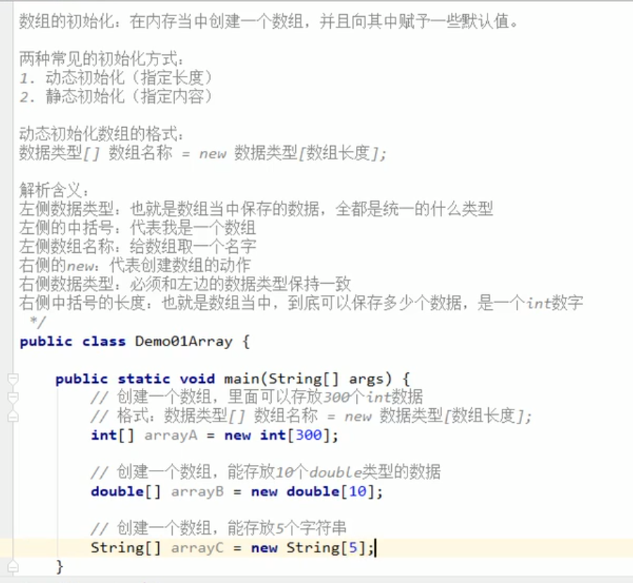

### 3.三元运算符，位运算符

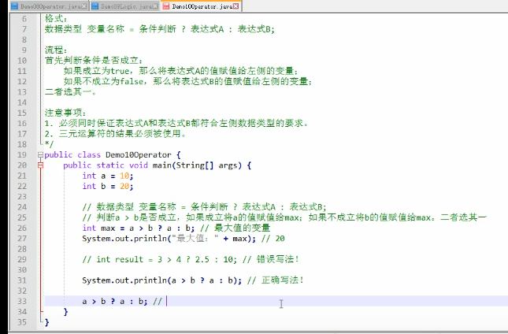	


### 4.API

	

### 5.多态

- 多态，简而言之就是==同一个行为具有多个不同表现形式或形态的能力==。
- 多态的分类：运行时多态( 重写式多态 )和编译时多态( 重载式多态 )。
- 运行时多态的前提：继承（实现），重写，向上转型
- 向上转型与向下转型。
- 继承链中对象方法的调用的优先级：this.show(O)、super.show(O)、this.show((super)O)、super.show((super)O)。


重载式多态，也叫编译时多态。也就是说这种多态再编译时已经确定好了。重载大家都知道，方法名相同而参数列表不同的一组方法就是重载。在调用这种重载的方法时，通过传入不同的参数最后得到不同的结果。

同一个行为具有多个不同表现形式或形态的能力就是多态，所以我认为重载也是一种多态

重写式多态，也叫运行时多态。这种多态通过动态绑定（dynamic binding）技术来实现，是指在执行期间判断所引用对象的实际类型，根据其实际的类型调用其相应的方法。也就是说，只有程序运行起来，你才知道调用的是哪个子类的方法。
这种多态通过函数的重写以及向上转型来实现，我们上面代码中的例子就是一个完整的重写式多态。我们接下来讲的所有多态都是重写式多态，因为它才是面向对象编程中真正的多态。

#### 5.1向上转型(把子类对象给父类引用)

- 减少重复代码，使代码变得简洁。
- 提高系统扩展性


#### 5.2向下转型(把父类对象转为子类对象)

```java
//还是上面的animal和cat dog
Animal a = new Cat();
Cat c = ((Cat) a);
c.eat();
//输出  我吃鱼
Dog d = ((Dog) a);
d.eat();
// 报错 ： java.lang.ClassCastException：com.chengfan.animal.Cat cannot be cast to com.chengfan.animal.Dog
Animal a1 = new Animal();
Cat c1 = ((Cat) a1);
c1.eat();
// 报错 ： java.lang.ClassCastException：com.chengfan.animal.Animal cannot be cast to com.chengfan.animal.Cat
```

为什么第一段代码不报错呢？相比你也知道了，因为a本身就是Cat对象，所以它理所当然的可以向下转型为Cat，也理所当然的不能转为Dog，你见过一条狗突然就变成一只猫这种操蛋现象？

而a1为Animal对象，它也不能被向下转型为任何子类对象。比如你去考古，发现了一个新生物，知道它是一种动物，但是你不能直接说，啊，它是猫，或者说它是狗。

- 向下转型的前提是父类对象指向的是子类对象（也就是说，在向下转型之前，它得先向上转型）
- 向下转型只能转型为本类对象（猫是不能变成狗的）。

#### 5.3经典案例分析

[多态案例分析]()

注意： 当父类对象引用变量引用子类对象时，被引用对象的类型决定了调用谁的成员方法，引用变量类型决定可调用的方法。如果子类中没有覆盖该方法，那么会去父类中寻找。 (即父类确定引用范围，子类确定引用类型)

```java
class A {
    public String show(D obj) {
        return ("A and D");
    }

    public String show(A obj) {
        return ("A and A");
    }

}

class B extends A{
    public String show(B obj){
        return ("B and B");
    }

    public String show(A obj){
        return ("B and A");
    }
}

class C extends B{

}

class D extends B{

}

public class Demo {
    public static void main(String[] args) {
        A a1 = new A();
        A a2 = new B();
        B b = new B();
        C c = new C();
        D d = new D();

        System.out.println("1--" + a1.show(b));
        System.out.println("2--" + a1.show(c));
        System.out.println("3--" + a1.show(d));
        System.out.println("4--" + a2.show(b));
        System.out.println("5--" + a2.show(c));
        System.out.println("6--" + a2.show(d));
        System.out.println("7--" + b.show(b));
        System.out.println("8--" + b.show(c));
        System.out.println("9--" + b.show(d));
    }
}
//结果：
//1--A and A
//2--A and A
//3--A and D
//4--B and A
//5--B and A
//6--A and D
//7--B and B
//8--B and B
//9--A and D

```

```java
a2.show()分析:
首先，a2是类型为A的引用类型，它指向类型为B的对象。A确定可调用的方法：show(D obj)和show(A obj)。
a2.show(b) ==> this.show(b)，这里this指的是B。
然后.在B类中找show（B obj），找到了，可惜没用，因为show（B obj）方法不在可调用范围内，this.show(O)失败，进入下一级别：super.show(O)，super指的是A。
在A 中寻找show（B obj)，失败，因为没用定义这个方法。进入第三级别：this.show((super)O)，this指的是B。
在B中找show（（A）O）,找到了：show(A obj)，选择调用该方法。
输出：B and A
```

- 先方法，后对象
- this.show(O)、super.show(O)、this.show((super)O)、super.show((super)O)

### 6.集合

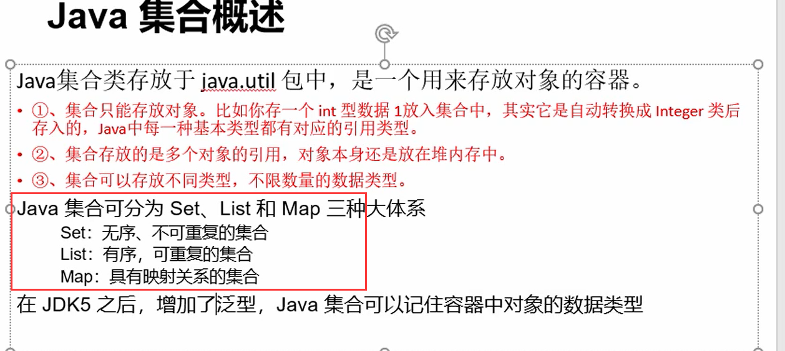

#### 6.1HashSet

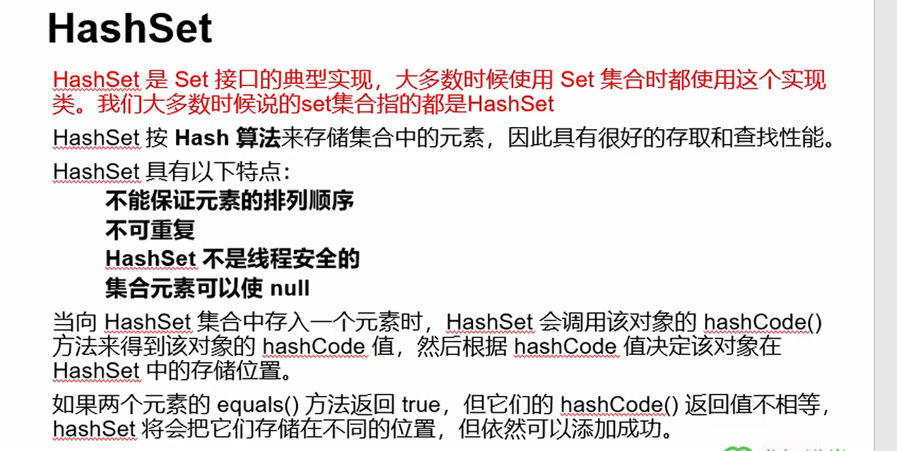

#### 6.2TreeSet

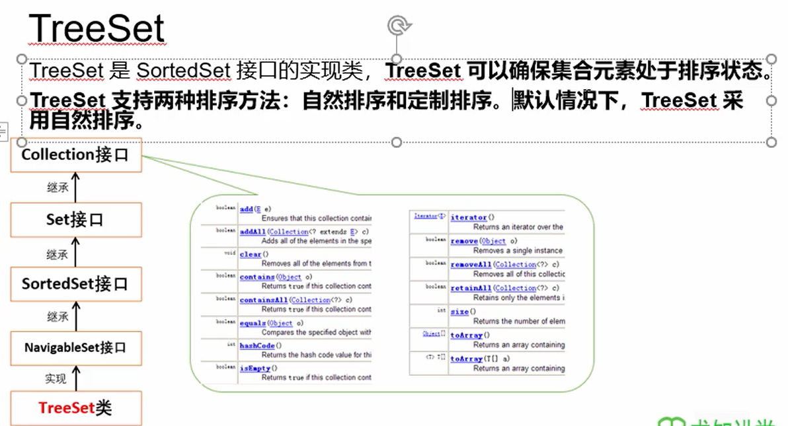

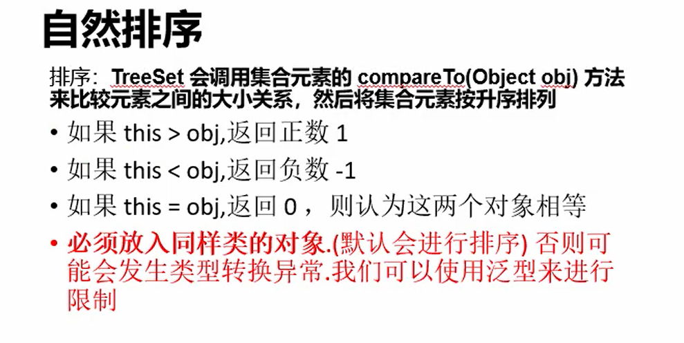

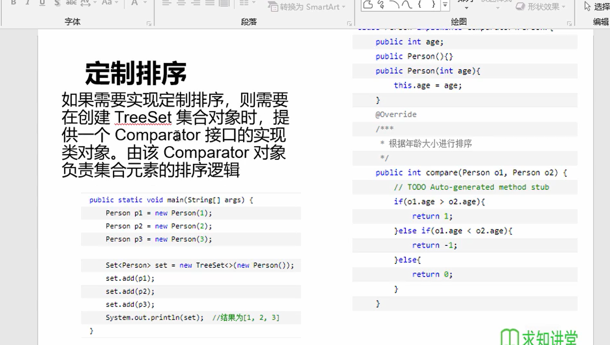

#### 6.3List


ArrayList线程不安全。

#### 6.4HashMap

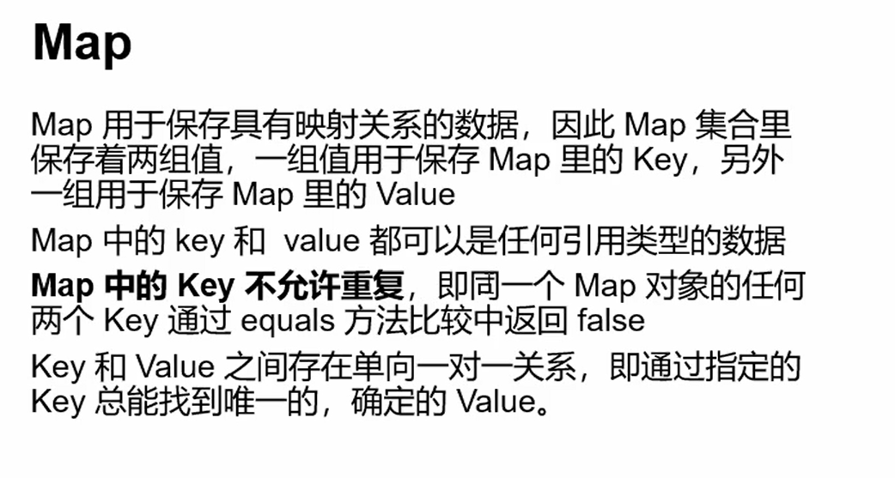

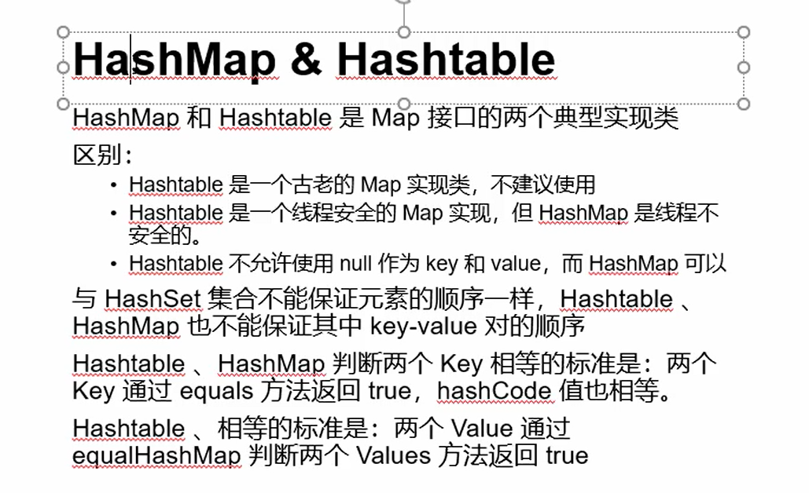

Map集合的遍历


第一种遍历效率较低

#### 6.5TreeMap

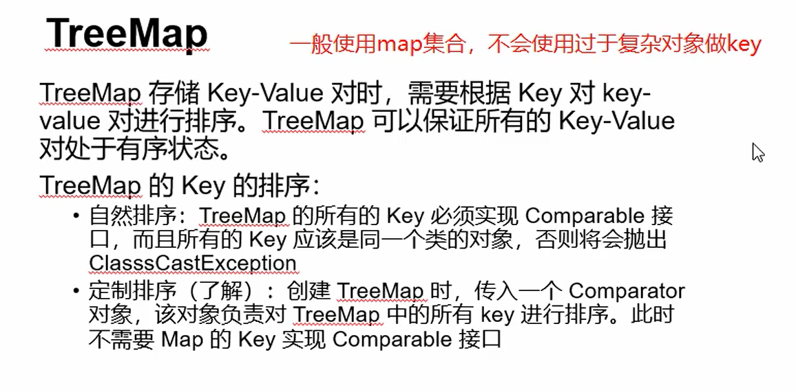

### 7.泛型


### 8.Anntation注解

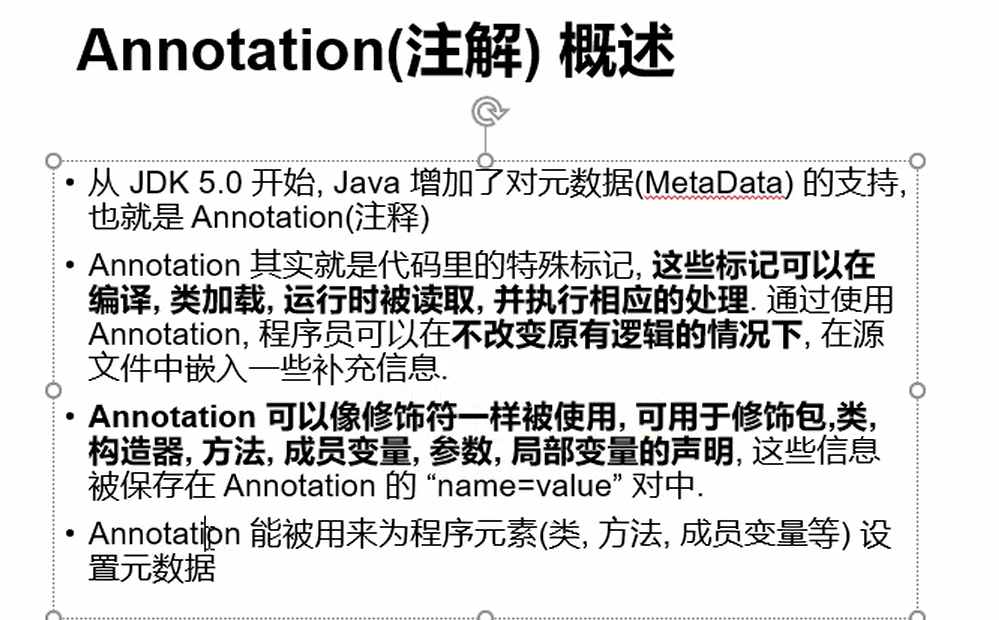

### 8.文件io操作

流的分类

外部输入，内部输出

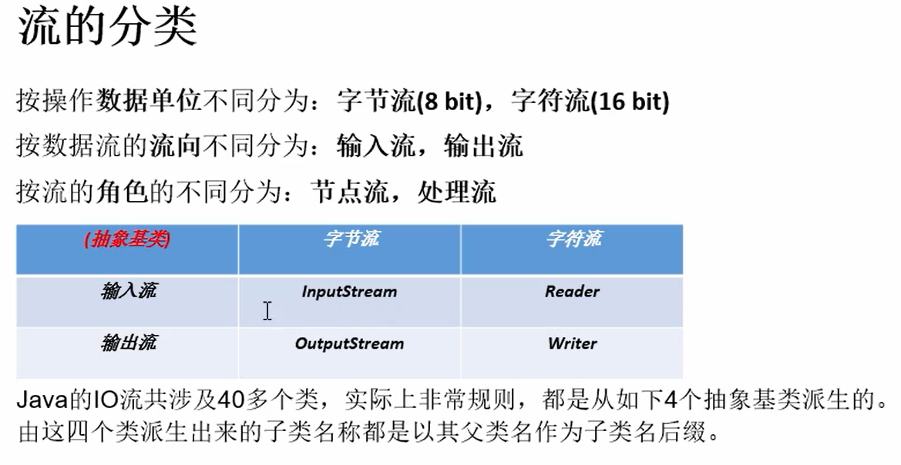

#### 8.1==字节流==

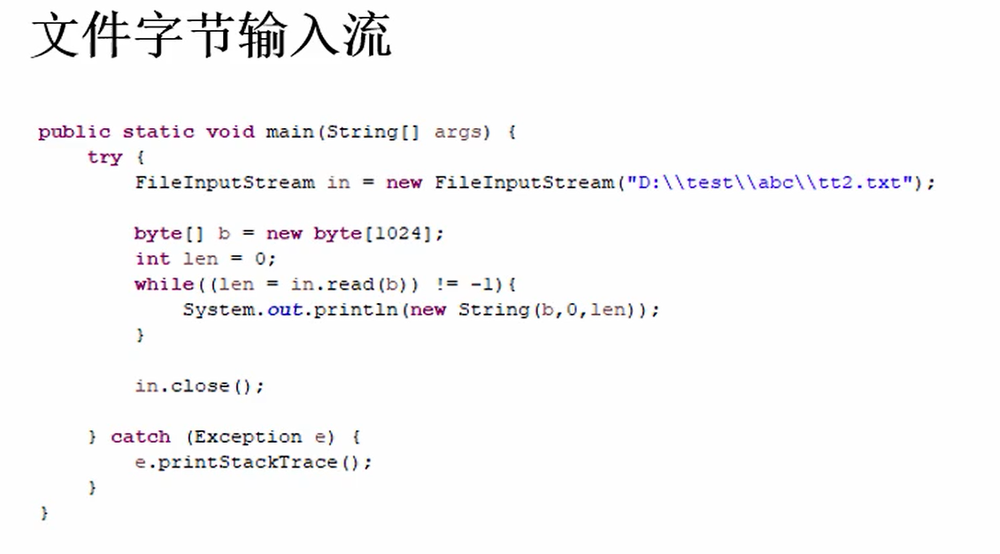

```java
	//字节流输入
			// 创建文件
		File f = new File("E:/TEST/io.txt");
		if (!f.exists()) {// 当文件不存在的时候进入创建
			// 创建文件
			try {
				f.createNewFile();
				System.out.println("文件创建成功");
			} catch (IOException e) {
				// TODO Auto-generated catch block
				e.printStackTrace();
			}
		} else {
			System.out.println("文件已存在");
		}

		// 通过FileInputstream来进行读字节流，读到内存中（磁盘到内存）
		FileInputStream fis = null;
		try {
			fis = new FileInputStream(f);
			int n = 0;// 实际读取到的字节数
			// 定义一个byte数组当做缓冲区
			byte[] bytes = new byte[1024];
			//循环读取
			while ((n = fis.read(bytes)) != -1) {// 可以读，未达到可读取上限
				// 将其转化成字符串
				String s = new String(bytes, 0, n);
				System.out.println(s);
			}

		} catch (FileNotFoundException e) {
			// TODO Auto-generated catch block
			e.printStackTrace();
		} finally {
			try {
				fis.close();
			} catch (Exception e) {
				// TODO Auto-generated catch block
				e.printStackTrace();
			}
		}

	}
```


```java
//字节流输出
public static void main(String[] args) throws IOException {
		// TODO Auto-generated method stub
		File f = new File("E:/TEST/io.txt");
		if (!f.exists()) {
			try {
				f.createNewFile();
			} catch (IOException e) {
				// TODO Auto-generated catch block
				e.printStackTrace();
			}
		} else {
			System.out.println("文件已存在,写入的内容将覆盖原内容");
		}

		// 通过FileOutputStream输出内容
		FileOutputStream fos = null;
		try {
			fos = new FileOutputStream(f);

			String s1 = "这是iodemo2的输出文件\r\n";// \r\n换行符
			String s2 = "测试换行的文字123qw!";
			// 把String->byte数组
			fos.write(s1.getBytes());
			fos.write(s2.getBytes());
			System.out.println("写入成功");
		} catch (FileNotFoundException e) {
			// TODO Auto-generated catch block
			e.printStackTrace();
		} finally {
			try {
				fos.close();
			} catch (IOException e) {
				// TODO Auto-generated catch block
				e.printStackTrace();
			}
		}
	}
```


#### 8.2==字符流==

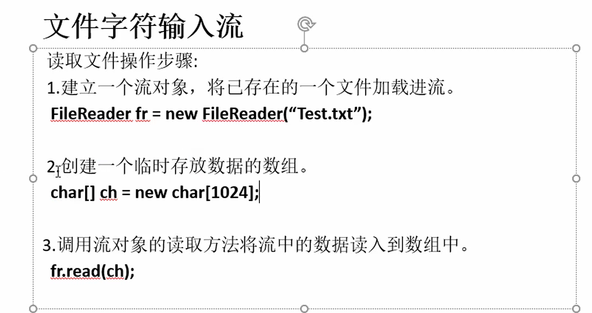

#### 8.3==缓冲流==


```java
//字符流缓冲
public static void main(String[] args) {
		// TODO Auto-generated method stub
		// 先定义一个BufferedReader
		BufferedReader br = null;
		// 定义一个BufferedWriter
		BufferedWriter bw = null;
		// 先写入内存，再从内存中输出
		try {
			// 因为BufferedWriter,Reader比FileWriter,Reader高级所以先创建低级对象，再用高级调用
			FileReader fr = new FileReader("E:/TEST/字符流.txt");// 创建输入流文件
			br = new BufferedReader(fr);
			FileWriter fw = new FileWriter("E:/TEST2/输出2.txt");// 创建输出流文件
			bw = new BufferedWriter(fw);
			String s = "";
          // 循环读入
			while ((s = br.readLine()) != null) {
          // 输出内容
				bw.write(s + "\r\n");// 让输出的每一行换行
			}
		} catch (Exception e) {
			// TODO: handle exception
		} finally {
			try {
				br.close();
				bw.close();
			} catch (IOException e) {
				// TODO Auto-generated catch block
				e.printStackTrace();
			}
		}
	}
```

#### 8.4转换流


#### 8.5记事本

```java
public class notepad extends JFrame implements ActionListener {
	// 创建文本域
	JTextArea jta = null;
	// 创建菜单条
	JMenuBar jmb = null;
	// 创建菜单
	JMenu jm = null;
	// 创建Item(子菜单)
	JMenuItem jmi1 = null;
	JMenuItem jmi2 = null;

	public static void main(String[] args) {
		notepad nd = new notepad();
	}

	// 初始化
	public notepad() {
		// 设置文本域
		jta = new JTextArea();
		// 创建菜单条,菜单,子菜单
		jmb = new JMenuBar();
		jm = new JMenu("文件");
		jmi1 = new JMenuItem("打开");
		// 注册监听
		jmi1.addActionListener(this);
		jmi1.setActionCommand("open");
		// 设置助记符
		jmi1.setMnemonic('F');// 按alt+f自动展开
		jmi2 = new JMenuItem("保存");
		// 注册监听
		jmi2.addActionListener(this);
		jmi2.setActionCommand("save");

		// 将菜单条加入文本域
		this.setJMenuBar(jmb);
		// 将菜单加入菜单条
		jmb.add(jm);
		// 将子菜单加入菜单
		jm.add(jmi1);
		jm.add(jmi2);

		// 将jta加入JFrame
		this.add(jta);
		// 设置大小
		this.setSize(400, 300);
		this.setTitle("我的记事本");
		this.setVisible(true);
		this.setDefaultCloseOperation(JFrame.EXIT_ON_CLOSE);
	}

	@Override
	public void actionPerformed(ActionEvent e) {
		// TODO Auto-generated method stub
		// 检测按下按钮是否是open
		if (e.getActionCommand().equals("open")) {

			// JFileChooser文件选择组件
			// 创建组件
			JFileChooser jfs = new JFileChooser();
			// 设置组件名字
			jfs.setDialogTitle("保存为:");
			// 设置默认方式打开
			jfs.showOpenDialog(null);
			// 设置组件可见
			jfs.setVisible(true);
			// 得到用户选择的文件的绝对路径
			String Filename = jfs.getSelectedFile().getAbsolutePath();

			// 读取文件
			FileReader fr = null;
			BufferedReader br = null;
			try {
				fr = new FileReader(Filename);
				br = new BufferedReader(fr);
				// 循环读入
				String s = "";
				String lastCont = "";
				while ((s = br.readLine()) != null) {
					// 换行符
					lastCont += s + "\r\n";
				}
				// 将内容输入到文本域
				jta.setText(lastCont);
			} catch (Exception e2) {
				// TODO: handle exception
				e2.printStackTrace();
			} finally {// 关闭流
				try {
					fr.close();
					br.close();
				} catch (IOException e1) {
					// TODO Auto-generated catch block
					e1.printStackTrace();
				}
			}
		}

		// 检测按下按钮是否是save
		else if (e.getActionCommand().equals("save")) {
			// 创建文件选择组件
			JFileChooser jfs = new JFileChooser();
			// 创建文件名字
			jfs.setDialogTitle("保存在");
			// 设置默认打开
			jfs.showSaveDialog(null);
			// 设置可见
			jfs.setVisible(true);

			// 设置用户选择保存文件的绝对路径
			String file = jfs.getSelectedFile().getAbsolutePath();

			// 输出到指定文件
			FileWriter fw = null;
			BufferedWriter bw = null;
			try {
				fw = new FileWriter(file);
				bw = new BufferedWriter(fw);

				bw.write(this.jta.getText());
			} catch (Exception e2) {
				// TODO: handle exception
				e2.printStackTrace();
			} finally {
				try {// 关闭流
					bw.close();
					fw.close();
				} catch (Exception e3) {
					// TODO: handle exception
					e3.printStackTrace();
				}
			}

		}
	}
}
```

#### 8.6序列化与反序列化


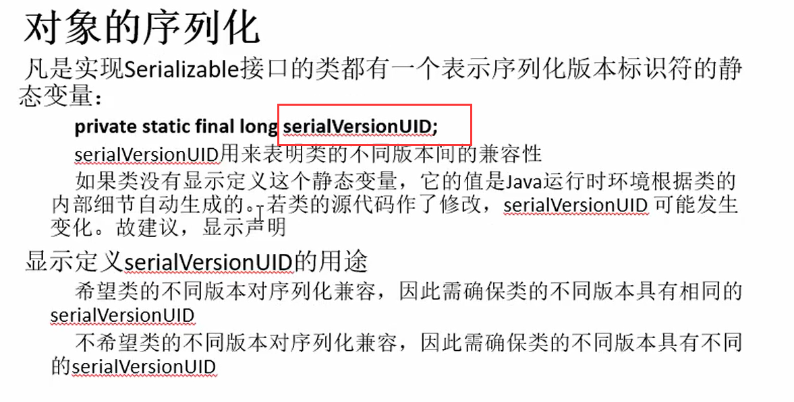

### 9.反射

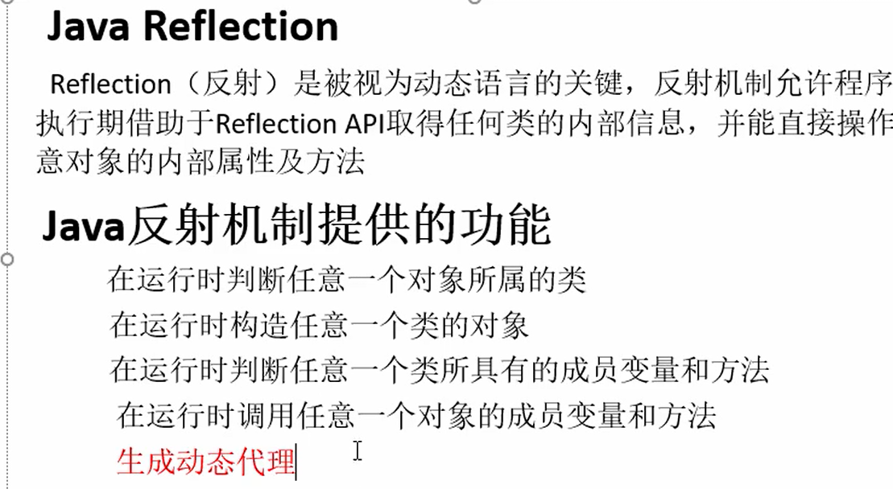

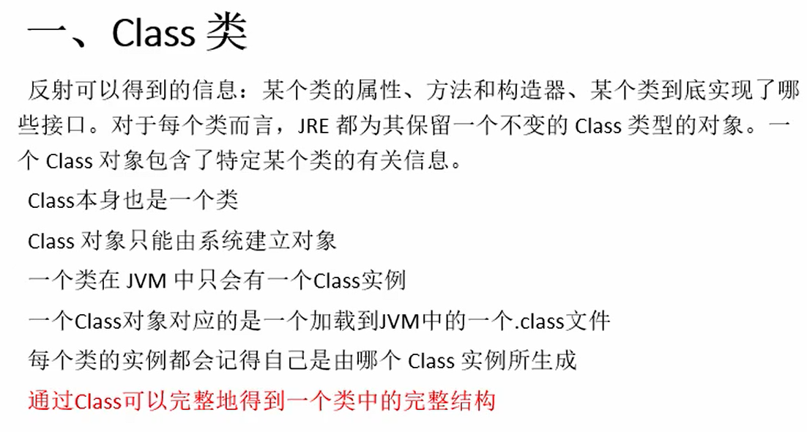

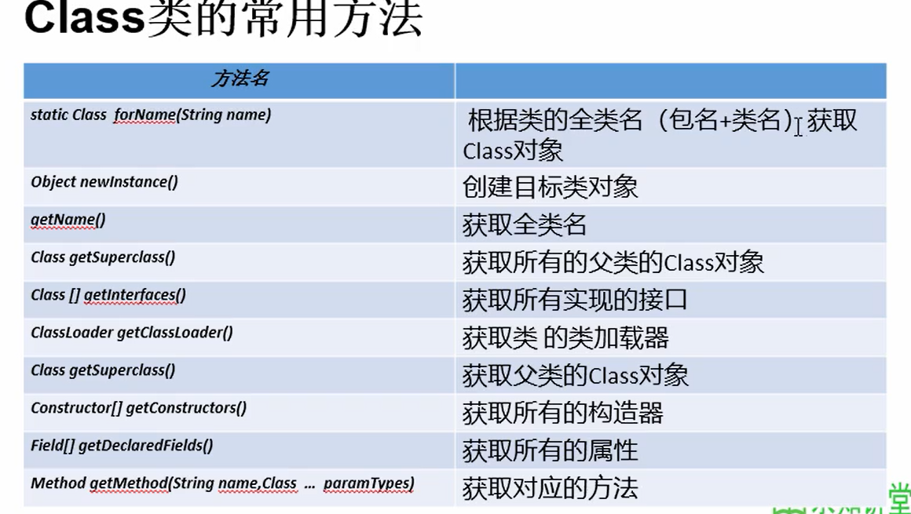

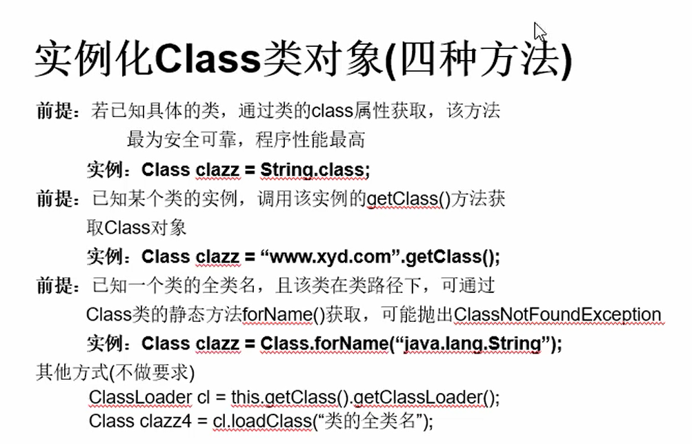


### 10.动态代理

动态代理类实现InvocationHandler


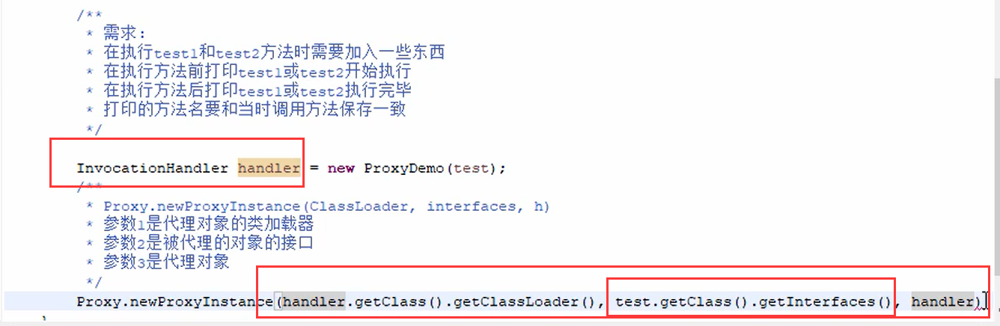

### 11.线程

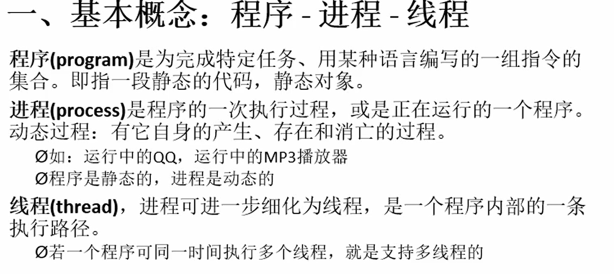

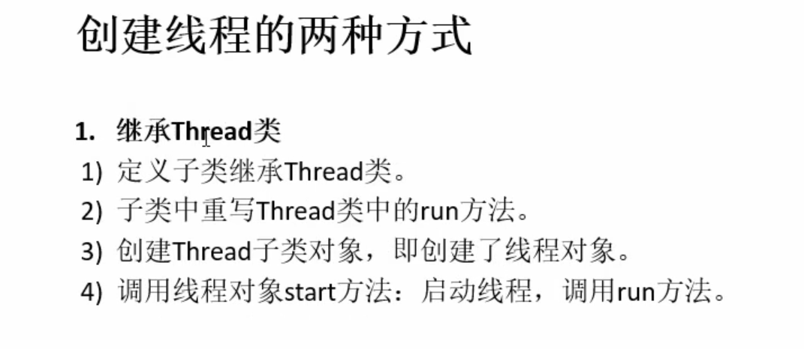

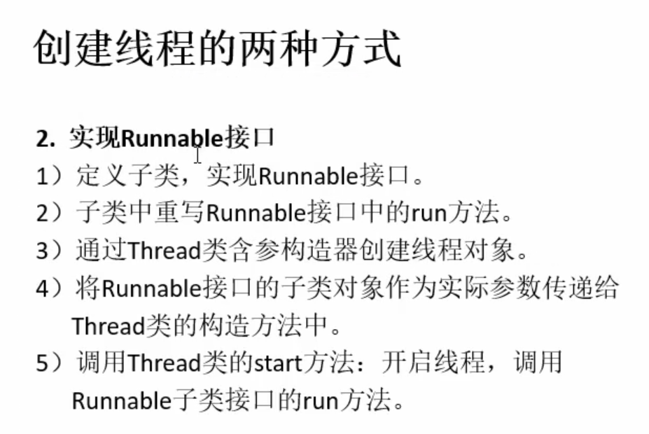

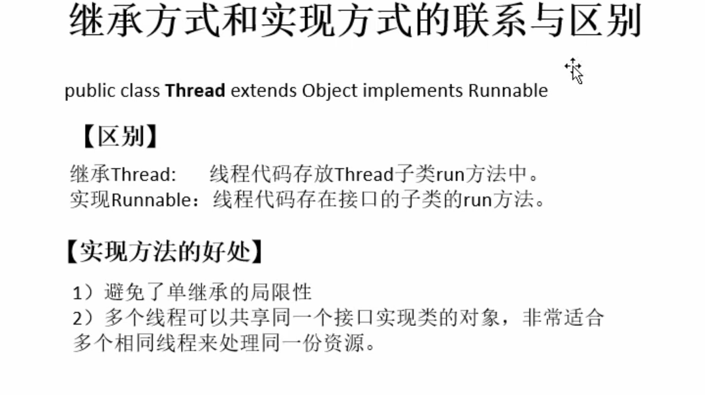


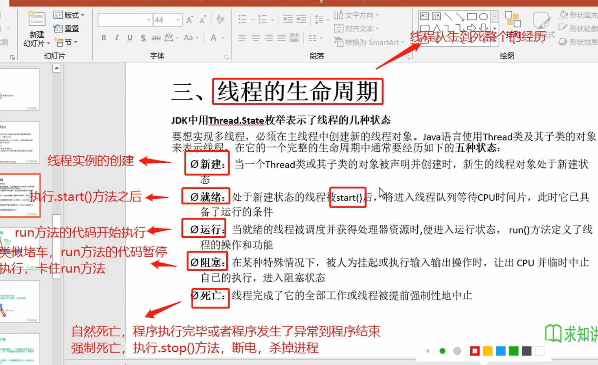


普通方法加同步锁，锁的是当前方法对应的对象，当前==对象==的所有加了同步锁的方法共用一个同步锁

静态方法加同步锁，所有对象共用一个同步锁

代码块加同步锁：当前对象的所有synchronized(this)同步的代码都使用同一个锁；synchronized(a)根据传入不同的对象使用不同的锁

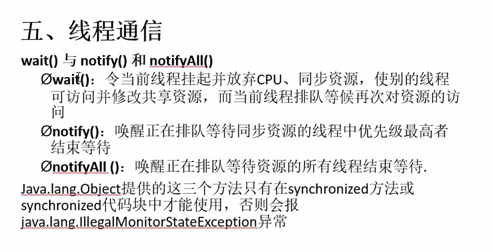

