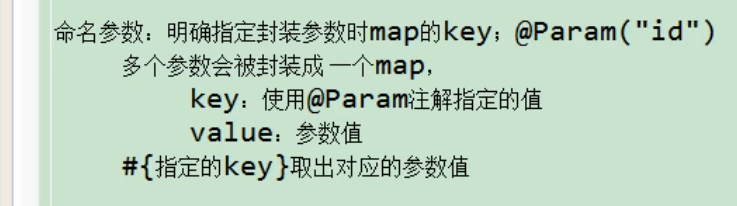

#  Mybatis

## 主要内容:（增删改查，动态sql，缓存，实现原理，插件）

## 一.Mybatis基本属性

### 1.概述

Mybatis是一个半自动化的持久层框架，它的优点在于sql和java编码分开，功能边界清晰，一个专注业务，一个专注数据

### 2.Mybatis全局配置文件

#### 1.配置mybatis配置

##### (1).mybatis的配置文件

###### 基于xml配置基本的mybatis配置

namespace是名称空间即调用名


###### 基于接口配置的mybatis配置

配置接口


使用接口映射


##### (2).将配置文件映射到全局配置文件中


##### (3).通过SqlSessionFactory实现方法

根据xml配置文件(全局配置文件)创建一个SqlSessionFactory对象

```java
public SqlSessionFactory getSqlSessionFactory(){
    //定义Mybaitis全局配置文件
	String resource="mybatis全局配置文件"
    //通过Inputstream流将mybatis文件写入
	InputStream in=Resources.getResourceAsStream(resource);
    //反射创建SqlSessionFactory对象
	return new SqlSessionFactoryBuilder().build(in);
}
```


### 3.Mybatis的属性

#### 1.properties属性

引入外部properties配置


#### 2.==settings属性(重要)==

驼峰命名法


开启驼峰命名==mapUnderscoreToCamelCase==:


#### 3.typeAliases属性

该属性用于为==java类型==取别名 默认是类名小写

方式有以下几种


#### 4.typeHandlers属性

类型处理器:mybatis与数据库进行数据映射


#### 5.plugin属性

插件:用来拦截sql语句执行步骤(实际是动态代理)


 Executor:执行器

ParameterHandler:参数处理器

ResultSetHandler:结果集处理器

StatementHandler:sql语句处理器

#### 6.environments属性


#### 7.databaseIdProvider属性

根据不同的数据库执行不同的sql命令


在xxxMepper.xml中用==select==标签中的==databaseId==引用起的别名

#### 8.mappers属性

将sql映射到全局配置中


sql映射在同一类路径问题


基于注解的mappers注解


缺点 :耦合性太高

### 4.Mybatis的 增删改查 

#### 1.增删改查实现

在增删改查的语句定义中,其中parameterType可以省略


```java
//提交数据方式
SqlSession opensession=sqlSessionFactory.openSession(); //该方式为手动提交
opensession.commit();
//用完之后关闭session连接
openssion.close();
    
SqlSession opensession=sqlSessionFactory.openSession(true); //该方式为自动提交
```

注意:==mybatis允许增删改查直接定义Integer,Long,Boolean,void的基础类和封装类==

#### 2.Mybatis获取自增主键

mybatis也利用statement.getGeneratedKey()获取主键

对于mysql:


对于oracle:

在查询语句之前获取id用Before 在查询语句之后用After:


#### 3.#{}与${}的区别

 #{}将传入的数据都当成一个字符串，会对自动传入的数据加一个双引号。采用预编译处理，是一个==占位符==

　　　　　　假设传入参数是“Smith”

　　　　　　会解析成：==order by "Smith"==

${}将传入的数据直接显示生成在sql中。

　　　　　　假设传入参数是“Smith” 　　

　　　　　　会解析成：==order by Smith==

注意: 

1.#{}方式能够很大程度防止sql注入，方式无法防止Sql注入。
2.${}方式一般用于传入数据库对象，例如传入表名。
3.从安全性上考虑，能使用#尽量使用#来传参，因为这样可以有效防止SQL注入的问题。

 MyBatis排序时使用order by ==动态参数==时需要注意，用==$==而不是#！ 


对null值段的插入:


#### 4.==insert==处理传入的参数问题

##### (1).在mybatis中获取参数时传入单个参数

mybatis不会做任何处理,#{参数名}取出参数值，与==参数名==无关，随便写参数名 : #{id},#{idac}

##### (2).在mybatis中获取参数时传入多个参数

!

使用==@param==指定ID之后可以用指定的ID


### 5.select查询


#### 1.返回类型为list集合时

xml配置文件中返回类型写集合中元素的类型


#### 2.返回类型为Map时

当返回记录为多条map语句时


#### 3.resultMap自定义结果映射规则

自定义resultMap 不能与 resultType一起使用


#### 4.联合查询

建立emp表与dept表的外键关系


##### （1）使用级联属性封装结果集(对象)


##### （2）使用==association==封装结果街（关联一个对象)

Emploeey表中查询部门Department

######  2.1定义关联对象的封装规则


###### 2.2使用association分布查询

每个javabean都有对应的mapper查询方法

流程:先去查emp表，再将emp表中的did的值传入association中的select方法中进行查询，结果再封装给property.

注意 此处的association中为==select==标签，调用的是dao层中的方法


##### （3）分布查询与延迟加载

弊端:分布查询每次查询都会查询全部要查询的信息，不管你是否需要Department中的属性,数据库负担较大

使用延迟加载


延迟加载的全局配置;

 lazyLoadingEnabled :懒加载，为true时开启 延迟加载 

 aggressiveLazyLoading :积极加载,为false时, 将积极加载改为消极加载及按需加载  


###### 3.1单例模式与多例模式

单例模式的特点：

-  单例类只能有一个实例。

-  单例类必须自己创建自己的唯一的实例。

- 单例类必须给所有其他对象提供这一实例。

1.==懒汉式==的特点是延迟加载，比如配置文件，采用懒汉式的方法，顾名思义，懒汉么，很懒的，配置文件的实例直到用到的时候才会加载.==在调用方法的时候才初始化MySingleton== 

```java

public class LazySingleton {
    private static LazySingleton instance = null;
 
    private LazySingleton() {
 
    }
 
    public static LazySingleton getInstance() {
        if (instance == null) {
            instance = new LazySingleton();
        }
        return instance;
 
    }
 
}
```

懒汉模式的改进(双重检测加锁)

```java
public class LazySingletonImprove {
    private static LazySingletonImprove instance = null;
 
    private LazySingletonImprove() {
 
    }
 
    public static LazySingletonImprove getInstance() {
        if (instance == null) {
            synchronized (LazySingletonImprove.class) {
                if (instance == null) {
                    instance = new LazySingletonImprove();
                }
            }
 
        }
        return instance;
 
    }
 
}
```

2.==饿汉式==的特点是一开始就加载了，如果说懒汉式是“时间换空间”，那么饿汉式就是“空间换时间”，因为一开始就创建了实例，所以每次用到的之后直接返回就好了。==直接创建实例MySingleton2()==

```java
//饿汉式单例模式
public class MySingleton2 {
 
	//设立静态变量，直接创建实例
	private static MySingleton2 mySingleton = new MySingleton2();
 
	private MySingleton2(){
		//私有化构造函数
		System.out.println("-->饿汉式单例模式开始调用构造函数");
	}
	
	//开放一个公有方法，判断是否已经存在实例，有返回，没有新建一个在返回
	public static MySingleton2 getInstance(){
		System.out.println("-->饿汉式单例模式开始调用公有方法返回实例");
		return mySingleton;
	}
}
```

3.==登记模式==的特点

 登记式实际对一组单例模式进行的维护，主要是在数量上的扩展，通过map我们把单例存进去，这样在调用时，先判断该单例是否已经创建，是的话直接返回，不是的话创建一个登记到map中，再返回。对于数量又分为固定数量和不固定数量的。 

```java

package 创建型_单例模式_登记式;
 
import java.util.HashMap;
import java.util.Map;
 
/**
 * 登记式单例实际上维护的是一组单例类的实例，将这些实例存储到一个Map(登记簿)
 * 中，对于已经登记过的单例，则从工厂直接返回，对于没有登记的，则先登记，而后
 * 返回
 * @author pp
 *
 */
public class RegSingleton {
    /**
     * 登记簿，用来存放所有登记的实例
     */
    private static Map<String, RegSingleton> map = new HashMap<String, RegSingleton>();
    //在类加载时添加一个实例到登记簿
    static{
        RegSingleton singleton = new RegSingleton();
        map.put(singleton.getClass().getName(), singleton);//运用了反射
    }
    /**
     * 受保护的默认构造方法
     */
    protected RegSingleton() {
        
    }
    /**
     * 静态工厂方法，返回指定登记对象的唯一实例
     * 对于已经登记的直接取出返回，对于还未登记的先登记，然后取出返回
     *
     */
    public static RegSingleton getInstance(String name){
        if(name==null){
            name="RegSingleton";
        }
        if(map.get(name)==null){
            try {
                map.put(name, (RegSingleton) Class.forName(name).newInstance());
            } catch (Exception e) {
                e.printStackTrace();
            }
        }
        return map.get(name);
    }
    
    /**
     * 一個示意性的商业方法
     */
    public String about(){
        return "Hello,I am RegSingleton";
    }
}

```

多例模式的特点

- 多例类可有多个实例。

- 多例类必须自己创建、管理自己的实例，并向外界提供自己的实例。

##### （4）使用==collection==封装结果集(关联多个对象)

Department表中查询所有员工

###### 4.1定义关联的集合类型元素的封装规则

通过嵌套结果集的方式进行封装，多表联查(通过左连接的方式)


###### 4.2使用collection分布查询

原理同association


扩展


#### 5.动态sql


##### （1）if标签

根据if条件判断携带了哪个字段就带上哪个字段的值


##### （2）where标签

where标签会将拼接的sql多出来的and 或者or去掉


##### （3）trim标签

trim标签截取字符串


##### （4）choose标签

分支选择，只会进入其中一个分支


##### （5）set标签

更新数据，通常与if标签一起使用,在mybatis中可以去除多余的逗号

set更新:


trim更新


##### （6）foreach标签

###### 6.1遍历

注意：批量操作的的时候要加==@Param注释i==,设置查询的主键


###### 6.2批量存储

==mysql==

方法一 利用foreach循环遍历emps，取出数组中的元素(建议)


方法二 利用foreach循环遍历插入语句


==oracle==

方法一 利用begin-end进行插入

oracle命令


Mybatis配置


方法二 利用==中间表==进行插入

oracle命令


Mybatis配置


改进后


##### （7）内置参数

\_parameter和\_databaseID


##### （8）bind标签

模糊查询还是建议用%e%直接代码完成，高并发少用mysql函数


也可以使用‘%${}%’进行拼串，但是不安全

##### （9）sql标签

抽取可重用的mysql片段，方便后面引用

抽取


引用


#### 6.pojo与javabean的区别

POJO（Plain Ordinary Java Object）简单的Java对象，实际就是普通JavaBeans，是为了避免和EJB混淆所创造的简称。
使用POJO名称是为了避免和EJB混淆起来, 而且简称比较直接. 其中有一些属性及其getter setter方法的类,没有业务逻辑，有时可以作为==VO==(value -object)或==dto==(Data Transform Object)来使用.当然,如果你有一个简单的运算属性也是可以的,但不允许有业务方法,也不能携带有connection之类的方法。

POJO 和JavaBean是我们常见的两个关键字，一般容易混淆，POJO全称是Plain Ordinary Java Object / Pure Old Java Object，中文可以翻译成：普通Java类，具有一部分getter/setter方法的那种类就可以称作POJO，但是JavaBean则比 POJO复杂很多， Java Bean 是可复用的组件，对 Java Bean 并没有严格的规范，理论上讲，任何一个 Java 类都可以是一个 Bean 。但通常情况下，由于 Java Bean 是被容器所创建（如 Tomcat) 的，所以 Java Bean 应具有一个无参的构造器，另外，==通常 Java Bean 还要实现 Serializable 接口用于实现 Bean 的持久性。 Java Bean 是不能被跨进程访问的。==JavaBean是一种组件技术，就好像你做了一个扳子，而这个扳子会在很多地方被拿去用，这个扳子也提供多种功能(你可以拿这个扳子扳、锤、撬等等)，而这个扳子就是一个组件。一般在web应用程序中建立一个数据库的映射对象时，我们只能称它为POJO。POJO(Plain Old Java Object)这个名字用来强调它是一个普通java对象，而不是一个特殊的对象，其主要用来指代那些没有遵从特定的Java对象模型、约定或框架（如EJB）的Java对象。==理想地讲，一个POJO是一个不受任何限制的Java对象（除了Java语言规范）==

## 二.Mybatis缓存

### 1.缓存等级

#### 1.1一级缓存(本地缓存)—->基于SqlSession级别的缓存

与数据库同一次会话期间查到的数据缓存到本地，再查询同样的时候直接从本地中拿取，不查询数据库，Mybatis自带一级缓存。

一级缓存失效的四种情况


#### 1.2二级缓存(全局缓存)—->基于namespace级别的缓存

一个namespace对应一个二级缓存，在SqlSession会话关闭以后，一级缓存中的数据会保存到二级缓存中，当新的SqlSession会话进来查询的时候会查询二级缓存中的数据。查出的数据默认先放在一级缓存中，当会话==提交或者关闭==之后才会放在二级缓存中。


### 2.缓存中的元素


### 3.缓存原理


4.Mybatis整合encache


### 4.Mybatis整合Spring,Spring MVC

### 5.Mybatis逆向工程

#### 1.概述


#### 2.逆向工程的配置

Mybatis3Simple能进行简单的crud操作


MGB配置文件模板

```xml
<?xml version="1.0" encoding="UTF-8"?>
<!DOCTYPE generatorConfiguration
  PUBLIC "-//mybatis.org//DTD MyBatis Generator Configuration 1.0//EN"
  "http://mybatis.org/dtd/mybatis-generator-config_1_0.dtd">

<generatorConfiguration>
    <!--导入jar包-->
  <classPathEntry location="/Program Files/IBM/SQLLIB/java/db2java.zip" />

  <context id="DB2Tables" targetRuntime="MyBatis3">
      <!--配置数据库连接-->
    <jdbcConnection driverClass="COM.ibm.db2.jdbc.app.DB2Driver"
        connectionURL="jdbc:db2:TEST"
        userId="db2admin"
        password="db2admin">
    </jdbcConnection>
	
      <!--用于指定用户提供的Java类型解析器-->
    <javaTypeResolver >
      <property name="forceBigDecimals" value="false" />
    </javaTypeResolver>

      <!--配置javabean-->
    <javaModelGenerator targetPackage="test.model" targetProject="\MBGTestProject\src">
      <property name="enableSubPackages" value="true" />
      <property name="trimStrings" value="true" />
    </javaModelGenerator>

     <!--配置javasql-->
    <sqlMapGenerator targetPackage="test.xml"  targetProject="\MBGTestProject\src">
      <property name="enableSubPackages" value="true" />
    </sqlMapGenerator>

     <!--配置javamapper-->
    <javaClientGenerator type="XMLMAPPER" targetPackage="test.dao"  targetProject="\MBGTestProject\src">
      <property name="enableSubPackages" value="true" />
    </javaClientGenerator>

      <!--配置表对应的类名-->
    <table schema="DB2ADMIN" tableName="ALLTYPES" domainObjectName="Customer" >
      <property name="useActualColumnNames" value="true"/>
      <generatedKey column="ID" sqlStatement="DB2" identity="true" />
      <columnOverride column="DATE_FIELD" property="startDate" />
      <ignoreColumn column="FRED" />
      <columnOverride column="LONG_VARCHAR_FIELD" jdbcType="VARCHAR" />
    </table>

  </context>
</generatorConfiguration>
```


##### 2.1配置数据库连接


##### 2.2配置javabean映射


##### 2.3配置mapper映射


##### 2.4配置javasql映射


##### 2.5配置生成类名


#### 3.生成逆向工程

```java
 List<String> warnings = new ArrayList<String>();
   boolean overwrite = true;
//MBG配置文件名
   File configFile = new File("generatorConfig.xml");
   ConfigurationParser cp = new ConfigurationParser(warnings);
   Configuration config = cp.parseConfiguration(configFile);
   DefaultShellCallback callback = new DefaultShellCallback(overwrite);
   MyBatisGenerator myBatisGenerator = new MyBatisGenerator(config, callback, warnings);
   myBatisGenerator.generate(null);
```

mybatis 运行环境为mybatis3时 添加sql语句拼装

```xml
  <context id="DB2Tables" targetRuntime="MyBatis3">
```


#### 4.mybatis运行原理


```java
public SqlSessionFactory getSqlSessionFactory(){
    //定义Mybaitis全局配置文件
	String resource="mybatis全局配置文件"
    //通过Inputstream流将mybatis文件写入
	InputStream in=Resources.getResourceAsStream(resource);
    //反射创建SqlSessionFactory对象
	return new SqlSessionFactoryBuilder().build(in);
}
```


##### 4.1根据配置文件创建SqlSessionFactory

==把配置文件中的信息解析并保存在Configuration中，返回一个包含Configuration的DefaultSqlSession对象==


##### 4.2openSession获取SqlSessionFactory对象

==通过DeafaultSqlSessionFactory返回一个包含Executor和Configuration的DefaultSqlSession对象.==


##### 4.3getmapper获取代理的对象

==t通过getMapper方法返回一个该接口的代理对象==


##### 4.4查询实现


##### 4.5mybatis总结


### 6.mybatis的插件


##### 6.1插件的执行


在方法上还要加上==@intercepts==注解声明拦截哪个对象的方法,再在全局配置中使用plugin标签声明配置

##### 6.2插件的执行顺序


##### 6.3mybatis自定义插件，修改数据


##### 6.4mybatis插件–pagehepler分页插件

##### 6.5批量执行添加操作


##### 6.6oracle存储过程

oracle中创建存储过程


oracle存储过程在Mybatis中的调用


##### 6.7mybatis自定义TypeHandler，处理枚举

枚举属性是final，应该只有get方法没有set方法.


默认mybatis处理枚举时保存的是枚举的名字EnumTypeHandler;若要改变使用索引保存，则需要在mybatis全局配置中使用==typehandler==标签修改.

```xml
<typeHandlers>
<typeHandler handler="........EnumOrdinalTypeHandler" javaType="......EmpStatus"></typeHandler>
</typeHandlers>
```

###### 6.7.1自定义枚举处理器

==定义保存到数据库中的方法==


==定义从数据库中获取结果的方式==

首先在==枚举类==中定义返回枚举对象的方法，这里是按照枚举的状态码来进行返回


其次在自定义枚举类中编写返回方法

按==列名==返回


按==索引==返回


按==存储过程==返回


###### 6.7.2自定义枚举处理器的配置方式

