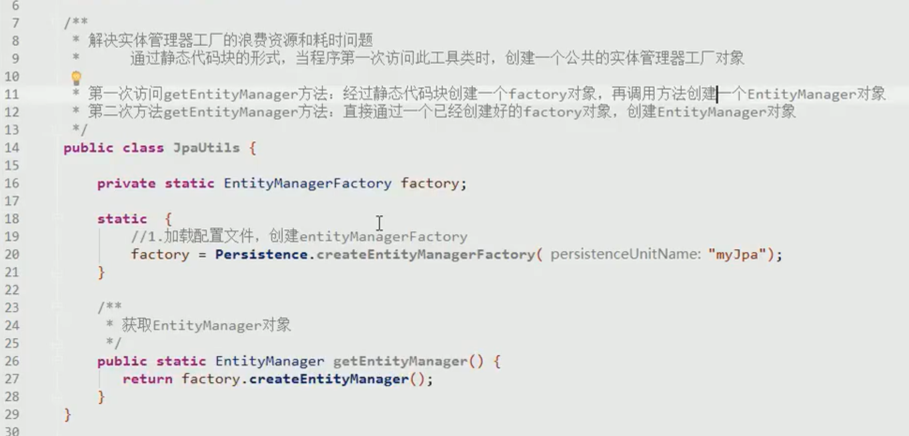
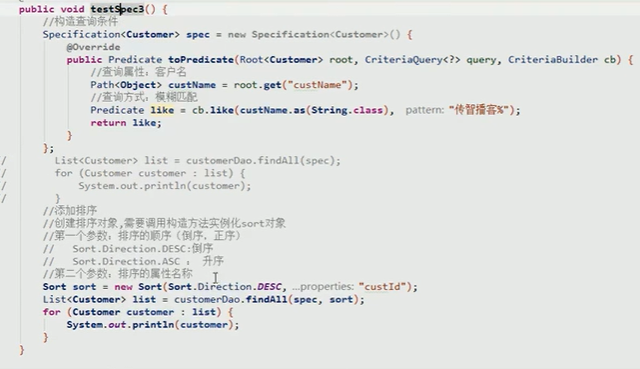

## 一.JPA的相关操作

### 1.JPA与ORM关系

JPA是一种ORM规范，它的作用就是使实现了JPA规范的ORM框架能够自由的切换;

ORM的作用是简化了JDBC的代码

### 2.JPA回顾

#### 2.1创建Maven项目导入JPA依赖

```xml
 <!--        hibernate实体类管理-->
        <!-- https://mvnrepository.com/artifact/org.hibernate/hibernate-entitymanager -->
        <dependency>
            <groupId>org.hibernate</groupId>
            <artifactId>hibernate-entitymanager</artifactId>
            <version>5.4.10.Final</version>
        </dependency>

        <!--        日志管理-->
        <!-- https://mvnrepository.com/artifact/log4j/log4j -->
        <dependency>
            <groupId>log4j</groupId>
            <artifactId>log4j</artifactId>
            <version>1.2.17</version>
        </dependency>

        <!--        junit测试-->
        <!-- https://mvnrepository.com/artifact/junit/junit -->
        <dependency>
            <groupId>junit</groupId>
            <artifactId>junit</artifactId>
            <version>4.13</version>
            <scope>test</scope>
        </dependency>
```

#### 2.2创建实体类

```java
package com.lx.Entity;

import javax.persistence.*;
import java.util.Date;

//声明实体类
//建立实体类与数据库之间的关系
@Entity
@Table(name = "article")
public class Article {

//    主键
    @Id
    @GeneratedValue(strategy = GenerationType.IDENTITY)   //设置主键自增
    private  Integer id;

    @Column(name = "author")
    private  String author;

    @Column(name = "title")
    private  String title;

    @Column(name = "creattime")
    private Date creattime;

    @Override
    public String toString() {
        return "Article{" +
                "id=" + id +
                ", author='" + author + '\'' +
                ", title='" + title + '\'' +
                ", creattime=" + creattime +
                '}';
    }

    public Integer getId() {
        return id;
    }

    public void setId(Integer id) {
        this.id = id;
    }

    public String getAuthor() {
        return author;
    }

    public void setAuthor(String author) {
        this.author = author;
    }

    public String getTitle() {
        return title;
    }

    public void setTitle(String title) {
        this.title = title;
    }

    public Date getCreattime() {
        return creattime;
    }

    public void setCreattime(Date creattime) {
        this.creattime = creattime;
    }
}

```

#### 2.3设置配置文件

在resources下创建META-INF文件在下面再创建一个persistence.xml文件

```xml
<?xml version="1.0" encoding="UTF-8"?>
<persistence xmlns="http://java.sun.com/xml/ns/persistence"
             xmlns:xsi="http://www.w3.org/2001/XMLSchema-instance"
             xsi:schemaLocation="http://java.sun.com/xml/ns/persistence
             http://java.sun.com/xml/ns/persistence/persistence_2_0.xsd"
             version="2.0">
    <!--    持久化单元
            name ：持久化单元名称
            transaction-type:事务类型
            transaction-type:本地事务 JTA分布式事务
    -->
    <persistence-unit name="mysql" transaction-type="RESOURCE_LOCAL">
        <properties>
<!--            数据库相关配置-->
            <property name="javax.persistence.jdbc.driver" value="com.mysql.cj.jdbc.Driver"/>
            <property name="javax.persistence.jdbc.url" value="jdbc:mysql///springdata"/>
            <property name="javax.persistence.jdbc.user" value="root"/>
            <property name="javax.persistence.jdbc.password" value="123456"/>
        </properties>
    </persistence-unit>
</persistence>
```

#### 2.4测试JPA

 ```java
package com.lx;

import com.lx.Entity.Article;
import org.junit.Test;

import javax.persistence.EntityManager;
import javax.persistence.EntityManagerFactory;
import javax.persistence.EntityTransaction;
import javax.persistence.Persistence;
import java.util.Date;

public class test {

    @Test
    public void saveArticle() {
        Article article = new Article();
        article.setAuthor("李兴");
        article.setCreattime(new Date());
        article.setTitle("jpa小测试");

//        创建持久化管理工厂
        EntityManagerFactory jpa1 = Persistence.createEntityManagerFactory("jpa1");
//        创建持久化管理器
        EntityManager entityManager = jpa1.createEntityManager();
//        得到事务并开启
        EntityTransaction transaction = entityManager.getTransaction();
        transaction.begin();
//        保存
        entityManager.persist(article);
//        提交事务
        transaction.commit();
//        关闭资源
        entityManager.close();

    }
}

 ```

### 3.静态代码加载工厂类

使用静态代码块的目的是解决实体类管理工厂的资源浪费和耗时问题



### 4.JPA查询方法

增删改查

==persist,remove,merge,find(getReference)==

其中删除和更新需要先查询数据在进行操作


查询方法中的 find方法与getReference方法加载原理不同

find方法(及时加载)


getReference方法 采用懒加载(延迟加载)


### 5.JPQL

SQL查询的是表和表中的字段
JPQL查询的是实体类和类中的属性

#### 5.1.JPQL查询

首先创建一个Query查询对象, 为对象赋值,在通过查询对象进行结果集的查询封装


#### 5.2.JPQL逆序查询

根据对象属性进行查询


#### 5.3.统计查询


#### 5.4分页查询

参数设置第一个设置的是起始参数，第二个设置的是每个页面的查询条数

	

#### 5.5条件查询（模糊查询）

采用占位符?的方式进行模糊查询

	

## 二.SpringDataJpa

### 1.SpringDataJpa概述

 可以理解为JPA规范的再次封装抽象，底层还是使用了Hibernate的JPA技术实现，引用JPQL（Java Persistence Query Language）查询语言，属于Spring整个生态体系的一部分 

### 2.环境搭建

#### 2.1引入pom依赖

```xml
<properties>
        <spring.version>4.2.4.RELEASE</spring.version>
        <hibernate.version>5.0.7.Final</hibernate.version>
        <slf4j.version>1.6.6</slf4j.version>
        <log4j.version>1.2.12</log4j.version>
        <c3p0.version>0.9.1.2</c3p0.version>
        <mysql.version>5.1.6</mysql.version>
    </properties>

    <dependencies>
        <!-- junit单元测试 -->
        <dependency>
            <groupId>junit</groupId>
            <artifactId>junit</artifactId>
            <version>4.9</version>
            <scope>test</scope>
        </dependency>
        
        <!-- spring beg -->
        <dependency>
            <groupId>org.aspectj</groupId>
            <artifactId>aspectjweaver</artifactId>
            <version>1.6.8</version>
        </dependency>

        <dependency>
            <groupId>org.springframework</groupId>
            <artifactId>spring-aop</artifactId>
            <version>${spring.version}</version>
        </dependency>

        <dependency>
            <groupId>org.springframework</groupId>
            <artifactId>spring-context</artifactId>
            <version>${spring.version}</version>
        </dependency>

        <dependency>
            <groupId>org.springframework</groupId>
            <artifactId>spring-context-support</artifactId>
            <version>${spring.version}</version>
        </dependency>

        <dependency>
            <groupId>org.springframework</groupId>
            <artifactId>spring-orm</artifactId>
            <version>${spring.version}</version>
        </dependency>

        <dependency>
            <groupId>org.springframework</groupId>
            <artifactId>spring-beans</artifactId>
            <version>${spring.version}</version>
        </dependency>

        <dependency>
            <groupId>org.springframework</groupId>
            <artifactId>spring-core</artifactId>
            <version>${spring.version}</version>
        </dependency>
        
        <!-- spring end -->

        <!-- hibernate beg -->
        <dependency>
            <groupId>org.hibernate</groupId>
            <artifactId>hibernate-core</artifactId>
            <version>${hibernate.version}</version>
        </dependency>
        <dependency>
            <groupId>org.hibernate</groupId>
            <artifactId>hibernate-entitymanager</artifactId>
            <version>${hibernate.version}</version>
        </dependency>
        <dependency>
            <groupId>org.hibernate</groupId>
            <artifactId>hibernate-validator</artifactId>
            <version>5.2.1.Final</version>
        </dependency>
        <!-- hibernate end -->

        <!-- c3p0 beg -->
        <dependency>
            <groupId>c3p0</groupId>
            <artifactId>c3p0</artifactId>
            <version>${c3p0.version}</version>
        </dependency>
        <!-- c3p0 end -->

        <!-- log end -->
        <dependency>
            <groupId>log4j</groupId>
            <artifactId>log4j</artifactId>
            <version>${log4j.version}</version>
        </dependency>

        <dependency>
            <groupId>org.slf4j</groupId>
            <artifactId>slf4j-api</artifactId>
            <version>${slf4j.version}</version>
        </dependency>

        <dependency>
            <groupId>org.slf4j</groupId>
            <artifactId>slf4j-log4j12</artifactId>
            <version>${slf4j.version}</version>
        </dependency>
        <!-- log end -->

        
        <dependency>
            <groupId>mysql</groupId>
            <artifactId>mysql-connector-java</artifactId>
            <version>${mysql.version}</version>
        </dependency>

        <dependency>
            <groupId>org.springframework.data</groupId>
            <artifactId>spring-data-jpa</artifactId>
            <version>1.9.0.RELEASE</version>
        </dependency>

        <dependency>
            <groupId>org.springframework</groupId>
            <artifactId>spring-test</artifactId>
            <version>4.2.4.RELEASE</version>
        </dependency>
        
        <!-- el beg 使用spring data jpa 必须引入 -->
        <dependency>  
            <groupId>javax.el</groupId>  
            <artifactId>javax.el-api</artifactId>  
            <version>2.2.4</version>  
        </dependency>  
          
        <dependency>  
            <groupId>org.glassfish.web</groupId>  
            <artifactId>javax.el</artifactId>  
            <version>2.2.4</version>  
        </dependency> 
        <!-- el end -->
    </dependencies>
```

#### 2.2设置配置文件

```xml
<?xml version="1.0" encoding="UTF-8"?>
<beans xmlns="http://www.springframework.org/schema/beans"
       xmlns:xsi="http://www.w3.org/2001/XMLSchema-instance" xmlns:aop="http://www.springframework.org/schema/aop"
       xmlns:context="http://www.springframework.org/schema/context"
       xmlns:jdbc="http://www.springframework.org/schema/jdbc" xmlns:tx="http://www.springframework.org/schema/tx"
       xmlns:jpa="http://www.springframework.org/schema/data/jpa"
       xmlns:task="http://www.springframework.org/schema/task"
       xsi:schemaLocation="
		http://www.springframework.org/schema/beans http://www.springframework.org/schema/beans/spring-beans.xsd
		http://www.springframework.org/schema/aop http://www.springframework.org/schema/aop/spring-aop.xsd
		http://www.springframework.org/schema/context http://www.springframework.org/schema/context/spring-context.xsd
		http://www.springframework.org/schema/jdbc http://www.springframework.org/schema/jdbc/spring-jdbc.xsd
		http://www.springframework.org/schema/tx http://www.springframework.org/schema/tx/spring-tx.xsd
		http://www.springframework.org/schema/data/jpa
		http://www.springframework.org/schema/data/jpa/spring-jpa.xsd">
    <!--扫描所有包-->
    <context:component-scan base-package="com.lx"></context:component-scan>

    <!--    配置spring和springdatajpa的整合-->
    <!--    创建entityManagerFactory给spring容器-->
    <bean id="entityManagerFactory" class="org.springframework.orm.jpa.LocalContainerEntityManagerFactoryBean">
        <!--        扫描实体类-->
        <property name="packagesToScan" value="com.lx.Entity"/>
        <!--        配置数据源-->
        <property name="dataSource" ref="dataSource"/>
        <!--        配置jpa实现厂家-->
        <property name="persistenceProvider">
            <bean class="org.hibernate.jpa.HibernatePersistenceProvider"/>
        </property>
        <!--        配置jpa供应商的适配器-->
        <property name="jpaVendorAdapter">
            <bean class="org.springframework.orm.jpa.vendor.HibernateJpaVendorAdapter">
                <!--                配置是否自动创建数据库-->
                <property name="generateDdl" value="false"/>
                <!--                配置数据库类型-->
                <property name="database" value="MYSQL"/>
                <!--                配置数据库方言-->
                <property name="databasePlatform" value="org.hibernate.dialect.MySQLDialect"/>
                <!--                是否显示数据库-->
                <property name="showSql" value="true"/>
            </bean>
        </property>

        <!--        开启Jpa方言-->
        <property name="jpaDialect">
            <bean class="org.springframework.orm.jpa.vendor.HibernateJpaDialect"></bean>
        </property>
    </bean>

    <!--    配置数据源-->
    <bean id="dataSource" class="com.mchange.v2.c3p0.ComboPooledDataSource">
        <!--        加载驱动-->
        <property name="driverClass" value="com.mysql.cj.jdbc.Driver"/>
        <!--        数据库地址-->
        <property name="jdbcUrl" value="jdbc:mysql://localhost:3306/springdata?serverTimeZone=GMT"/>
        <!--        用户名-->
        <property name="user" value="root"/>
        <!--        密码-->
        <property name="password" value="123456"/>
    </bean>

    <!--    整合springdata jpa-->
    <jpa:repositories base-package="com.lx.Dao" entity-manager-factory-ref="entityManagerFactory"
                      transaction-manager-ref="transaction">
    </jpa:repositories>

    <!--    配置事务管理器-->
    <bean id="transaction" class="org.springframework.orm.jpa.JpaTransactionManager">
        <property name="entityManagerFactory" ref="entityManagerFactory"></property>
    </bean>
</beans>
```

#### 2.3创建实体类

```java
package com.lx.Entity;


import javax.persistence.*;

//实体类与表的映射
@Entity
@Table(name = "user")
public class User {

    @Id //主键
    @GeneratedValue(strategy = GenerationType.IDENTITY)  //主键关系 自增
    @Column(name = "id")
    private Integer id;

    @Column(name = "name")
    private String name;

    @Column(name = "address")
    private String address;

    @Column(name = "phonenumber")
    private String phonenumber;

    @Column(name = "age")
    private Integer age;

    @Column(name = "sex")
    private String sex;

    @Override
    public String toString() {
        return "User{" +
                "id=" + id +
                ", name='" + name + '\'' +
                ", address='" + address + '\'' +
                ", phonenumber='" + phonenumber + '\'' +
                ", age=" + age +
                ", sex='" + sex + '\'' +
                '}';
    }

    public Integer getId() {
        return id;
    }

    public void setId(Integer id) {
        this.id = id;
    }

    public String getName() {
        return name;
    }

    public void setName(String name) {
        this.name = name;
    }

    public String getAddress() {
        return address;
    }

    public void setAddress(String address) {
        this.address = address;
    }

    public String getPhonenumber() {
        return phonenumber;
    }

    public void setPhonenumber(String phonenumber) {
        this.phonenumber = phonenumber;
    }

    public Integer getAge() {
        return age;
    }

    public void setAge(Integer age) {
        this.age = age;
    }

    public String getSex() {
        return sex;
    }

    public void setSex(String sex) {
        this.sex = sex;
    }
}

```

3.编写Dao层接口

```java
package com.lx.Dao;

import com.lx.Entity.User;
import org.springframework.data.jpa.repository.JpaRepository;
import org.springframework.data.jpa.repository.JpaSpecificationExecutor;

/**
 * 接口要符合springdatajpa的接口规范
 * 要实现下面的两个类
 * JpaRepository<User,Integer>  一个是操作的实体类类型，一个是主键类型
 * 该接口封装了基本的CRUD操作
 * JpaSpecificationExecutor<User> 一个是操作的实体类类型
 * 该接口实现了复杂操作（分页、、）
 */

public interface UserDao extends JpaRepository<User, Integer>, JpaSpecificationExecutor<User> {
}

```

#### 2.4测试SpringDataJpa

```java
package com.lx;

import com.lx.Dao.UserDao;
import com.lx.Entity.User;
import org.junit.Test;
import org.junit.runner.RunWith;
import org.springframework.beans.factory.annotation.Autowired;
import org.springframework.test.context.ContextConfiguration;
import org.springframework.test.context.junit4.SpringJUnit4ClassRunner;


@RunWith(SpringJUnit4ClassRunner.class)  //声明Spring容器提供的单元测试环境
@ContextConfiguration(locations = "classpath:applicationContext.xml")  //制定容器配置文件
public class test {
    @Autowired
    UserDao userDao;

    @Test
    public void test() {
        User user = userDao.findOne(1);
        System.out.println(user);
    }
}

```

### 3.SpringBoot快速集成SpringDataJpa

#### 3.1导入依赖

引入springdatajpa,jdbc模块,再在建好的pom.xml中添加驱动以及连接池

```xml
        <!--        mysql驱动-->
        <!-- https://mvnrepository.com/artifact/mysql/mysql-connector-java -->
        <dependency>
            <groupId>mysql</groupId>
            <artifactId>mysql-connector-java</artifactId>
            <version>8.0.15</version>
        </dependency>
        <!--        druid连接池-->
        <!-- https://mvnrepository.com/artifact/com.alibaba/druid -->
        <dependency>
            <groupId>com.alibaba</groupId>
            <artifactId>druid</artifactId>
            <version>1.1.12</version>
        </dependency>
```

#### 3.2配置applicationContext文件

注意时区问题

```xml
spring.datasource.driver-class-name=com.mysql.cj.jdbc.Driver
spring.jackson.date-format=yyyy-MM-dd HH:mm:ss
spring.jackson.time-zone=Asia/Shanghai 
spring.datasource.url=jdbc:mysql://localhost:3306/springdatatest?serverTimezone=UTC&characterEncoding=utf8&useUnicode=true&useSSL=false
spring.datasource.username=root
spring.datasource.password=123456

spring.datasource.type=com.alibaba.druid.pool.DruidDataSource

#jpa的正向工程
spring.jpa.hibernate.ddl-auto=update

#显示sql
spring.jpa.show-sql=true

```

#### 3.3测试连接

```java
package com.lx.jpa;

import com.lx.jpa.dao.UsrDao;
import com.lx.jpa.entity.User;
import com.sun.xml.bind.v2.model.core.ID;
import org.junit.jupiter.api.Test;
import org.springframework.beans.factory.annotation.Autowired;
import org.springframework.boot.test.context.SpringBootTest;

import java.util.Optional;

@SpringBootTest
class JpaApplicationTests {
    @Autowired
    UsrDao usrDao;

    @Test
   public  void testSave(){
        User user=new User();
        user.setId(4L);
        user.setAddress("sadd");
        user.setAge(23L);
        user.setName("王老五");
        user.setPhonenumber("231414");
        user.setSex("男");
        usrDao.save(user);
    }

    @Test
    public  void testfind(){
        Optional<User> byId = usrDao.findById(2L);
        System.out.println(byId);
    }

}

```

### 4.SpringDataJpa实现逻辑


#### 4.1findOne方法与getOne方法区别

查询通过调用底层JPA方法进行实现,区别同JPA的find方法与getReference方法.

	

#### 4.2SimpleJpaRepository查询

dao接口实现

```java

    /**
     * 根据用户姓名返回结果
     *
     * @param name 查询的名字
     * @return
     */
    @Query(value = "from User where name=?1")
    public User getUserById(String name);

    /**
     * 多个占位符实现 ?后面是占位符的位置
     *
     * @param Id   查询的id
     * @param name 查询的名字
     * @return
     */
    @Query(value = "from User where id=?1 and name=?2")
    public User getUsersByIdAndName(Long Id, String name);


    /**
     * 更新操作
     *modifying声明是一个更新操作
     * @param name 传入的更新信息
     * @param id   传入的id
     */
    @Query(value = "update User set name=?1 where id=?2")
    @Modifying  
    public void updateInfo(String name, Long id);

 /**
     * 用sql语句进行查询
     * 其中value表示查询语句
     * nativeQuery指定使用什么方式进行查询
     * true表示使用sql进行查询
     * false表示使用jpql进行查询
     *
     * @return
     */

    @Query(value = "select * from  user_table", nativeQuery = true)
    public List<Object[]> findBynativesql();

    /**
     * 通过sql进行模糊查询
     * @param name 查询的名字
     * @return
     */
    @Query(value = "select * from user_table where name like ?1",nativeQuery = true)
    public List<Object[]> findNameBynativesql(String  name);
```

测试方法

```java
@Autowired
    UsrDao usrDao;

    @Test
    public void testSave() {
        User user = new User();
        user.setId(4L);
        user.setAddress("sadd");
        user.setAge(23L);
        user.setName("王老五");
        user.setPhonenumber("231414");
        user.setSex("男");
        usrDao.save(user);
    }

    @Test
    public void testfind() {
        Optional<User> byId = usrDao.findById(2L);
        System.out.println(byId);
    }

    @Test
    public void findAll() {
        List<User> all = usrDao.findAll();
        for (User user : all) {
            System.out.println(user);
        }
    }

    //    通过name进行查询
    @Test
    public void getByName() {
        User user = usrDao.getUserById("李兴");
        System.out.println(user);
    }


    //通过name和id进行查询
    @Test
    public void findByIdAndName() {
        User usersByIdAndName = usrDao.getUsersByIdAndName(2L, "洗打到");
        System.out.println(usersByIdAndName);
    }

    //    通过id进行数据更新

    @Test
    @Transactional  //事务控制
    @Rollback(value = false)  //控制不回滚
    public void updateByid() {
        usrDao.updateInfo("更改后的名字", 2L);
    }

	//通过sql语句进行查询
    @Test
    public  void findBysql(){
        List<Object[]> bynativesql = usrDao.findBynativesql();
        for (Object[] objects:bynativesql){
            System.out.println(Arrays.toString(objects));
        }
    }

    //通过sql语句进行模糊查询
    @Test
    public  void findNameBynativesql(){
        List<Object[]> bynativesql = usrDao.findNameBynativesql("安大的");
        for (Object[] objects:bynativesql){
            System.out.println(Arrays.toString(objects));
        }
    }
```


#### 4.3自定义方法查询


#### 4.4SpecificationExecutor查询


JpaSpecificationExecutor方法使用

实现Specification接口

实现接口方法

传入参数


```java
//    JpaSpecificationExecutor使用

    /**
     * Specification方法中的参数
     *          root:获取需要查询的属性对象
     *          CriteriaBuilder:查询条件
     */
    @Test
    public  void findBySpecificationExecutor(){
        //获取接口 创建一个实现类
        Specification<User> specification = new Specification<User>() {
            @Override
            public Predicate toPredicate(Root<User> root, CriteriaQuery<?> criteriaQuery, CriteriaBuilder criteriaBuilder) {
//                获取根对象
                Path<Object> objectPath = root.get("name");
//                构造查询 其中cb的第一个属性是比较对象，第二个是比较的值
                Predicate predicate = criteriaBuilder.equal(objectPath, "213");
                return predicate;
            }
        };
        Optional<User> userOptional = usrDao.findOne(specification);
        System.out.println(userOptional);
    }

//    动态查询
    @Test
    public  void findByIdAndAddress(){
        //获取接口 创建一个实现类
        Specification<User> specification = new Specification<User>() {
            @Override
            public Predicate toPredicate(Root<User> root, CriteriaQuery<?> criteriaQuery, CriteriaBuilder criteriaBuilder) {
//                获取根对象
                Path<Object> id = root.get("id");
                Path<Object> address = root.get("address");
//                构造查询
                Predicate predicate = criteriaBuilder.equal(id, "1");
                Predicate predicate2 = criteriaBuilder.equal(address, "adad");
//                将两个查询进行关联
                Predicate and = criteriaBuilder.and(predicate, predicate2);
                return and;
            }
        };
        Optional<User> user = usrDao.findOne(specification);
        System.out.println(user);
    }

    //    模糊查询
    @Test
    public  void findByLike(){
        Specification<User> specification = new Specification<User>() {
            @Override
            public Predicate toPredicate(Root<User> root, CriteriaQuery<?> criteriaQuery, CriteriaBuilder criteriaBuilder) {
//                获取根对象
                Path<Object> name = root.get("name");
//                构造查询
                Predicate like = criteriaBuilder.like(name.as(String.class), "李%");
                return like;
            }
        };
        List<User> all = usrDao.findAll(specification);
        for (User user:all){
            System.out.println(user);
        }
    }
```


#### 4.5排序查询

	

```java
//    模糊查询(排序)
    @Test
    public  void findByNameDesc(){
        Specification<User> specification = new Specification<User>() {
            @Override
            public Predicate toPredicate(Root<User> root, CriteriaQuery<?> criteriaQuery, CriteriaBuilder criteriaBuilder) {
//                获取根对象
                Path<Object> path = root.get("name");
//                构造查询
                Predicate predicate = criteriaBuilder.like(path.as(String.class), "李%");
                return predicate;
            }
        };

//        根据id进行逆序查询
//        版本过期原因不能直接New Sort,使用sort.by
        Sort sort = Sort.by(Sort.Direction.DESC, "id");
        List<User> list = usrDao.findAll(specification, sort);
        for (User user:list){
            System.out.println(user);
        }
    }
```

#### 4.6分页查询


```java
    //    分页查询
    @Test
    public void findByPage() {
//        不添加查询条件
        Specification specification = null;
        /**
         * Pageable是分页参数
         * findAll(Specification,Pageable)是带查询条件的分页查询
         * findAll(Pageable)是不带查询条件的分页查询
         * 返回一个Page(是SpringDatajpa为我们封装好的pageBean对象)
         * pageRequest是pageable接口的实现类
         *          其中有两个参数
         *          第一个参数:开始分页的页数
         *          第二个参数：每页分页的数量
         */
//        新的写法不用new PageRequest，直接用 PageRequest.of这个方法 根据你的需求选择入参
        PageRequest pageRequest = PageRequest.of(0, 2);
        Page<User> page = usrDao.findAll((Specification<User>) null, pageRequest);
        System.out.println(page.getTotalElements());//得到总条数
        System.out.println(page.getContent());//得到数据集合列表
        System.out.println(page.getTotalPages());//得到总页数
    }
```

#### 4.7Specification总结


### 5.多表查询

#### 5.1建立表之间的关系


#### 5.2==一对多:==

主表：


副表：


测试

保存操作：

	

在Customer主表中添加linkMan的外键约束

对于一对多，删除主表的外键维护


#### 5.3一对多级联操作


级联添加

	

级联删除


#### 5.4==多对多:==

主表:


副表:


多表测试


对于多对多关系，有中间表需要被动的哪一方放弃维护权

5.4

#### 5.5多对多级联操作


级联添加

	

#### 5.6导航查询

查询一个对象的时候，通过此对象查询所有的关联对象


查询方式的延迟加载(不推荐)

一对多默认延迟加载


在主表配置fetch属性可实现延迟加载


多对一默认立即加载


在多表配置延迟加载


导航查询总结

