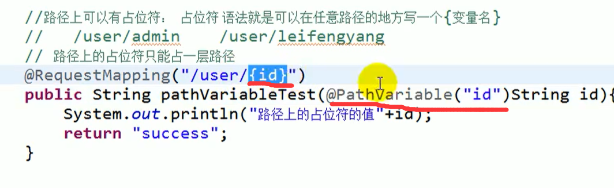
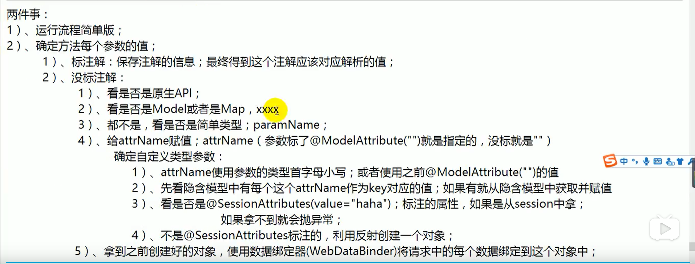
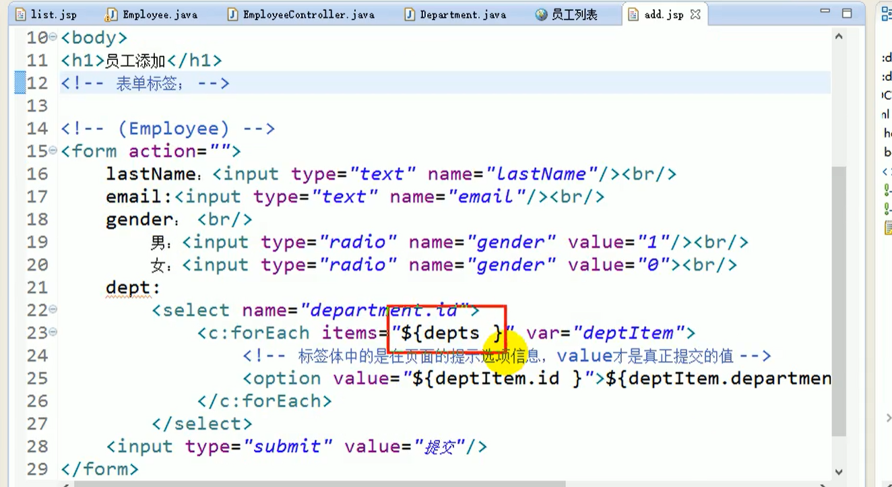
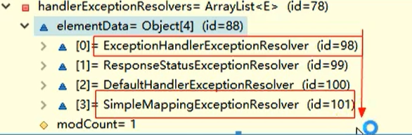

# SpringMVC

## 一.SpringMVC

### 1.配置

#### 1.1web.xml文件配置

配置springmvc的==前端控制器==，配置springmvc的文件位置

```xml
load-on-startup <!--数值越小优先级越高-->
init-param中指定springmvc文件位置
```


#### 1.2spring框架配置

配置包扫描路径,前缀,后缀……

```xml
<!--配置包扫描路径-->
<context:conmponent-scan base-backage=""></context:conmponent-scan>
<!--配置视图解析器-->
         <bean class="org.springframework.web.servlet.view.InternalResourceViewResolver">
               <property name="prefix" value="/WEB-INF/jsp/"/> 
               <property name="suffix" value=".jsp"/>
        </bean>
```

#### 1.3springmvc实现页面跳转细节

```java
@RequestMapping("/hello")//处理hello请求
public String HelloWorld(){
    	<!--返回success.jsp页面-->
        return "success";
}
```

##### 1.3.1.HelloWorld实现流程

​	

##### 1.3.2.在springmvc配置文件中不配置指定路径

​	

不指定去找<servlet-name>-servlet.xml文件

##### 1.3.3.url-pattern中/*与/的区别

```xml
<!--/ 拦截所有请求，不拦截*.jsp请求-->

<!--/* 拦截所有请求,包括*jsp请求-->

而在服务器中所有静态资源(除了jsp与和servlet的资源)都由tomcat处理，
当使用/ 时,tomcat无法处理index.html页面 <!--index.html相当于静态资源，重写父类方法后，tomcat无法处理静态资源-->
/相当于重写了整体web.xml中的url-pattern路径
```

### 2.springmvc注解

#### 1.RequestMapping注解

##### 1.1 声明位置

```java
//注解在类上声明一个请求基本路径

//注解在方法上声明是什么请求
```

##### 1.2 规定请求方式

```java
//声明请求方式method
//put get post delete.....
method=RequestMethod.Post  //声明请求方式为post
  
//声明参数param
params={"username"}  //声明必须携带一个参数username,不携带请求404

//声明消息头(让谷歌浏览器能访问，火狐浏览器不能访问)
//User-Agent浏览器信息
headers={"User-Agent=Mozilla/5.0 (Windows NT 10.0; Win64; x64) AppleWebKit/537.36 (KHTML, like Gecko) Chrome/78.0.3904.97 Safari/537.36"} //让指定的浏览器进行访问
```

##### 1.3url路径(Ant风格)

在路径上进行模糊匹配

​	

```java
@RequestMapping("/hello") //匹配hello请求
@RequestMapping("/hello?")//匹配带有一个占位符的路径 eg:/hellog请求
@RequestMapping("/hello*")//匹配多个字符或者一层路径 eg:/hellogadad请求 /hello/adadd请求
@RequestMapping("/hello**") //匹配多层路径 eg:/hello/adad/adad请求
```

当都能匹配到路径时，精确优先?>*>**

##### 1.4 pathvariable获取==路径中==的参数



##### 1.5url地址(REST风格)

REST:Representational State Transer,资源状态转换，是一种互联网软件架构.


###### 2.1.5.1REST环境搭建

因为请求的资源标识符可能在变化，通过{bid}进行占位，所以采用@pathvariable进行取值。


POST、PUT、DELETE同理

###### 2.1.5.2发起PUT、DELETE请求

首先创建一个post类型的表单，然后在表单中携带一个_method的参数，这个_method的值就是PUT或者DELETE.

	

###### 2.1.5.3实现原理

==重写了request.getMethod()方法==最终获取的请求类型是通过wrapper.getMethod()返回PUT或者DELETE请求

###### 2.1.5.4高版本tomcat405问题


jsp页面可能会出错，添加错误界面支持

#### 2.RequestParam 注解获取==带的参数==的值

该注解用来获取==带的参数==的值，与PathVariable区别在于，PathVariable用于获取路径中的值。

 

#### 3.RequestHeader注解

该注解用来获取请求中的消息头


#### 4.CookieValue注解

该注解用来获取cookie的值


#### 5.springmvc封装pojo


支持的原生API


#### 6.请求乱码问题


解决post请求乱码


#### 7.数据输出ModelAttribute


### 3.源码

#### 1.DispatcherServlet源码分析


首先请求来到httpservlet的doget或者dopodt方法，由于DispatcherServlet继承了HttpServlet所以在DispatcherServlet中要实现该方法，在doService中实现==doDispatcher==方法

##### 1.调用doDispatcher实现流程

###### 3.1.1获取处理器(Controller)


getHander通过handlerMapping保存的映射信息获取处理器，基于配置信息的HandlerMapping去BeanNameHandleMapping去找；基于注解信息的HandlerMapping去DeafalutAnnotationHandlerMapping去找.handlerMapping中的信息在spring ioc中创建对象组件的时候添加进去的.


###### 3.1.2获取适配器(Adapter)


getHandlerAdapter原理同getHandler


###### 3.1.3通过适配器执行方法

方法返回一个ModelAndView


通过==method.invoke==反射创建对象


###### 3.1.4转发到目标页面（视图解析器处理）


###### 3.1.5总结


流程:



配置


使用


### 4.视图解析器(render渲染原理)

#### 1.请求转发页面

请求转发是服务器行为，本质上是==一次请求，地址栏不变== 原生的Servlet请求转发:

```java
request.getRequestDispatcher().forard(request,response)
```


相对路径转发==../相当于上层路径==


forward转发

有前缀的转发不会由视图解析器拼串


#### 2.重定向页面

重定向是客户端行为，本质上是==两次请求，地址栏会变==

原生Servlet重定向如下:

有前缀的重定向不会由视图解析器拼串


#### 3.视图解析流程

##### 1.视图

调用render方法进行渲染


常用的视图


##### 2.视图解析器


##### 3.执行流程

方法执行最终都会返回一个ModelAndview;

视图解析器根据ModelAndView里的视图名得到==视图对象==；

视图对象将ModelAndView里的Model进行渲染

	

#### 4.国际化


###### 4.1国际化配置

	


jstl配置

id名一定要配置为==messageSource==


jsp页面使用(导入jstl/fmt标签库)


###### 4.2国际化原理

所有用到区域信息的地方都是用==AcceptHeaderLocaleResover==获取的


获取国际化中的信息

通过ResoureBundleMessageSource或者它的子类MessageSource中的getMessage方法获取.

###### 4.3点击链接切换国际化

==方法一==

自定义自己的国际化解析器


在springmvc中配置


==方法二==

使用自带的SessionLocaleResolver

SessionLocaleResolver的区域信心是在Session中获取的,所以通过在session中设置一个Locale对象从而实现国际化


通过LocalChangeInterceptor优化获取locale对象过程


#### 5.ViewController


### 5.CRUD

#### 1.查询所有员工列表

###### 1.1处理查询所有员工请求


###### 1.2查询页面


删除按钮


#### 2.实现员工添加添加

##### 1.原生表单实现员工添加页面



##### 2.SpringMVC表单标签实现

SpringMVC表单标签可以实现将模型中的数据与HTML中的元素进行绑定

引入标签


###### 2.1.1处理来到添加页面的请求


###### 2.2.2添加页面回显


###### 2.2.3处理添加保存的请求


#### 3.实现员工修改

###### 3.1处理来到修改页面的请求


###### 3.2修改页面回显(PUT请求)

带上id


###### 3.3处理修改保存的请求

先用ModelAttribute查询数据，在使用ModelAttribute中的数据进行封装


#### 4.实现员工删除

###### 4.1处理来到删除页面的请求


###### 4.2删除按钮优化成超链接

在主页面删除按钮绑定删除事件


使用jquery将表单action地址变为超链接地址,其中return false禁止点击后页面的跳转


#### 5.mvc:default-servlet-handler与mvc:annotation-driven的使用


###### 5.1两个配置都没配时

处理资源映射时handlerMapping使用的是默认defaultMapping

handlerMapping


handlerAdapter(注解配置)


###### 5.2配置了mvc:default-servlet-handler

handlerMapping


handlerAdapter


配置mvc:annotation-driven同理(RequestMappingHandlerMapping)，只能让动态映射访问

###### 5.3两个都配置了

先来到RequestMappingHandlerMapping处理所有映射，可以映射的请求处理完(这一步==处理动态映射==)，不能映射的放过交给后面的处理器进行处理，在SimpleUrlHandlerMapping中将映射交给Tomcat处理(这一步==处理静态资源映射==)

handlerMapping


其中的handlerMethods保存了每一个请求用那个方法进行处理


handlerAdaper


### 6.数据绑定与校验

#### 1.数据绑定实现流程


#### 2.实现自定义类型转换器

实现流程

自定义converter接口中要继承Converter接口处理类型转换


将我们自定义的converter添加进conversionService中时可以使用==FormattingConversionServiceFactoryBean==


#### 3.mvc-annotation-driven

可以实现很多功能

	

#### 4.日期格式化

使用==@DateTimeFormat==标签,处理数字格式还可以用==@NumberFormat==标签


#### 5.数据校验

###### 5.1导入jar包

通过JSR303进行，可用==hibernate validator== 进行校验

###### 5.2添加注解


###### 3.将注解注入容器

在需要校验的javabean上添加==@Valid注解==，通过==BindingResult==返回校验结果,再根据返回结果处理


###### 4.返回错误信息

4.1在页面中通过==form:erros标签==可返回错误信息

#### 

4.2将错误信息放进model

将result错误信息放进一个list集合，再将这个集合循环遍历错误信息放进map集合中，最后将此map放进隐藏表单中，在页面通过${}进行获取


#### 6.自定义国际化错误信息


###### 1.实现流程


在页面中通过==form:erros标签==可返回错误信息


精确优先

国际化字段长度动态处理

	

字段{0}是属性名,在动态排序时是按首字母顺序排序的


###### 2.message指定错误信息

不能国际化

	

### 7.SpringMVC支持Ajax

#### 1.ResponseBody


其余注解

```xml-dtd
@JsonIgnore,@JsonFormat(patten="yyyy-mm-dd")
```

ajax测试


#### 2.RequestBody


RequestBody接受json


#### 3.Httpentity

RequestHeader拿到的是某个属性的头，HttpEntity是拿到所有属性的头


#### 4.ResponseEntity

能够返回响应体中内容的类型,自定义自己的相应内容


#### 5.文件下载与上传

###### 5.1文件下载


建议使用原生javawebAPI

未加缓冲流简易版下载

```java
package com.lsgjzhuwei.servlet.response;
 
import java.io.FileInputStream;
import java.io.FileOutputStream;
import java.io.IOException;
import java.io.InputStream;
import java.io.OutputStream;
 
import javax.servlet.ServletException;
import javax.servlet.annotation.WebServlet;
import javax.servlet.http.HttpServlet;
import javax.servlet.http.HttpServletRequest;
import javax.servlet.http.HttpServletResponse;
 
/**
 * Servlet implementation class ServletDownload
 */
@WebServlet(asyncSupported = true, urlPatterns = { "/ServletDownload" })
public class ServletDownload extends HttpServlet {
	private static final long serialVersionUID = 1L;
       
    /**
     * @see HttpServlet#HttpServlet()
     */
    public ServletDownload() {
        super();
        // TODO Auto-generated constructor stub
    }
 
	/**
	 * @see HttpServlet#doGet(HttpServletRequest request, HttpServletResponse response)
	 */
	protected void doGet(HttpServletRequest request, HttpServletResponse response) throws ServletException, IOException {
		// TODO Auto-generated method stub
		
		//获得请求文件名
		String filename = request.getParameter("filename");
		System.out.println(filename);
		
		//设置文件MIME类型
		response.setContentType(getServletContext().getMimeType(filename));
		//设置Content-Disposition
		response.setHeader("Content-Disposition", "attachment;filename="+filename);
		//读取目标文件，通过response将目标文件写到客户端
		//获取目标文件的绝对路径
		String fullFileName = getServletContext().getRealPath("/download/" + filename);
		//System.out.println(fullFileName);
		//读取文件
		InputStream in = new FileInputStream(fullFileName);
		OutputStream out = response.getOutputStream();
		
		//写文件
		int b;
		while((b=in.read())!= -1)
		{
			out.write(b);
		}
		
		in.close();
		out.close();
	}
 
	/**
	 * @see HttpServlet#doPost(HttpServletRequest request, HttpServletResponse response)
	 */
	protected void doPost(HttpServletRequest request, HttpServletResponse response) throws ServletException, IOException {
		// TODO Auto-generated method stub
	}
 
}
```

###### 5.2单文件上传

1.配置文件上传解析器

这里配置了上传文件最大大小为20m(1kb\*1024\*20)


2.处理文件上传请求

前端界面传入文件名


后端处理文件上传

通过==MultipartFile==获取从前端传过来的文件名，用==file,.transferTo==上传文件


###### 5.3多文件上传

将MultipartFile改成数组,多文件上传保证RequestParam取到的是同一个值


### 8.拦截器

#### 1.拦截器介绍


单拦截器的==正常运行流程==

拦截器的preHandle方法- - ->目标方法的执行 - - ->拦截器的postHandle方法 - - ->来到目标页面 - - ->拦截器的afterCompletion方法

多拦截器运行流程与filter运行流程类似，从A进去从B出,拦截器顺序谁先进谁先处理.

	

#### 2.拦截器执行流程

执行==applyPreHandle==，在目标方法之前执行，记录每个==拦截器的索引==


执行==目标方法==


执行==applyPostHandle==,在目标方法之后执行


执行==页面跳转==


执行==applyAfterConcurrentHandlingStarted==，在整个请求完成执行


这里模拟自定义的第一个拦截器放行 ，第二个prerHandle不放行


#### 3.总结

	

什么时候用Filter？什么时候用拦截器

如果某些功能需要其他组件配合完成，用拦截器

其余情况用Filter

Filter脱离SpringMvc还能运行，而拦截器不能

### 9.异常处理

#### 1.异常处理流程

所有异常解析器尝试解析,解析成功进行后续操作，解析失败换下一个解析器

常规异常处理器

	

###### 1.1ExceptionHandler6异常处理(该类)


###### 1.2ControllerAdvice全局处理异常


==全局异常处理与本类处理同时存在，本类优先==

###### 1.3ResponseStatus自定义异常

标注在类上


###### 1.4SimpleMappingExeceptionResolver

	

优先级最低


### 10总结

springMVC运行流程


eclipse中整合spring与springmvc,双容器启动springmvc只负责逻辑层,其余交给spring管理 