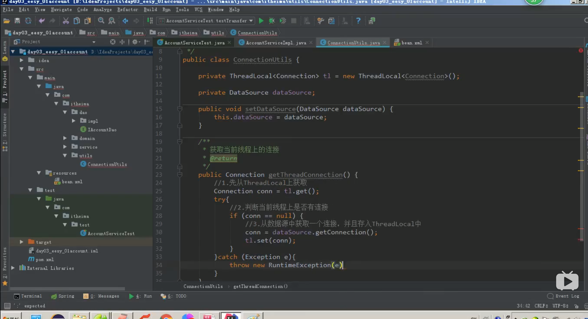
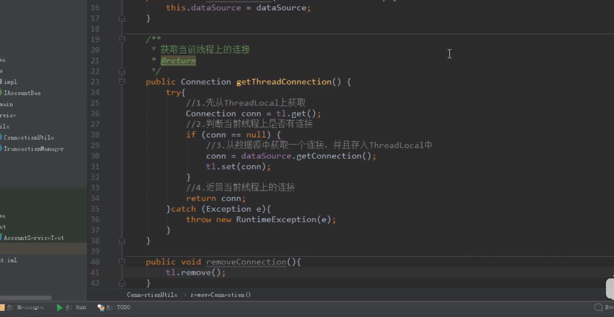
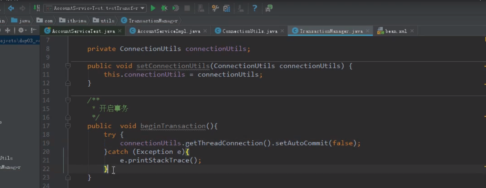
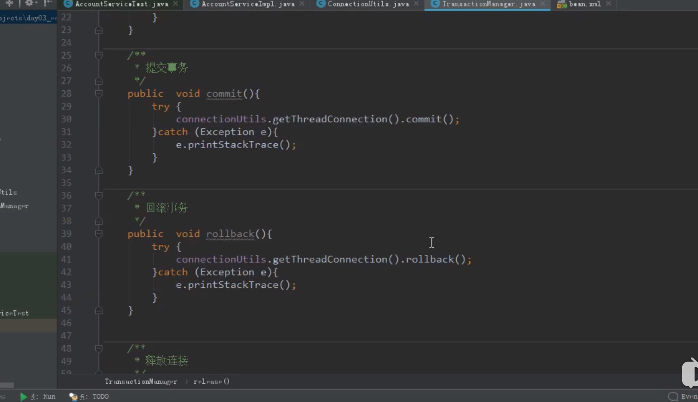
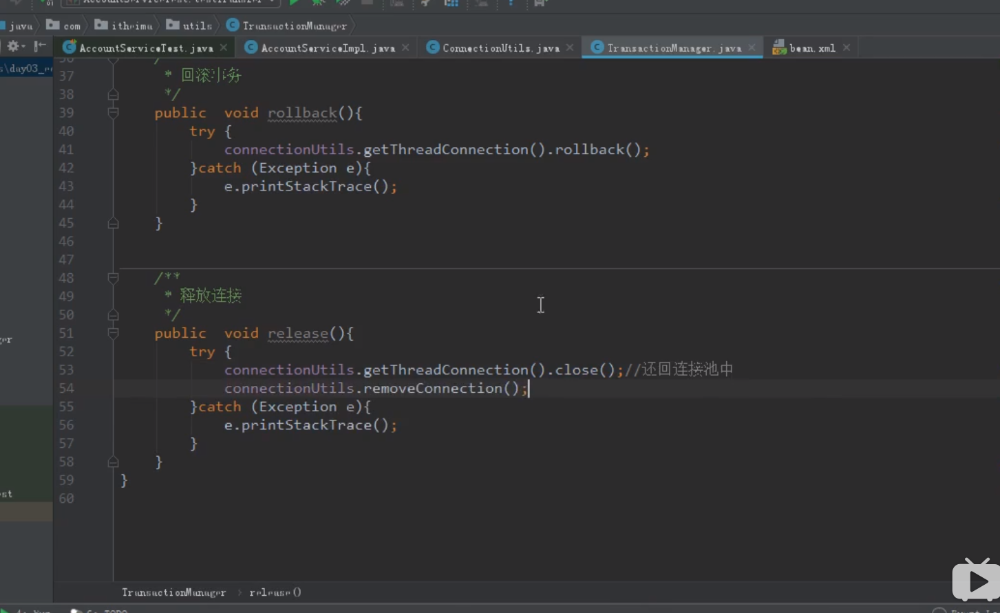
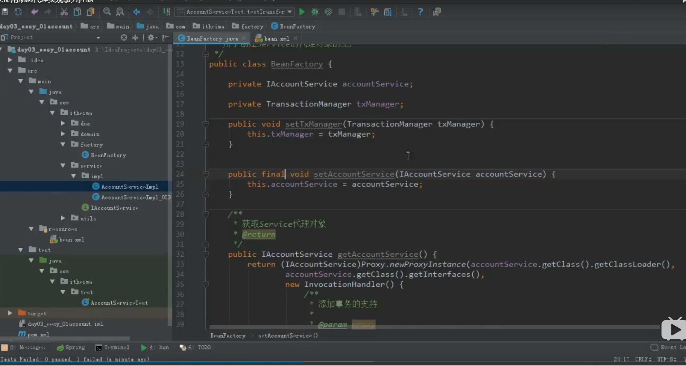
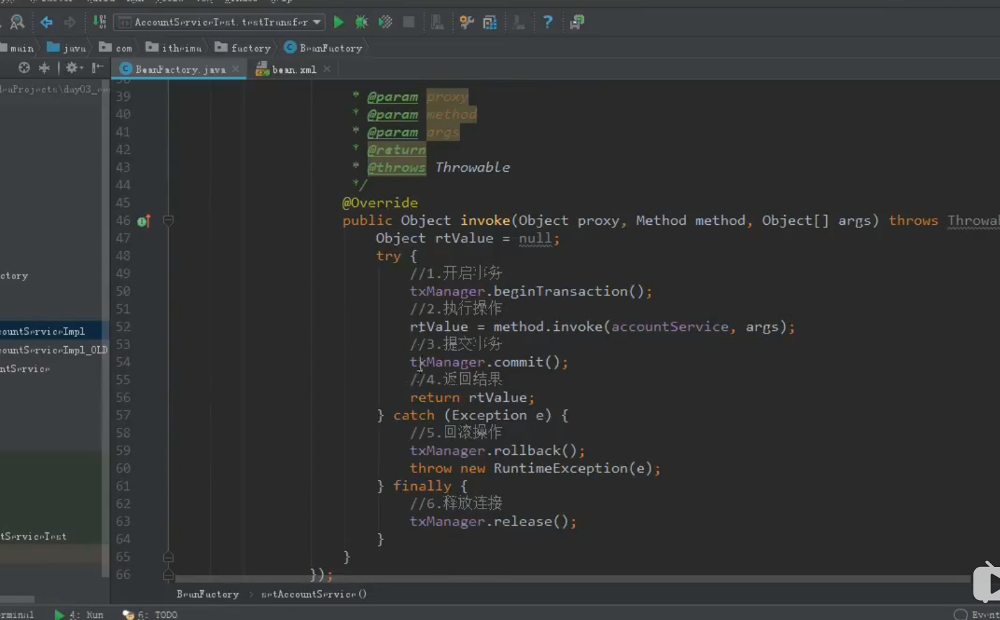

# Spring

## 一. Spring Ioc 与 Aop

### 1、ApplicationContext 的三个常用实现类

在Spring中使用IOC时常用ApplicationContext获取容器

ClassPathXmlApplicationContext： 它可以加载路径下的配置文件，要求配置文件必须在路径下，否则加载不了

```java
ApplicationContext ac = new ClassPathXmlApplicationContext("beans.xml");
```

FileSyetemXmlApplicationContext：它可以加载磁盘下任意路径下的配置文件（必须有访问权限）
加载方式如下：

```java
ApplicationContext ac = new FileSystemXmlApplicationContext("C:\\user\\greyson\\...")
```

AnnotationConfigApplicationContext：它是用于读取注解创建容器的 例如Config.class
```java
AnnotationConfigApplicationContext ac=new AnnotationConfigApplicationContext(Config.class)
```


### 2. 核心容器的两个接口引发出来的问题 

ApplicationContext：它在创建核心容器时，创建对象采取的策略是采用立即加载的方式，也就是说，只要一读取完配置文件就马上创建配置文件中配置的对象
  - 单例对象适用
  - 开发中常采用此接口
BeanFactory: 它在构建核心容器时，创建对象的策略是采用延迟加载的方式，什么时候获取 id 对象了，什么时候就创建对象。懒加载

### 3. Spring 中 Bean 的细节

#### 3.1 三种创建 bean 对象的方式：

1. 使用默认构造函数创建

   在spring的配置文件中，使用 id 和 class 属性之后，且没有其他属性和标签时，采用的就是默认构造函数创建 bean 对象，此时==如果类中没有默认构造函数，则对象无法创建==。

   ```xml
   <bean id = "accountService" class = "com.itheima.service.impl.AccountServiceImpl"></bean>
   ```

2. 使用普通工厂中的方法创建对象（使用某个类中的方法创建对象，并存入 Spring容器）,如下

   ```java
    /**
     *模拟一个工厂类，该类可能存在于jar包中，无法通过修改源码的方式来提供默认构造函数
     * 
     */
    public class InstanceFactory {
        public IAccountService getAccountService() {
            return new AccountServiceImpl();
        }
    }
   ```

   配置方式如下：

   ```xml
    <bean id = "instanceFactory" class = "com.itheima.factory.InstanceFactory"></bean>
        <bean id = "accountService" factory-bean="instanceFactory" factory-method="getAccountService"></bean>
   ```

3. 使用工厂中的静态方法创建对象（使用某个类中的静态方法创建对象，并存入spring容器），如下：

   ```java
    public class StaticFactory {
        public  static IAccountService getAccountService() {
    
            return new AccountServiceImpl();
        }
    }
   ```

   配置方式如下：

   ```xml
    <bean id = "accountService" class = "com.itheima.factory.StaticFactory" factory-method="getAccountService"></bean>
   ```

####   3.2 bean 的作用范围调整

1. bean 标签的 scope 属性

   作用：用于指定 bean 的作用范围

   取值：常用的就是单例和多例

   - singletond : 单例的（default）
   - prototype : 多例的
   - request : 作用于 web 应用的请求范围
   - session : 作用于 web 应用的会话范围
   - global-session : 作用于集群的会话范围（全局会话范围），当不是集群范围时，它就是 session

2. bean对象的声明周期

   单例对象：

   - 出生：当容器创建时发生
   - 活着：只要容器还在对象就一直活着
   - 死亡：容器销毁，对象消亡

   总结：单例对象的声明周期和容器相同

   多例对象：

   - 出生：当我们使用对象时 Spring 框架为我们创建
   - 活着：对象只要是在使用过程中就活着
   - 死亡：当对象长时间不用，且没有别的对象引用时，由 Java 的GC回收

   ==当为多例对象时若要调用destroy()方法需要使用:==
   
   ```java
   ClassPathXmlApplicationContext ac = new ClassPathXmlApplicationContext("beans.xml");
   ```
   
   因为多例对象在销毁时是由容器进行销毁，若要自己销毁就要使用子类的方法，而不是父类的ApplicationContext

### 4.依赖注入（Dependency Injection)与IOC

#### 4.1.IOC概述

1. 能注入的数据：

- 基本类型和 String
- 其他 bean 类型（在配置文件中或者注解中配置过的bean）
- 复杂类型/集合类型

1. IOC的作用：==减低程序间的耦合（即依赖关系）==

2. 控制反转:==将创建对象的权利交给框架==

   在当前类需要用到其他类的对象，由 Spring 为我们提供，而我们在配置文件中说明依赖关系的维护，这种方式就称为依赖注入。

#### 4.2 注入的方式

==使用构造函数提供==

- 使用的标签：==constructor-arg==

- 标签所在位置：bean 标签的内部

标签中的属性：

- type : 用于指定要注入的数据类型，该类型也是构造函数中某个或某些参数的类型
- index : 用于指定要注入的数据给构造函数中指定索引位置的参数赋值，索引的位置时从0开始
- name(常用) : 用于指定给构造函数中指定名称的参数赋值
- value : 用于提供基本类型和String类型的数据
- ref : 用于指定其他的bean类型数据。它指的就是在spring的IOC核心容器出现过的bean对象

特点：在获取 bean 对象时，注入数据是必须的操作，否则无法操作成功

弊端：改变了 bean 对象的实例化方式，使我们在==用不到这些数据的情况下也必须提供带参构造函数==，因此开发中较少使用此方法，除非避无可避

例：

```java
 public class AccountServiceImpl implements IAccountService {
     // 如果时经常变化的数据不适用于依赖注入，此处仅为演示
     private String name;
     private Integer age;
     private Date birthday;
 
     public AccountServiceImpl(String name, Integer age, Date birthday){
         this.name = name;
         this.age = age;
         this.birthday = birthday;
     }
 
     public void  saveAccount() {
         System.out.println("service中的saveaccount()执行了");
     }
 
 }
```

测试类：

```java
 public static void main(String[] args) {
         //1.获取核心容器对象
         ApplicationContext ac = new ClassPathXmlApplicationContext("bean.xml");
         //2.根据id获取Bean对象
         IAccountService as  = (IAccountService)ac.getBean("accountService");
         as.saveAccount();
     }
```

配置如下：

```java
 <bean id = "accountService" class = "com.itheima.service.impl.AccountServiceImpl">
         <constructor-arg name = "name" value="taylor"></constructor-arg>
         <constructor-arg name = "age" value = "23"></constructor-arg>
         <constructor-arg name = "birthday" ref = "now"></constructor-arg>
     </bean>
 
     <bean id = "now" class = "java.util.Date"></bean>
```

==使用 set 方法提供（更常用的方式）==

- 使用的标签：==property==

- 出现的位置：bean 标签的内部

标签的属性：

- name : 用于指定注入时所使用的 set 方法

- value : 用于提供基本类型和 String 类型的数据

- ref : 用于指定其他的bean类型数据，它指的就是在 Spring 容器中出现过的bean对象

- 优势：创建对象时没有明确的限制，可以直接使用默认构造函数

- 弊端：如果有某个成员必须有值，是有可能 set 方法没有执行

1. 基本类型和 String 的注入方式

   - 业务层

     ```java
       public class AccountServiceImpl implements IAccountService {
           // 如果时经常变化的数据不适用于依赖注入，此处仅为演示
           private String name;
           private Integer age;
           private Date birthday;
       
           public void setName(String name) {
               this.name = name;
           }
       
           public void setAge(Integer age) {
               this.age = age;
           }
       
           public void setBirthday(Date birthday) {
               this.birthday = birthday;
           }
       
           public void  saveAccount() {
               System.out.println("service中的saveaccount()执行了" + name + "," + age + "," +birthday);
           }
       
       }
     ```

   - 配置bean.xml

     ```java
       <bean id = "accountService" class = "com.itheima.service.impl.AccountServiceImpl">
               <property name="name" value ="taylor"></property>
               <property name="age" value="21"></property>
               <property name="birthday" ref="now"></property>
           </bean>
       
           <bean id = "now" class = "java.util.Date"></bean>
     ```

     测试类

     ```java
      public static void main(String[] args) {
               //1.获取核心容器对象
               ClassPathXmlApplicationContext ac = new ClassPathXmlApplicationContext("bean.xml");
               //2.根据id获取Bean对象
               IAccountService as  = (IAccountService)ac.getBean("accountService");
       
               as.saveAccount();
           }
       }
     ```

####  4.3 复杂集合类型的注入方式

- 用于给 List 结构集合注入的标签
  - list
  - array
  - set
- 用于给map结构集合注入的标签
  - map
  - properties

==结构相同，标签可以互换，因此开发中只要记住两组标签即可==

编写实例：

```java
 public class AccountServiceImpl implements IAccountService {
 
     private String[] myStrs;
     private List<String> myList;
     private Set<String> mySet;
     private Map<String, String> myMap;
     private Properties myProps;
 
     public void setMyStrs(String[] myStrs) {
         this.myStrs = myStrs;
     }
 
     public void setMyList(List<String> myList) {
         this.myList = myList;
     }
 
     public void setMySet(Set<String> mySet) {
         this.mySet = mySet;
     }
 
     public void setMyMap(Map<String, String> myMap) {
         this.myMap = myMap;
     }
 
     public void setMyProps(Properties myProps) {
         this.myProps = myProps;
     }
 
     public void  saveAccount() {
         System.out.println(Arrays.toString(myStrs));
         System.out.println(myList);
         System.out.println(myMap);
         System.out.println(mySet);
         System.out.println(myProps);
     }
 
 }
```

配置如下：

```xml
 <bean id = "accountService" class = "com.itheima.service.impl.AccountServiceImpl">
         <!--以下三个标签是等价的，set未列出-->
         <property name="myList">
             <list>
                 <value>aaa</value>
                 <value>bbb</value>
             </list>
         </property>
 
         <property name="myStrs">
             <array>
                 <value>aaa</value>
                 <value>bbbb</value>
             </array>
         </property>
 
         <property name="mySet">
             <array>
                 <value>aaa</value>
                 <value>bbbb</value>
             </array>
         </property>
 
         <!--以下两种方式等价-->
         <property name="myMap">
             <map>
                 <!--以下两种配置方式都可以-->
                 <entry key="testA" value="aaa"></entry>
                 <entry key="testA">
                     <value>bbb</value>
                 </entry>
             </map>
         </property>
 
         <property name="myProps">
             <props>
                 <prop key="testB">bbb</prop>
             </props>
         </property>
     </bean>
```


### 5.基于 xml 的 IOC 案例

1. 创建数据库

   ```sql
    create table account(
    	id int primary key auto_increment,
    	name varchar(40),
    	money float
    )character set utf8 collate utf8_general_ci;
    
    insert into account(name,money) values('aaa',1000);
    insert into account(name,money) values('bbb',1000);
    insert into account(name,money) values('ccc',1000);
   ```

2. 创建接口

   - IAccountDao

     ```java
       public interface IAccountDao {
       
           /**
            * 查询所有
            * @return
            */
           List<Account> findAllAccount();
       
           /**
            * 查询一个
            * @return
            */
           Account findAccountById(Integer accountId);
       
           /**
            * 保存
            * @param account
            */
           void saveAccount(Account account);
       
           /**
            * 更新
            * @param account
            */
           void updateAccount(Account account);
       
           /**
            * 删除
            * @param accountId
            */
           void deleteAccount(Integer accountId);
       }
     ```

   - IAccountService

     ```java
       public interface IAccountService {
       
           /**
            * 查询所有
            * @return
            */
           List<Account> findAllAccount();
       
           /**
            * 查询一个
            * @return
            */
           Account findAccountById(Integer accountId);
       
           /**
            * 保存
            * @param account
            */
           void saveAccount(Account account);
       
           /**
            * 更新
            * @param account
            */
           void updateAccount(Account account);
       
           /**
            * 删除
            * @param accountId
            */
           void deleteAccount(Integer accountId);
       }
     ```

3. 创建实现类

   - AccountDaoImpl

     ```java
       public class AccountDaoImpl implements IAccountDao {
       
           private QueryRunner runner;
       
           public void setRunner(QueryRunner runner) {
               this.runner = runner;
           }
       
           public List<Account> findAllAccount() {
               try{
                   return runner.query("select * from account", new BeanListHandler<Account>(Account.class));
               } catch (Exception e) {
                   throw new RuntimeException(e);
               }
           }
       
           public Account findAccountById(Integer accountId) {
               try{
                   return runner.query("select * from account where id = ?", new BeanHandler<Account>(Account.class),accountId);
               } catch (Exception e) {
                   throw new RuntimeException(e);
               }
           }
       
           public void saveAccount(Account account) {
               try{
                   runner.update("insert into account(name, money) values(?,?)", account.getName(),account.getMoney());
               } catch (Exception e) {
                   throw new RuntimeException(e);
               }
           }
       
           public void updateAccount(Account account) {
               try{
                   runner.update("update account set name = ?, money = ? where id = ?", account.getName(),account.getMoney(),account.getId());
               } catch (Exception e) {
                   throw new RuntimeException(e);
               }
           }
       
           public void deleteAccount(Integer accountId) {
               try{
                   runner.update("delete from account where id = ?", accountId);
               } catch (Exception e) {
                   throw new RuntimeException(e);
               }
     ```

   - AccountServiceImpl

     ```java
       public class AccountServiceImpl implements IAccountService {
       
           private IAccountDao accountDao;
       
           public void setAccountDao(IAccountDao accountDao) {
               this.accountDao = accountDao;
           }
       
           public List<Account> findAllAccount() {
               return accountDao.findAllAccount();
           }
       
           public Account findAccountById(Integer accountId) {
               return accountDao.findAccountById(accountId);
           }
       
           public void saveAccount(Account account) {
               accountDao.saveAccount(account);
           }
       
           public void updateAccount(Account account) {
               accountDao.updateAccount(account);
           }
       
           public void deleteAccount(Integer accountId) {
               accountDao.deleteAccount(accountId);
           }
       }
     ```

4. 创建账户实体类

- Account

  ```java
    public class Account implements Serializable {
    
        private Integer id;
        private String name;
        private Float money;
    
        public void setId(Integer id) {
            this.id = id;
        }
    
        public void setName(String name) {
            this.name = name;
        }
    
        public void setMoney(Float money) {
            this.money = money;
        }
    
        public Integer getId() {
            return id;
        }
    
        public String getName() {
            return name;
        }
    
        public Float getMoney() {
            return money;
        }
    
        @Override
        public String toString() {
            return "Account{" +
                    "id=" + id +
                    ", name='" + name + '\'' +
                    ", money=" + money +
                    '}';
        }
    }
  ```

1. 创建测试类

- AccountServiceTest

  ```java
    public class AccountServiceTest {
    
        @Test
        public void testFindAll() {
            // 1.获取容器
            ApplicationContext applicationContext = new ClassPathXmlApplicationContext("bean.xml");
            // 2.得到业务层对象
            IAccountService iAccountService = applicationContext.getBean("accountService",IAccountService.class);
            // 3.执行方法
            List<Account> accounts = iAccountService.findAllAccount();
            for (Account account : accounts) {
                System.out.println(account);
            }
        }
    
        @Test
        public void testFindOne() {
            // 1.获取容器
            ApplicationContext applicationContext = new ClassPathXmlApplicationContext("bean.xml");
            // 2.得到业务层对象
            IAccountService iAccountService = applicationContext.getBean("accountService",IAccountService.class);
            // 3.执行方法
            Account account = iAccountService.findAccountById(1);
            System.out.println(account);
        }
    
        @Test
        public void testSave() {
            Account account = new Account();
            account.setName("test");
            account.setMoney(12345f);
            // 1.获取容器
            ApplicationContext applicationContext = new ClassPathXmlApplicationContext("bean.xml");
            // 2.得到业务层对象
            IAccountService iAccountService = applicationContext.getBean("accountService",IAccountService.class);
            // 3.执行方法
            iAccountService.saveAccount(account);
        }
    
        @Test
        public void testUpdate() {
            // 1.获取容器
            ApplicationContext applicationContext = new ClassPathXmlApplicationContext("bean.xml");
            // 2.得到业务层对象
            IAccountService iAccountService = applicationContext.getBean("accountService",IAccountService.class);
            // 3.执行方法
            Account account = iAccountService.findAccountById(4);
            account.setMoney(23456f);
            iAccountService.updateAccount(account);
        }
    
        @Test
        public void testDelete() {
            // 1.获取容器
            ApplicationContext applicationContext = new ClassPathXmlApplicationContext("bean.xml");
            // 2.得到业务层对象
            IAccountService iAccountService = applicationContext.getBean("accountService",IAccountService.class);
            // 3.执行方法
            iAccountService.deleteAccount(4);
        }
    }
  ```

1. 配置 bean.xml

   

   ```java
    <!--配置dao-->
    <bean id="accountDao" class="com.greyson.dao.impl.AccountDaoImpl">
        <!--注入runner-->
        <property name="runner" ref="runner"></property>
    </bean>
   
    <!--配置runner-->
    <bean id="runner" class="org.apache.commons.dbutils.QueryRunner" scope="prototype">
        <!--注入数据源-->
        <constructor-arg name="ds" ref="dataSource"></constructor-arg>
    </bean>
   
    <!--配置数据源-->
    <bean id="dataSource" class="com.mchange.v2.c3p0.ComboPooledDataSource">
        <property name="driverClass" value="com.mysql.jdbc.Driver"></property>
        <property name="jdbcUrl" value="jdbc:mysql://localhost:3306/eesy"></property>
        <property name="user" value="root"></property>
        <property name="password" value="HotteMYSQL"></property>
    </bean>
   ```

### 6.基于注解的IOC实例

1. Spring 中的新注解：

   - @Configuration

     - 作用：指定当前类是一个配置类
     - 细节：当配置类作为 ==AnnotationConfigurationApplicationContext== 对象创建的参数时，该注解可以不写

   - @ComponentScan

     - 作用：用于通过注解指定 Spring 在创建容器时要扫描的包

     - 属性：

       value : 它和 basepackages 的作用是一样的，都是用于指定创建容器时要扫描的包

       使用此注解就等同于在 xml 中配置了：

       ```xml
       <context:component-scan base-package="com.greyson"></context:component-scan>
       ```

       

   - @Bean

     - 作用：用于把当前方法的返回值作为 bean 对象放入 Spring 的IOC容器中

     - 属性：

       name : 用于指定 bean 的 id，当不写时，默认值为当前方法的名称

     - 细节：

       当我们使用注解配置方法时，如果方法有参数，Spring 框架会去容器中查找有没有可用的 bean 对象，

       查找的方式和 Autowired 注解的作用是一样的

   - @I*mport*

     - 作用：用于导入其他的配置类

     - 属性：

       value : 用于指定其他配置类的字节码

       当我们使用 Import 的注解之后，有 Import 注解的类就是父配置类，而导入的都是子配置类

   - @Properties

     - 作用：用于指定 properties 文件的位置

     - 属性：

       value : 指定文件的名称和路径

       关键字：classpath , 表示类路径下

###      7. Spring 整合 Junit（后续补充）

   Spring 整合 Junit 的配置过程：

1. 导入 Spring 整合 Junit 的 jar ( 坐标 )

2. 使用 Junit 提供的一个注解把原有的 main 方法替换了，替换成 Spring 提供的

   @Runwith

3. 告知 Spring 的运行器， Spring 和 ioc 创建是基于 xml 还是注解的，并且说明位置，用到的注解如下

   @ContextConfiguration

   Locations : 指定 xml 文件的位置，加上 classpath 关键字，表示在类路径下

   classes : 指定注解类所在地位置

4. 使用@Autowired 给测试类中的变量注入数据

### 8.事物的处理

要么都做，要么都不做，保持一致性

#### 1.事务的流程：

1.创建一个连接池获取连接





2.事务的方法(开启事务，提交事务，回滚事务，释放链接)

2.1





### 9.动态代理分析

#### 1、什么是代理？

简单理解，本来厂商可以自产自销，但是由于各种开销，最后厂商选择只生产产品，销售则交由各级经销商完成。

- 特点：字节码随用随创建，随用随加载

- 作用：不修改源码的基础上对方法增强

- 分类：

  基于接口的动态代理

  基于子类的动态代理

#### 2、基于接口的动态代理

1. 基于接口的动态代理：

   涉及的类：==Proxy==

   提供者：JDK官方

2. 如何创建代理对象：

   使用Proxy类中的newProxyInstance方法

3. 创建代理对象的要求：

   被代理类最少实现的一个接口，如果没有则不能使用

4. newProxyInstance方法的参数：

   ClassLoader : 用于加载代理对象字节码，和被代理对象使用相同的类加载器，固定写法

   Class [ ] : 用于让代理对象和被代理对象有相同的方法，固定写法

   InvocationHandler : 用于提供增强的代码

   它是让我们写如何代理。我们一般是写一个该接口的实现类，通常是匿名内部类，但不是必须的。此接口的实现类都是谁用谁写。

- 生产厂家接口IProducer

  ```java
    /**
     * 对生产厂家要求的接口
     */
    public interface IProducer {
        /**
         * 销售
         * @param money
         */
        public void saleProduct(float money);
    
        /**
         * 售后
         * @param money
         */
        public void afterService(float money);
    }
  ```

- 生产者Producer

  ```java
    /**
     * 一个生产者
     */
    public class Producer implements IProducer {
    
        /**
         * 销售
         * @param money
         */
        public void saleProduct(float money) {
            System.out.println("销售产品，并拿到钱：" + money);
        }
    
        /**
         * 售后
         * @param money
         */
        public void afterService(float money) {
            System.out.println("提供售后服务，并拿到钱：" + money);
        }
    }
  ```

- 消费者Client

  ```java
    /**
     * 模拟一个消费者
     */
    public class Client {
        public static void main(String[] args) {
            final Producer producer = new Producer();
    
            IProducer proxyProducer = (IProducer) Proxy.newProxyInstance(producer.getClass().getClassLoader(),
                    producer.getClass().getInterfaces(), new InvocationHandler() {
                        /**
                         * 作用：执行被代理对象的任何接口方法都会经过该方法
                         * 方法参数的含义：
                         * @param proxy         代理对象的含义
                         * @param method        当前执行的方法
                         * @param args          当前执行方法的参数
                         * @return              和被代理对象方法有相同的返回值
                         * @throws Throwable
                         */
                        public Object invoke(Object proxy, Method method, Object[] args) throws Throwable {
                            // 提供增强的代码
                            Object returnValue = null;
                            // 1.获取方法执行的参数
                            Float money = (Float)args[0];
                            // 2.判断当前方法是不是销售
                            if ("saleProduct".equals(method.getName())) {
                                returnValue = method.invoke(producer,money * 0.8f);
                            }
                            return returnValue;
                        }
                    });
        }
    }
  ```

#### 3、基于子类的动态代理

1. 基于子类的动态代理：

   涉及的类：==Enhancer==

   提供者：第三方 cglib 库

2. 如何创建代理对象：

   使用 Enhancer 类中的 create 方法

3. 创建代理对象的要求：

   被代理类不能是最终类

4. create 方法的参数：

   Class : 它是用于被指定代理对象的字节码

   callback : 用于提供增强的代码

   它是让我们写如何代理。我们一般是写一个该接口的实现类，通常是匿名内部类，但不是必须的。此接口的实现类都是谁用谁写。我们一般写的都是该接口的子实现类：MethodInterCeptor

- 生产者Producer

  ```java
    public class Producer {
    
        /**
         * 销售
         * @param money
         */
        public void saleProduct(float money) {
            System.out.println("销售产品，并拿到钱：" + money);
        }
    
        /**
         * 售后
         * @param money
         */
        public void afterService(float money) {
            System.out.println("提供售后服务，并拿到钱：" + money);
        }
    }
  ```

- 消费者Client

  ```java
    /**
     * 模拟一个消费者
     */
    public class Client {
        public static void main(String[] args) {
            final Producer producer = new Producer();
            Producer cglibProducer = (Producer) Enhancer.create(producer.getClass(), new MethodInterceptor() {
                public Object intercept(Object proxy, Method method, Object[] args, MethodProxy methodProxy) throws Throwable {
                    // 提供增强的代码
                    Object returnValue = null;
                    // 1.获取方法执行的参数
                    Float money = (Float)args[0];
                    // 2.判断当前方法是不是销售
                    if ("saleProduct".equals(method.getName())) {
                        returnValue = method.invoke(producer,money * 0.8f);
                    }
                    return returnValue;
                }
            });
            cglibProducer.saleProduct(12000f);
        }
    }
  ```

而在事物控制中在service层用动态代理的方式整合:





从而实现service与业务控制的分离

### 10 .  Spring  Aop

#### 10.1Aop概述

AOP（ AOP为Aspect Oriented Programming的缩写 ）是一种==面向切面编程==，通过==预编译与动态代理==从而实现程序统一维护的技术。 AOP是OOP的延续，是软件开发中的一个 热点，也是Spring框架中的一个重要内容，是函数式编程的一种衍生范型。利用AOP可以对业务逻辑 的各个部分进行隔离，从而==使得业务逻辑各部分之间的耦合度降低==，提高程序的可重用性，同时提高 了开发的效率。 

在单体架构下的软件开发中，一个大型项目通常是依照功能拆分成各个模块。但是如日志、安全和事务管理此类重要且繁琐的开发却没有必要参与到各个模块中，将这些功能与业务逻辑相关的模块分离就是面向切面编程所要解决的问题。 **AOP采取的是==横向抽取机制==，取代了传统纵向继承体系重复性代码。** 

 什么是软件的横向和纵向？

 从纵向结构来看就是我们软件的==各个模块==，它所负责的是软件的核心业务（如购商品购买、添加购物车等）；从横向来看的话，软件的各个模块之间又==有所关联==，其中会包含一些==公共模块（例如日志、权限等）==；这些公共模块可以存在于各个核心业务中，而AOP的处理将两者分离，使开发人员可以专注于核心业务的开发，提高了开发效率。 

#### 10.2 AOP的专业术语

##### 1.Aspect（切面）：

-  Aspect 声明类似于 Java 中的类声明，在 Aspect 中会包含着一些 Pointcut 以及相应的 Advice。编程中，对象与对象之间，方法与方法之间，模块与模块之间都是一个个切面。

##### 2.Joint point（连接点）：

- 表示在程序中明确定义的点，典型的包括方法调用，对类成员的访问以及异常处理程序块的执行等等，它自身还可以嵌套其它 joint point。例如==业务层中每一个的方法==

- 

##### 3.Pointcut（切入点）：

- 表示一组 joint point，这些 joint point 或是通过逻辑关系组合起来，或是通过通配、正则表达式等方式集中起来，它定义了相应的 Advice 将要发生的地方。例如业务层中每一个==被增强==的代码
- test因为没有被动态代理加强处理所以并不是一个切入点，只有被加强的方法才是切入点。（它只是连接点并不是切入点）所有的切入点都是连接点 但所有的连接点不一定是切入点
- 

##### 4.Advice（通知/增强）  包括前置通知，后置通知，异常通知，最终通知，环绕通知：

- Advice 定义了在 Pointcut 里面定义的程序点具体要做的操作，它通过 before、after 和 around 来区别是在每个 joint point 之前、之后还是代替执行的代码。==方法执行之前的是前置通知，之后是后置通知，异常通知在catch中，最终通知在finally里，而环绕通知就是方法本身。==

- 

  ##### 5.Target（目标对象）：

- 织入 Advice 的目标对象；代理的目标对象 例如accountService就是目标对象

- 

  ##### 6.Weaving（织入）：

- 将 Aspect 和其他对象连接起来, 并创建 Adviced object 的过程

- 加入了对事务的支持，这个过程就是织入

- 

- ##### 7.AOP场景图


#### 10.3 AOP 的作用及优势

作用： 在程序运行期间，不修改源码对已有方法进行增强。

优势： 减少重复代码 提高开发效率 维护方便

#### 10.4 AOP底层原理

使用动态代理实现 

（1）基于JDK的代理

适用于有接口情况，使用动态代理创建接口实现类代理对象

（2）基于CGLIB动态代理

适用于没有接口情况，使用动态代理创建类的子类代理对象

### 11.Spring中基于 xml 的 AOP 配置步骤

#### 11.1 AOP配置过程

1. 把通知 Bean 也交给 Spring 来管理

2. 使用 aop : config 标签来表明开始 AOP 的设置

3. 使用 aop : aspect 标签配置切面

   - id 属性：是给切面提供一个唯一标识
   - ref 属性：是指定通知类 Bean 的 id

4. 在 aop : aspect 标签的内部使用对应标签来配置通知的类型

   1. aop : before 标识前置通知

      - method 属性：用于指定类中哪个放啊是前置通知
      - pointcut 属性：用于指定切入点表达式，该切入点表达式指的是对业务层中哪些方法增强

   2. 切入点表达式的写法：

      - 关键字：execution ( 表达式 )

      - 表达式：

        - 标准写法：访问修饰符 + 返回值 + 包名.类名.方法名（参数列表）
        - 举例：==public void com.greyson.service.impl.IAccountServiceImpl.saveAccount ( )==

      - 全通配写法：

        ```
        * * ..*.*(..) 所有方法都被代理加强
        ```

        - 访问修饰符可以省略  ==void com.greyson.service.impl.AccountServiceImpl.saveaccount()==
        
        - 返回值可以使用通配符，表示任意返回值
        
        - ==* com.greyson.service.impl.AccountServiceImpl.saveaccount()==
        
        - 包名可以使用通配符，表示任意包，但是有几级包就需要写几个 `*.`
        
        - ==`*` `*.*.*.*.`AccountServiceImpl.saveaccount()== 4个包
        
        - 包名可以使用 `..` 表示当前包和子包
        
          ==`*` `*..`AccountServiceImpl.saveaccount()== 表示任意包下所有AccounttServiceImpl.saveaccount() 
      
        - 类名和方法名都可以使用 `*` 来实现通配
      
        - ==`*` `*..` `*.*`()== 
      
        - 参数列表：
          - 可以直接使写数据类型：
            - 基本类型直接写名称（如 int ）
            - 引用类型写包名.类名的方式 （如 java.lang.String ）
    - 可以使用通配符表四任意类型，但是必须有参数
          
      - 可以使用 `..` 表示有无参数即可，有参数可以是任意类型
        
      - 实际开发中切入点表达式的通常写法：
      
        - 切到业务层类实现下的所有方法：==`* com.greyson.service.impl.*.*(..)`==
      
      - 配置切入点表达式（aop : pointcut）：
   
     - id属性用于指定表达式的唯一标识，expression属性用于指定表达式内容
        - 此标签写在 aop : aspect 标签内部只能当前切面使用，在其外部则所有切面可用
        - ==将该标签放在外面时 要放在aspect前面(引入顺序)==
   
#### 11.2 Spring常用通知类型

   - 前置通知（aop : before）：在切入点方法执行之前执行
   - 后置通知（aop : after-returning）：在切入点方法正常执行之后执行，它和异常通知永远只能执行一个
   - 异常通知（aop : after-throwing）：在切入点方法执行产生异常之后执行，它和后置通知永远只能执行一个
   
   - 最终通知（aop : after）：无论切入点方法是否正常执行它都会在其后面执行
      - 

   4. 环绕通知
   
      
   
      
   
      环绕通知示例 在Logger中进行处理:
      
      

#### 11.3 基于xml的AOP配置示例图


#### 11.4 配置AOP的实例

##### 11.4.1 编写业务代码

- IAccountService

  ```java
    /**
     * 账户的业务层接口
     */
    public interface IAccountService {
        /**
         * 模拟保存账户
         *
         */
        void saveAccount();
    
        /**
         * 模拟更新账户
         * @param i
         */
        void updateAccount(int i);
    
        /**
         * 删除账户
         * @return
         */
        int deleteAccount();
    }
  ```

- AccountServiceImpl

  ```java
    /**
     * 账户的业务层实现类
     */
    public class AccountServiceImpl implements IAccountService {
    
        @Override
        public void saveAccount() {
            System.out.println("执行了保存");
        }
    
        @Override
        public void updateAccount(int i) {
            System.out.println("执行了更新" + i);
        }
    
        @Override
        public int deleteAccount() {
            System.out.println("执行了删除");
            return 0;
        }
    }
  ```

- Logger

  ```java
    /**
     * 用于记录日志的工具类，它里面提供了公共的代码
     */
    public class Logger {
        public void printLog() {
            System.out.println("lOGGER类中的printLog开始记录日志了。。。");
        }
    }
  ```

##### 11.4.2 配置Spring

- bean.xml

  ```java
    <?xml version="1.0" encoding="UTF-8"?>
    <beans xmlns="http://www.springframework.org/schema/beans"
           xmlns:xsi="http://www.w3.org/2001/XMLSchema-instance"
           xmlns:aop="http://www.springframework.org/schema/aop"
           xsi:schemaLocation="http://www.springframework.org/schema/beans
            http://www.springframework.org/schema/beans/spring-beans.xsd
            http://www.springframework.org/schema/aop
            http://www.springframework.org/schema/aop/spring-aop.xsd">
    
            <!-- 配置Spring的IOC,把Service对象配置进来-->
            <bean id="accountService" class="com.greyson.service.impl.AccountServiceImpl"></bean>
    
            <!--配置Logger类-->
            <bean id="logger" class="com.greyson.utils.Logger"></bean>
    
            <!--配置AOP-->
            <aop:config>
                    <!--配置切面-->
                    <aop:aspect id="logAdvice" ref="logger">
                            <!--配置通知的类型，并且建立通知方法和切入点方法的关联-->
                            <aop:before method="printLog" pointcut="execution(* com.greyson.service.impl.*.*(..))"></aop:before>
                    </aop:aspect>
            </aop:config>
    </beans>
  ```

##### 11.4.3 编写测试类

- TestAOP

  ```java
    /**
     * 测试AOP的配置
     */
    public class TestAOP {
        public static void main(String[] args) {
            // 1. 获取容器
            ApplicationContext applicationContext = new ClassPathXmlApplicationContext("bean.xml");
            // 2. 获取对象
            IAccountService accountService = (IAccountService)applicationContext.getBean("accountService");
            // 3. 执行方法
            accountService.saveAccount();
            accountService.updateAccount(1);
            accountService.deleteAccount();
        }
    }
  ```

### 12 Spring中基于 注解的 AOP 配置步骤

AOP配置如上

#### 12.1首先引入注解支持

xml注解支持:


spring-boot支持:


若不使用xml配置注解支持则在配置类里使用==:注意 扫描路径 扫描到包名com.lx==


#### 12.2声明业务层方法


#### 12.3在通知类中进行注解

​      

注意：

1.不是Service或者Control 所以用@Component注解将其添加到容器里

2.若用 before after…通知 在spring容器中调用顺序有问题 建议用==around通知==执行

3.pt1方法将切入点表达式抽取出来 在注解通知里进行调用 ==必须加上括号 pt1()==

## 二. Spring中的JdbcTemplate  (xml与注解)

### 1.Jdbc Template的作用:

用于和数据库交互的，实现对表的CRUD操作

### 2.Jdbc Template编码方式

- pom.xml

  ```xml
    <?xml version="1.0" encoding="UTF-8"?>
    <project xmlns="http://maven.apache.org/POM/4.0.0"
             xmlns:xsi="http://www.w3.org/2001/XMLSchema-instance"
             xsi:schemaLocation="http://maven.apache.org/POM/4.0.0 http://maven.apache.org/xsd/maven-4.0.0.xsd">
        <modelVersion>4.0.0</modelVersion>
    
        <groupId>com.greyson</groupId>
        <artifactId>jdbctTemplates</artifactId>
        <version>1.0-SNAPSHOT</version>
        <packaging>jar</packaging>
    
        <dependencies>
            <dependency>
                <groupId>org.springframework</groupId>
                <artifactId>spring-context</artifactId>
                <version>5.0.7.RELEASE</version>
            </dependency>
    			
            //引入jdbc依赖
            <dependency>
                <groupId>org.springframework</groupId>
                <artifactId>spring-jdbc</artifactId>
                <version>5.0.2.RELEASE</version>
            </dependency>
    			
            //引入事务依赖
            <dependency>
                <groupId>org.springframework</groupId>
                <artifactId>spring-tx</artifactId>
                <version>5.0.2.RELEASE </version>
            </dependency>
    
            //引入Mysql连接依赖
            <dependency>
                <groupId>mysql</groupId>
                <artifactId>mysql-connector-java</artifactId>
                <version>5.1.6</version>
            </dependency>
    
        </dependencies>
    
    
    </project>
  ```

- Account

  ```java
    /**
     * Account domain class
     *
     */
    public class Account implements Serializable {
    
        private Integer Id;
        private String name;
        private Float money;
    
        public Integer getId() {
            return Id;
        }
    
        public void setId(Integer id) {
            Id = id;
        }
    
        public String getName() {
            return name;
        }
    
        public void setName(String name) {
            this.name = name;
        }
    
        public Float getMoney() {
            return money;
        }
    
        public void setMoney(Float money) {
            this.money = money;
        }
    
        @Override
        public String toString() {
            return "Account{" +
                    "Id=" + Id +
                    ", name='" + name + '\'' +
                    ", money=" + money +
                    '}';
        }
    }
  ```

- JdbcTemplateDemo

  ```java
    /**
     * The Basic Usage of JdbcTemplate
     */
    public class JdbcTemplateDemo {
    
        public static void main(String[] args) {
            // prepare dataSource
            DriverManagerDataSource dataSource = new DriverManagerDataSource();
            dataSource.setDriverClassName("com.mysql.jdbc.Driver");
            dataSource.setUrl("jdbc:mysql://localhost:3306/eesy");
            dataSource.setUsername("root");
            dataSource.setPassword("HotteMYSQL");
            // 1. create the object of JdbcTemplate
            JdbcTemplate jdbcTemplate = new JdbcTemplate();
            jdbcTemplate.setDataSource(dataSource);
            // 2. execute operation
            jdbcTemplate.execute("insert into  account(name, money)values('aaa', 1000)");
        }
    }
  ```

### 3.Jdbc Template配置方式

添加配置文件`ApplicationContext.xml`以及修改`JdbcTemplateDemo`

- ApplicationContext.xml

  ```java
    <?xml version="1.0" encoding="UTF-8"?>
    <beans xmlns="http://www.springframework.org/schema/beans"
           xmlns:xsi="http://www.w3.org/2001/XMLSchema-instance"
           xsi:schemaLocation="http://www.springframework.org/schema/beans http://www.springframework.org/schema/beans/spring-beans.xsd">
    
        <!-- congigure JdbcTemplate-->
        <bean id="jdbcTemplate" class="org.springframework.jdbc.core.JdbcTemplate">
            <property name="dataSource" ref="dataSource"></property>
        </bean>
    
        <!--configure dataSource-->
        <bean id="dataSource" class="org.springframework.jdbc.datasource.DriverManagerDataSource">
            <property name="driverClassName" value="com.mysql.jdbc.Driver"></property>
            <property name="url" value="jdbc:mysql://localhost:3306/eesy"></property>
            <property name="username" value="root"></property>
            <property name="password" value="HotteMYSQL"></property>
        </bean>
    </beans>
  ```

- JdbcTemplateDemo2

  ```java
    /**
     * The Basic Usage of JdbcTemplate
     */
    public class JdbcTemplateDemo {
    
        public static void main(String[] args) {
            // prepare dataSource
            DriverManagerDataSource dataSource = new DriverManagerDataSource();
            dataSource.setDriverClassName("com.mysql.jdbc.Driver");
            dataSource.setUrl("jdbc:mysql://localhost:3306/eesy");
            dataSource.setUsername("root");
            dataSource.setPassword("HotteMYSQL");
            // 1. create the object of JdbcTemplate
            JdbcTemplate jdbcTemplate = new JdbcTemplate();
            jdbcTemplate.setDataSource(dataSource);
            // 2. execute operation
            jdbcTemplate.execute("insert into  account(name, money)values('aaa', 1000)");
        }
    }
  ```

springboot中连接jdbc：

```xml
<dependency>
			<groupId>org.springframework.boot</groupId>
			<artifactId>spring-boot-starter-jdbc</artifactId>
		</dependency>
		<dependency>
			<groupId>mysql</groupId>
			<artifactId>mysql-connector-java</artifactId>
			<scope>runtime</scope>
		</dependency>
```


```yaml
spring:
  datasource:
    username: root
    password: 123456
    url: jdbc:mysql://192.168.15.22:3306/jdbc
    driver-class-name: com.mysql.jdbc.Driver
```

### 4.spring用jdbcTemplate实现CRUD操作


其中查询所有数据中的query语句根据自己查询的条件进行筛选，==BeanPropertyRowMapper==是spring提供的 一种封装策略(封装返回结果到集合)。 它不同于Dbutils中的query方法，sping的JdbcTemplate是靠不同的query方法来返回不同的值可以是泛型或者集合，而Dbutils中的query方法是根据ResultSetHeadler的返回值进行返回的


### 5.spring中的事务控制

#### 5.1 sping中的事务API

##### 5.1.1PlatformTransactionManager 接口


##### 5.1.2TransactionDefinition 接口


##### 5.1.3TransactionStatus 接口


#### 5.2 事务的隔离级别


#### 5.3事务的传播行为


### 6.spring基于XML的声明式事务控制

#### 6.1配置流程


配置连接驱动


#### 6.2.配置事务管理器


#### 6.3.配置事务的通知


#### 6.4.配置AOP中通用的切入点表达式


#### 6.5.建立切入点表达式与事务通知之间的关系


#### 6.6.配置事务的属性


其中<tx:method name>  中==find `*`==的优先级比 ==`*`== 的优先级高
