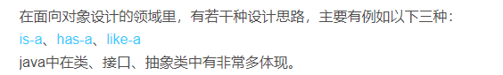
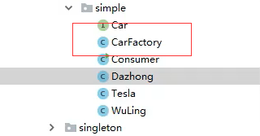

# 设计模式

**模式类型**：

	

## 1.OOP七大原则

	面向对象主要关系

	

[关系说明链接](https://blog.csdn.net/weixin_33963189/article/details/85920196?utm_medium=distribute.pc_relevant.none-task-blog-BlogCommendFromMachineLearnPai2-1.compare&depth_1-utm_source=distribute.pc_relevant.none-task-blog-BlogCommendFromMachineLearnPai2-1.compare)

### 单例模式

单例模式的特点：

- 单例类只能有一个实例。

- 单例类必须自己创建自己的唯一的实例。

- 单例类必须给所有其他对象提供这一实例。

- 1.==懒汉式==的特点是延迟加载，比如配置文件，采用懒汉式的方法，顾名思义，懒汉么，很懒的，配置文件的实例直到用到的时候才会加载.==在调用方法的时候才初始化MySingleton== 

  懒汉模式的改进(双重检测加锁)

  ```java
  public class LazySingletonImprove {
      private volatile static LazySingletonImprove instance = null;
   
      private LazySingletonImprove() {
   
      }
   
      public static LazySingletonImprove getInstance() {
          if (instance == null) {
              synchronized (LazySingletonImprove.class) {
                  if (instance == null) {
                      instance = new LazySingletonImprove();
                  }
              }
   
          }
          return instance;
   
      }
   
  }
  ```

  2.==饿汉式==的特点是一开始就加载了，如果说懒汉式是“时间换空间”，那么饿汉式就是“空间换时间”，因为一开始就创建了实例，所以每次用到的之后直接返回就好了。==直接创建实例MySingleton2()==

  ```java
  //饿汉式单例模式
  public class MySingleton2 {
   
  	//设立静态变量，直接创建实例
  	private static MySingleton2 mySingleton = new MySingleton2();
   
  	private MySingleton2(){
  		//私有化构造函数
  		System.out.println("-->饿汉式单例模式开始调用构造函数");
  	}
  	
  	//开放一个公有方法，判断是否已经存在实例，有返回，没有新建一个在返回
  	public static MySingleton2 getInstance(){
  		System.out.println("-->饿汉式单例模式开始调用公有方法返回实例");
  		return mySingleton;
  	}
  }
  ```

  **Spring中的单例与多例**
  spring ioc容器的bean都是默认单例的，即==spring依赖注入Bean实例==默认是单例的。

  spring提供了5中scope，分别是singleton，prototype，request，session，global session，常用是前两种。[点此查看官网介绍](https://docs.spring.io/spring/docs/3.0.0.M3/reference/html/ch04s04.html)。

### 工厂模式

 定义一个创建对象的接口，让其子类自己决定实例化哪一个工厂类，工厂模式使其创建过程延迟到子类进行。 

**简单工厂**：只使用一个工厂类返回需要的实例：通过CarFactory传入的参数进行判断返回何种实例。

	

**工厂方法**:每个实现方法都有一个工厂类，工厂类通过实现一个工厂方法接口返回实例。

	

	

### 适配器模式

 将一个类的接口转换成客户希望的另外一个接口。适配器模式使得原本由于接口不兼容而不能一起工作的那些类可以一起工作。 

适配器原理：通过转接器进行上网，转接器中处理上网请求，使得客户的USB接口能适配网线。

	客户的USB接口（通过适配器实现）

	

网线接口

	

适配器(一般使用组合实现，通常使用接口实现)

​	

使用场景：InputStreamReader流，SpringMVC中Dispatcher中调用HandlerMapping进行处理

### 观察者模式

 定义对象间的一种一对多的依赖关系，当一个对象的状态发生改变时，所有依赖于它的对象都得到通知并被自动更新 

	

1.定义观察者接口

```java
interface Observer {
    public void update();
}

```

2、定义被观察者

```java
abstract class Subject {
    private Vector<Observer> obs = new Vector();

    public void addObserver(Observer obs){
        this.obs.add(obs);
    }
    public void delObserver(Observer obs){
        this.obs.remove(obs);
    }
    //进行更新操作
    protected void notifyObserver(){
        for(Observer o: obs){
            o.update();
        }
    }
    public abstract void doSomething();
}
```

3、具体的被观察者

```java
class ConcreteSubject extends Subject {
    public void doSomething(){
        System.out.println("被观察者事件发生改变");
        this.notifyObserver();
    }
}
```

4、具体的被观察者

```java
class ConcreteObserver1 implements Observer {
    public void update() {
        System.out.println("观察者1收到信息，并进行处理");
    }
}
class ConcreteObserver2 implements Observer {
    public void update() {
        System.out.println("观察者2收到信息，并进行处理");
    }
}
```

5、客户端

```java
public class Client {
    public static void main(String[] args){
        Subject sub = new ConcreteSubject();
        sub.addObserver(new ConcreteObserver1()); //添加观察者1
        sub.addObserver(new ConcreteObserver2()); //添加观察者2
        sub.doSomething();
    }
}
```

	